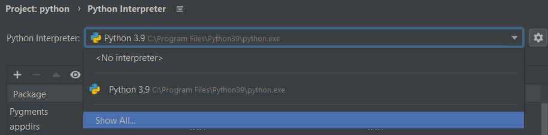

# Tools

IMPORTANT TODO: UPDATE URL PATHS OF IMAGES

Before you can start coding, make sure that you have the proper version of Python installed. Exercism currently supports `Python 3.8` and above. For more information, please refer to [Installing Python locally](https://exercism.org/docs/tracks/python/installation).

- [Environments](#environments)
  - [Global](#global-environments)
  - [Virtualenv](#venv)
  - [Conda](#Conda)

- [VS Code](#visual-studio-code)
  - [The Python extension](#python-for-vs-code)

## Visual Studio Code

Visual studio code (VS Code) is a code editor created by Microsoft. It is not specialized to work for a specific programming language, but to be an editor that can do everything. You can extend the editor using extensions, but it comes with some great extensions as well.

### Python for VS Code

_Extension-id: ms-python.python_

The Python extension from Microsoft is extremely useful because of its range of features. Notably it supports testing and has a testing explorer! It has many other features that you can view on [its homepage](https://marketplace.visualstudio.com/items?itemName=ms-python.python). 

#### Selecting the interpreter

The Python extensions supports the switching between multiple `interpreters`, this way you can use different Python environments for different projects. This is also useful for when you are using `venv` or `conda`, which you find more about [here]().

Click on the "Select interpreter" button in the lower left-hand of your window, another window should pop up where you can select the interpreter you want to use.

#### Other features

The Python plugin also comes with some other features that can help you debug and improve your python code, here are some of those tools.

[Test discovery tool](https://code.visualstudio.com/docs/python/testing#_configure-tests) - A tool that generates a tree containing all the *Pytest* and *Unittest* inside a directory. It will give you an easier and more readable interface for *Pytest*. 

[Debugging tool](https://code.visualstudio.com/docs/python/testing#_configure-tests) - This tool will help you debug your code, it allows you to set a `breakpoint` on a line. The debugging tool then allows you to view all *private* and *global* variables at that point in your program.

[Linting](https://code.visualstudio.com/docs/python/testing#_configure-tests) - Linting looks out for simple mistakes in your code and notifies you when you write bad-practice code according to PEP. Exercism currently focusses on the correct use of [PEP 8](https://www.python.org/dev/peps/pep-0008/).

[Formatting](https://code.visualstudio.com/docs/python/editing#_formatting) - This tool automatically formats your code to look a certain way, we recommend `autopep8` because it adheres to [PEP 8](https://www.python.org/dev/peps/pep-0008/), other formatters are supported.

[Config reference](https://code.visualstudio.com/docs/python/settings-reference) - If you want to make your Python development on VS Code behave exactly like you want it to, view this reference guide. It explains options for the extension that can really improve your coding experience.

## PyCharm

PyCharm is an *Integrated Development Environment* built by JetBrains. It is specialized to work for Python and is commonly used among professionals. You can also extend it's features using plugins, but out-of-the-box it comes with a load of features pre-installed.

### Selecting the interpreter

Open your project, then navigate to `File` >> `Settings` >> `Project: ...` >> `Python Interpreter`. Click on the dropdown menu and select the environment you will be using. If the environment you would like to use is not in the list click on the `Show All...` button:

## Code Style and Linting

There's a style guide called [PEP8](http://legacy.python.org/dev/peps/pep-0008/) that many Python projects adhere to.
Read it when you get a chance!

If you just want a quick overview of some problems in your code, use [pylint](http://www.pylint.org/)!
It can be pretty picky though, so take its results with a grain of salt.
If you don't agree with one of its points, that's a good topic for a discussion in the comments for your program!

If you'd rather have a tool take care of your style issues, take a look at [autopep8](https://github.com/hhatto/autopep8)!
Run `autopep8 -d mycode.py` to get a diff of the changes it proposes and `autopep8 -i mycode.py` to format the code in place!
