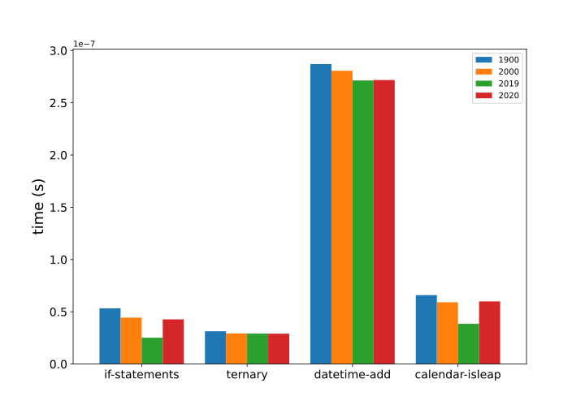

# Performance

In this approach, we'll find out how to most efficiently calculate if a year is a leap year in Python.

The [approaches page][approaches] lists two idiomatic approaches to this exercise:

1. [Using the boolean chain][approach-boolean-chain]
2. [Using the ternary operator][approach-ternary-operator]

For our performance investigation, we will also include a two further approaches:
3. [datetime addition][approach-datetime-addition]
4. The [`calendar.isleap()`][approach-calendar-isleap] function

## Benchmarks

To benchmark the approaches, we wrote a [small benchmark application][benchmark-application] using the [`timeit`][timeit] library.

|                 |    1900 |    2000 |    2019 |    2020 |
|:----------------|--------:|--------:|--------:|--------:|
| if statements   | 5.1e-08 | 4.5e-08 | 2.5e-08 | 3.9e-08 |
| ternary         | 3.3e-08 | 3.0e-08 | 3.0e-08 | 3.3e-08 |
| datetime add    | 2.8e-07 | 2.8e-07 | 2.7e-07 | 2.8e-07 |
| calendar isleap | 6.5e-08 | 5.8e-08 | 3.8e-08 | 5.5e-08 |

All methods are fast, but the difference may be easier to see graphically. Note the `1e-7` multiplier on the y-axis: these are all sub-microsecond run times.

- The boolean chain is the fastest approach when testing a year that is not evenly divisible by `100` and is not a leap year.
Since most years fit those conditions, it is overall the most efficient approach.
- The ternary operator is faster in benchmarking when the year is a leap year or is evenly divisible by `100`,
but those are the least likely conditions.
- Adding to the `datetime` may not only be a "cheat", but it is slower than the other approaches.
  - Comparing `import datatime` and `from datetime import datetime, timedelta` showed  little speed difference _(data not shown)_.
- Using the built-in `calendar.isleap()` function is terse, convenient and very readable, but not quite as fast as writing your own logic.

Often, it is helpful to the programmer to use imported packages, but a large `import` to use a simple function may not give the fastest code.
Consider the context, and decide which is best for you in each case.

[approaches]: https://exercism.org/tracks/python/exercises/leap/approaches
[approach-boolean-chain]: https://exercism.org/tracks/python/exercises/leap/approaches/boolean-chain
[approach-ternary-operator]: https://exercism.org/tracks/python/exercises/leap/approaches/ternary-operator
[approach-datetime-addition]: https://exercism.org/tracks/python/exercises/leap/approaches/datetime-addition
[approach-calendar-isleap]: https://exercism.org/tracks/python/exercises/leap/approaches/calendar-isleap
[benchmark-application]: https://github.com/exercism/python/blob/main/exercises/practice/leap/.articles/performance/code/Benchmark.py
[timeit]: https://docs.python.org/3/library/timeit.html
