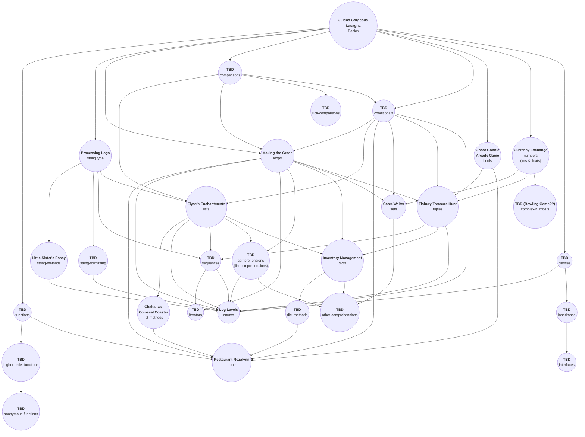

# Python concept exercises

| **Concept   (_about & links_)**                                                                              | **Exercise Name**                                                                                                                      | **Topics**                              | **Design**                                                                                                                                  | **Prerequisites**                                                                                                  |
| --------------------------------------------------------------------------------------------------------------- | -------------------------------------------------------------------------------------------------------------------------------------- | --------------------------------------- | ------------------------------------------------------------------------------------------------------------------------------------------- | ------------------------------------------------------------------------------------------------------------------ |
| [`basics`](https://github.com/exercism/v3/tree/master/languages/python/concepts/basics)                         | [Guidos Gorgeous Lasagna](https://github.com/exercism/v3/tree/master/languages/python/exercises/concept/guidos-gorgeous-lasagna)       | `basics`                                | [basics](https://github.com/exercism/v3/blob/master/languages/python/exercises/concept/guidos-gorgeous-lasagna/.meta/design.md)             | --                                                                                                                 |
| [`bools`](https://github.com/exercism/v3/tree/master/languages/python/concepts/bools)                           | [ghost-gobble-arcade-game](https://github.com/exercism/v3/tree/master/languages/python/exercises/concept/ghost-gobble-arcade-game)     | `bools`                                 | [bools](https://github.com/exercism/v3/blob/master/languages/python/exercises/concept/ghost-gobble-arcade-game/.meta/design.md)             | `basics`                                                                                                           |
| `comparisons`                                                                                                   | TBD (PR in progress)                                                                                                                   | `comparisons`                           | [#2039](https://github.com/exercism/v3/issues/2039)                                                                                         | `basics`                                                                                                           |
| `rich-comparisons`                                                                                              | TBD (split from comparisons)                                                                                                           | `rich-comparisons`                      | [#2171](https://github.com/exercism/v3/issues/2171)                                                                                         | `comparisons`                                                                                                      |
| [`dicts`](https://github.com/exercism/v3/tree/master/languages/python/concepts/dicts)                           | [Inventory Management](https://github.com/exercism/v3/tree/master/languages/python/exercises/concept/inventory-management)             | `dicts`                                 | [dicts](https://github.com/exercism/v3/blob/master/languages/python/exercises/concept/inventory-management/.meta/design.md)                 | `loops`, `lists`, `tuples`                                                                                         |
| [`enums`](https://github.com/exercism/v3/tree/master/languages/python/concepts/enums)                           | [log-levels](https://github.com/exercism/v3/tree/master/languages/python/exercises/concept/log-levels)                                 | `enums`                                 | [enums](https://github.com/exercism/v3/blob/master/languages/python/exercises/concept/log-levels/.meta/design.md)                           | `classes`, `conditionals`, `loops`, `comprehensions`, `sequences`, `string-formatting`, `string-methods`, `tuples` |
| [`loops`](https://github.com/exercism/v3/tree/master/languages/python/concepts/loops)                           | [Making the Grade](https://github.com/exercism/v3/tree/master/languages/python/exercises/concept/making-the-grade)                     | `iteration`, `loops`, `range`           | [loops](https://github.com/exercism/v3/blob/master/languages/python/exercises/concept/making-the-grade/.meta/design.md)                     | `basics`, `comparisons`, `conditionals`, `lists`, `strings`                                                        |
| [`list-methods`](https://github.com/exercism/v3/tree/master/languages/python/concepts/list-methods)             | [Chaitanas Colossal Coaster](https://github.com/exercism/v3/tree/master/languages/python/exercises/concept/chaitanas-colossal-coaster) | `list-methods`                          | [list-methods](https://github.com/exercism/v3/blob/master/languages/python/exercises/concept/chaitanas-colossal-coaster/.meta/design.md)    | `lists`                                                                                                            |
| [`lists`](https://github.com/exercism/v3/tree/master/languages/python/concepts/lists)                           | [Elyses Enchantments](https://github.com/exercism/v3/tree/master/languages/python/exercises/concept/elyses-enchantments)               | `lists`                                 | [lists](https://github.com/exercism/v3/blob/master/languages/python/exercises/concept/chaitanas-colossal-coaster/.meta/design.md)           | `comparisons`, `conditionals`, `strings`                                                                           |
| [`none`](https://github.com/exercism/v3/tree/master/languages/python/concepts/none)                             | [Restaurant Rozalynn](https://github.com/exercism/v3/tree/master/languages/python/exercises/concept/restaurant-rozalynn)               | `None`                                  | [none](https://github.com/exercism/v3/blob/master/languages/python/exercises/concept/restaurant-rozalynn/.meta/design.md)                   | `bools`, `conditionals`, `functions`, `dict-methods`, `list-methods`, `loops`                                      |
| [`numbers`](https://github.com/exercism/v3/tree/master/languages/python/concepts/numbers)                       | [Currency Exchange](https://github.com/exercism/v3/tree/master/languages/python/exercises/concept/currency-exchange)                   | `numbers`, `ints`, `floats`             | [ numbers](https://github.com/exercism/v3/blob/master/languages/python/exercises/concept/currency-exchange/.meta/design.md)                 | `basics`                                                                                                           |
| [`complex-numbers`](https://github.com/exercism/v3/tree/master/languages/python/concepts/complex-numbers)       | TBD (PR in process)                                                                                                                    | `complex-numbers`, `imaginary-numbers`  | [Issue #2208](https://github.com/exercism/v3/issues/2208)                                                                                   | `numbers`                                                                                                          |
| [`strings`](https://github.com/exercism/v3/tree/master/languages/python/concepts/strings)                       | [Processing Logs](https://github.com/exercism/v3/tree/master/languages/python/exercises/concept/processing-logs)                       | `strings`                               | [strings design](https://github.com/exercism/v3/blob/master/languages/python/exercises/concept/processing-logs/.meta/design.md)             | `basics`                                                                                                           |
| [`string-formatting`](https://github.com/exercism/v3/tree/master/languages/python/concepts/string-formatting)   | TBD (PR in process)                                                                                                                    | `string-formatting`                     | [Issue #1647](https://github.com/exercism/v3/issues/1648)                                                                                   | `basics`, `strings`, `string-methods`                                                                              |
| [`string-methods`](https://github.com/exercism/v3/tree/master/languages/python/concepts/string-methods)         | [Litte Sister's Essay](https://github.com/exercism/v3/tree/master/languages/python/exercises/concept/little-sisters-essay)             | `string-methods`                        | [string-methods design](https://github.com/exercism/v3/blob/master/languages/python/exercises/concept/little-sisters-essay/.meta/design.md) | `basics`, `strings`                                                                                                |
| [`string-methods-TBD`](https://github.com/exercism/v3/tree/master/languages/python/concepts/string-methods-TBD) | TBD (PR in process)                                                                                                                    | `string-splitting`, `string processing` | TBD                                                                                                                                         | `basics`, `strings`, `string-methods`                                                                              |
| [`tuples`](https://github.com/exercism/v3/tree/master/languages/python/concepts/tuples)                         | [Tisbury Treasure Hunt](https://github.com/exercism/v3/tree/master/languages/python/exercises/concept/tisbury-treasure-hunt)           | `tuples`                                | [tuples design](https://github.com/exercism/v3/blob/master/languages/python/exercises/concept/tisbury-treasure-hunt/.meta/design.md)        | `bools`, `loops`, `conditionals`, `numbers`                                                                        |  |

## Chart

