 

<h1>Concept and Practice Exercises</h1>

 

## Implemented Practice Exercises

<b><em>Practice Exercises with Difficulty, Solutions, and Mentor Notes</em></b>

 

| Exercise                                                                                                                                   	| Difficulty 	| Solutions                                                                                                                                                                                                                           	| Prereqs                                                                                                  	| Practices                                                                                                	| Hints?                                                                                                 	| Approaches?                                                                                           	| Mentor Notes                                                                                         	| Appends?                                                                                                                   	| Jinja?                                                                                                          	|
|--------------------------------------------------------------------------------------------------------------------------------------------	|:----------:	|-------------------------------------------------------------------------------------------------------------------------------------------------------------------------------------------------------------------------------------	|----------------------------------------------------------------------------------------------------------	|----------------------------------------------------------------------------------------------------------	|--------------------------------------------------------------------------------------------------------	|-------------------------------------------------------------------------------------------------------	|------------------------------------------------------------------------------------------------------	|----------------------------------------------------------------------------------------------------------------------------	|-----------------------------------------------------------------------------------------------------------------	|
| [**Hello World**](https://github.com/exercism/python/blob/main/exercises/practice/hello-world/.docs/instructions.md)                       	|      1     	| NA                                                                                                                                                                                                                                  	| NONE                                                                                                     	| NONE                                                                                                     	| NA                                                                                                     	| NA                                                                                                    	| NA                                                                                                   	| NA                                                                                                                         	| NA                                                                                                              	|
| [Acronym](https://github.com/exercism/python/blob/main/exercises/practice/acronym/.docs/instructions.md)                                   	|      2     	| [example](https://github.com/exercism/python/blob/main/exercises/practice/acronym/.meta/example.py)┋[most⭐](https://exercism.org/tracks/python/exercises/acronym/solutions?passed_head_tests=true)                                   	| [⚙⚙](https://github.com/exercism/python/blob/64396fd483c6c6770c1313b71cb4d972e5ab9819/config.json#L337)  	| [⚙⚙](https://github.com/exercism/python/blob/64396fd483c6c6770c1313b71cb4d972e5ab9819/config.json#L330)  	|                                                                                                        	| ✔                                                                                                     	| [✔](https://github.com/exercism/website-copy/tree/main/tracks/python/exercises/acronym/)             	| [✔](https://github.com/exercism/python/blob/main/exercises/practice/acronym/.docs/instructions.append.md)                  	| [✔](https://github.com/exercism/python/blob/main/exercises/practice/acronym/.meta/template.j2)                  	|
| [Affine Cipher](https://github.com/exercism/python/blob/main/exercises/practice/affine-cipher/.docs/instructions.md)                       	|      6     	| [example](https://github.com/exercism/python/blob/main/exercises/practice/affine-cipher/.meta/example.py)┋[most⭐](https://exercism.org/tracks/python/exercises/affine-cipher/solutions?passed_head_tests=true)                       	| [⚙⚙](https://github.com/exercism/python/blob/64396fd483c6c6770c1313b71cb4d972e5ab9819/config.json#L1174) 	| [⚙⚙](https://github.com/exercism/python/blob/64396fd483c6c6770c1313b71cb4d972e5ab9819/config.json#L1173) 	|                                                                                                        	|                                                                                                       	|                                                                                                      	| [✔](https://github.com/exercism/python/blob/main/exercises/practice/affine-cipher/.docs/instructions.append.md)            	| [✔](https://github.com/exercism/python/blob/main/exercises/practice/affine-cipher/.meta/template.j2)            	|
| [All Your Base](https://github.com/exercism/python/blob/main/exercises/practice/all-your-base/.docs/instructions.md)                       	|      4     	| [example](https://github.com/exercism/python/blob/main/exercises/practice/all-your-base/.meta/example.py)┋[most⭐](https://exercism.org/tracks/python/exercises/all-your-base/solutions?passed_head_tests=true)                       	| [⚙⚙](https://github.com/exercism/python/blob/64396fd483c6c6770c1313b71cb4d972e5ab9819/config.json#L1394) 	| [⚙⚙](https://github.com/exercism/python/blob/64396fd483c6c6770c1313b71cb4d972e5ab9819/config.json#L1393) 	|                                                                                                        	|                                                                                                       	|                                                                                                      	| [✔](https://github.com/exercism/python/blob/main/exercises/practice/all-your-base/.docs/instructions.append.md)            	| [✔](https://github.com/exercism/python/blob/main/exercises/practice/all-your-base/.meta/template.j2)            	|
| [Allergies](https://github.com/exercism/python/blob/main/exercises/practice/allergies/.docs/instructions.md)                               	|      3     	| [example](https://github.com/exercism/python/blob/main/exercises/practice/allergies/.meta/example.py)┋[most⭐](https://exercism.org/tracks/python/exercises/allergies/solutions?passed_head_tests=true)                               	| [⚙⚙](https://github.com/exercism/python/blob/64396fd483c6c6770c1313b71cb4d972e5ab9819/config.json#L701)  	| [⚙⚙](https://github.com/exercism/python/blob/64396fd483c6c6770c1313b71cb4d972e5ab9819/config.json#L700)  	|                                                                                                        	|                                                                                                       	| [✔](https://github.com/exercism/website-copy/tree/main/tracks/python/exercises/allergies/)           	|                                                                                                                            	| [✔](https://github.com/exercism/python/blob/main/exercises/practice/allergies/.meta/template.j2)                	|
| [Alphametics](https://github.com/exercism/python/blob/main/exercises/practice/alphametics/.docs/instructions.md)                           	|      6     	| [example](https://github.com/exercism/python/blob/main/exercises/practice/alphametics/.meta/example.py)┋[most⭐](https://exercism.org/tracks/python/exercises/alphametics/solutions?passed_head_tests=true)                           	| [⚙⚙](https://github.com/exercism/python/blob/64396fd483c6c6770c1313b71cb4d972e5ab9819/config.json#L1935) 	| [⚙⚙](https://github.com/exercism/python/blob/64396fd483c6c6770c1313b71cb4d972e5ab9819/config.json#L1934) 	|                                                                                                        	|                                                                                                       	|                                                                                                      	|                                                                                                                            	| [✔](https://github.com/exercism/python/blob/main/exercises/practice/alphametics/.meta/template.j2)              	|
| [Anagram](https://github.com/exercism/python/blob/main/exercises/practice/anagram/.docs/instructions.md)                                   	|      1     	| [example](https://github.com/exercism/python/blob/main/exercises/practice/anagram/.meta/example.py)┋[most⭐](https://exercism.org/tracks/python/exercises/anagram/solutions?passed_head_tests=true)                                   	| [⚙⚙](https://github.com/exercism/python/blob/64396fd483c6c6770c1313b71cb4d972e5ab9819/config.json#L577)  	| [⚙⚙](https://github.com/exercism/python/blob/64396fd483c6c6770c1313b71cb4d972e5ab9819/config.json#L576)  	|                                                                                                        	| ✔                                                                                                     	|                                                                                                      	|                                                                                                                            	| [✔](https://github.com/exercism/python/blob/main/exercises/practice/anagram/.meta/template.j2)                  	|
| [Armstrong Numbers](https://github.com/exercism/python/blob/main/exercises/practice/armstrong-numbers/.docs/instructions.md)               	|      1     	| [example](https://github.com/exercism/python/blob/main/exercises/practice/armstrong-numbers/.meta/example.py)┋[most⭐](https://exercism.org/tracks/python/exercises/armstrong-numbers/solutions?passed_head_tests=true)               	| [⚙⚙](https://github.com/exercism/python/blob/64396fd483c6c6770c1313b71cb4d972e5ab9819/config.json#L512)  	| [⚙⚙](https://github.com/exercism/python/blob/64396fd483c6c6770c1313b71cb4d972e5ab9819/config.json#L511)  	|                                                                                                        	| ✔                                                                                                     	| [✔](https://github.com/exercism/website-copy/tree/main/tracks/python/exercises/armstrong-numbers/)   	|                                                                                                                            	| [✔](https://github.com/exercism/python/blob/main/exercises/practice/armstrong-numbers/.meta/template.j2)        	|
| [Atbash Cipher](https://github.com/exercism/python/blob/main/exercises/practice/atbash-cipher/.docs/instructions.md)                       	|      2     	| [example](https://github.com/exercism/python/blob/main/exercises/practice/atbash-cipher/.meta/example.py)┋[most⭐](https://exercism.org/tracks/python/exercises/atbash-cipher/solutions?passed_head_tests=true)                       	| [⚙⚙](https://github.com/exercism/python/blob/64396fd483c6c6770c1313b71cb4d972e5ab9819/config.json#L1102) 	| [⚙⚙](https://github.com/exercism/python/blob/64396fd483c6c6770c1313b71cb4d972e5ab9819/config.json#L1101) 	|                                                                                                        	|                                                                                                       	|                                                                                                      	|                                                                                                                            	| [✔](https://github.com/exercism/python/blob/main/exercises/practice/atbash-cipher/.meta/template.j2)            	|
| [Bank Account](https://github.com/exercism/python/blob/main/exercises/practice/bank-account/.docs/instructions.md)                         	|      6     	| [example](https://github.com/exercism/python/blob/main/exercises/practice/bank-account/.meta/example.py)┋[most⭐](https://exercism.org/tracks/python/exercises/bank-account/solutions?passed_head_tests=true)                         	| [⚙⚙](https://github.com/exercism/python/blob/64396fd483c6c6770c1313b71cb4d972e5ab9819/config.json#L2207) 	| [⚙⚙](https://github.com/exercism/python/blob/64396fd483c6c6770c1313b71cb4d972e5ab9819/config.json#L2206) 	|                                                                                                        	|                                                                                                       	|                                                                                                      	| [✔](https://github.com/exercism/python/blob/main/exercises/practice/bank-account/.docs/instructions.append.md)             	| [✔](https://github.com/exercism/python/blob/main/exercises/practice/bank-account/.meta/template.j2)             	|
| [Binary Search Tree](https://github.com/exercism/python/blob/main/exercises/practice/binary-search-tree/.docs/instructions.md)             	|      5     	| [example](https://github.com/exercism/python/blob/main/exercises/practice/binary-search-tree/.meta/example.py)┋[most⭐](https://exercism.org/tracks/python/exercises/binary-search-tree/solutions?passed_head_tests=true)             	| [⚙⚙](https://github.com/exercism/python/blob/64396fd483c6c6770c1313b71cb4d972e5ab9819/config.json#L1157) 	| [⚙⚙](https://github.com/exercism/python/blob/64396fd483c6c6770c1313b71cb4d972e5ab9819/config.json#L1156) 	|                                                                                                        	|                                                                                                       	|                                                                                                      	|                                                                                                                            	| [✔](https://github.com/exercism/python/blob/main/exercises/practice/binary-search-tree/.meta/template.j2)       	|
| [Binary Search](https://github.com/exercism/python/blob/main/exercises/practice/binary-search/.docs/instructions.md)                       	|      1     	| [example](https://github.com/exercism/python/blob/main/exercises/practice/binary-search/.meta/example.py)┋[most⭐](https://exercism.org/tracks/python/exercises/binary-search/solutions?passed_head_tests=true)                       	| [⚙⚙](https://github.com/exercism/python/blob/64396fd483c6c6770c1313b71cb4d972e5ab9819/config.json#L1192) 	| [⚙⚙](https://github.com/exercism/python/blob/64396fd483c6c6770c1313b71cb4d972e5ab9819/config.json#L1191) 	|                                                                                                        	|                                                                                                       	| [✔](https://github.com/exercism/website-copy/tree/main/tracks/python/exercises/binary-search/)       	| [✔](https://github.com/exercism/python/blob/main/exercises/practice/binary-search/.docs/instructions.append.md)            	| [✔](https://github.com/exercism/python/blob/main/exercises/practice/binary-search/.meta/template.j2)            	|
| [Bob](https://github.com/exercism/python/blob/main/exercises/practice/bob/.docs/instructions.md)                                           	|      1     	| [example](https://github.com/exercism/python/blob/main/exercises/practice/bob/.meta/example.py)┋[most⭐](https://exercism.org/tracks/python/exercises/bob/solutions?passed_head_tests=true)                                           	| [⚙⚙](https://github.com/exercism/python/blob/64396fd483c6c6770c1313b71cb4d972e5ab9819/config.json#L715)  	| [⚙⚙](https://github.com/exercism/python/blob/64396fd483c6c6770c1313b71cb4d972e5ab9819/config.json#L714)  	|                                                                                                        	| [✔](https://github.com/exercism/python/blob/main/exercises/practice/bob/.approaches/)                 	| [✔](https://github.com/exercism/website-copy/tree/main/tracks/python/exercises/bob/)                 	|                                                                                                                            	| [✔](https://github.com/exercism/python/blob/main/exercises/practice/bob/.meta/template.j2)                      	|
| [Book Store](https://github.com/exercism/python/blob/main/exercises/practice/book-store/.docs/instructions.md)                             	|      5     	| [example](https://github.com/exercism/python/blob/main/exercises/practice/book-store/.meta/example.py)┋[most⭐](https://exercism.org/tracks/python/exercises/book-store/solutions?passed_head_tests=true)                             	| [⚙⚙](https://github.com/exercism/python/blob/64396fd483c6c6770c1313b71cb4d972e5ab9819/config.json#L445)  	| [⚙⚙](https://github.com/exercism/python/blob/64396fd483c6c6770c1313b71cb4d972e5ab9819/config.json#L437)  	|                                                                                                        	| ✔                                                                                                     	|                                                                                                      	|                                                                                                                            	| [✔](https://github.com/exercism/python/blob/main/exercises/practice/book-store/.meta/template.j2)               	|
| [Bottle Song](https://github.com/exercism/python/blob/main/exercises/practice/bottle-song/.docs/instructions.md)                           	|      3     	| [example](https://github.com/exercism/python/blob/main/exercises/practice/bottle-song/.meta/example.py)┋[most⭐](https://exercism.org/tracks/python/exercises/bottle-song/solutions?passed_head_tests=true)                          	| [⚙⚙](https://github.com/exercism/python/blob/main/config.json/#LC1012)                                   	| [⚙⚙](https://github.com/exercism/python/blob/main/config.json#LC1012)                                    	|                                                                                                        	|                                                                                                       	|                                                                                                      	|                                                                                                                            	| [✔](https://github.com/exercism/python/blob/main/exercises/practice/bottle-song/.meta/template.j2)              	|
| [Bowling](https://github.com/exercism/python/blob/main/exercises/practice/bowling/.docs/instructions.md)                                   	|      5     	| [example](https://github.com/exercism/python/blob/main/exercises/practice/bowling/.meta/example.py)┋[most⭐](https://exercism.org/tracks/python/exercises/bowling/solutions?passed_head_tests=true)                                   	| [⚙⚙](https://github.com/exercism/python/blob/64396fd483c6c6770c1313b71cb4d972e5ab9819/config.json#L1553) 	| [⚙⚙](https://github.com/exercism/python/blob/64396fd483c6c6770c1313b71cb4d972e5ab9819/config.json#L1552) 	|                                                                                                        	|                                                                                                       	|                                                                                                      	| [✔](https://github.com/exercism/python/blob/main/exercises/practice/bowling/.docs/instructions.append.md)                  	| [✔](https://github.com/exercism/python/blob/main/exercises/practice/bowling/.meta/template.j2)                  	|
| [Change](https://github.com/exercism/python/blob/main/exercises/practice/change/.docs/instructions.md)                                     	|      4     	| [example](https://github.com/exercism/python/blob/main/exercises/practice/change/.meta/example.py)┋[most⭐](https://exercism.org/tracks/python/exercises/change/solutions?passed_head_tests=true)                                     	| [⚙⚙](https://github.com/exercism/python/blob/64396fd483c6c6770c1313b71cb4d972e5ab9819/config.json#L1412) 	| [⚙⚙](https://github.com/exercism/python/blob/64396fd483c6c6770c1313b71cb4d972e5ab9819/config.json#L1411) 	|                                                                                                        	|                                                                                                       	|                                                                                                      	| [✔](https://github.com/exercism/python/blob/main/exercises/practice/change/.docs/instructions.append.md)                   	| [✔](https://github.com/exercism/python/blob/main/exercises/practice/change/.meta/template.j2)                   	|
| [Circular Buffer](https://github.com/exercism/python/blob/main/exercises/practice/circular-buffer/.docs/instructions.md)                   	|      3     	| [example](https://github.com/exercism/python/blob/main/exercises/practice/circular-buffer/.meta/example.py)┋[most⭐](https://exercism.org/tracks/python/exercises/circular-buffer/solutions?passed_head_tests=true)                   	| [⚙⚙](https://github.com/exercism/python/blob/64396fd483c6c6770c1313b71cb4d972e5ab9819/config.json#L1475) 	| [⚙⚙](https://github.com/exercism/python/blob/64396fd483c6c6770c1313b71cb4d972e5ab9819/config.json#L1469) 	|                                                                                                        	|                                                                                                       	|                                                                                                      	| [✔](https://github.com/exercism/python/blob/main/exercises/practice/circular-buffer/.docs/instructions.append.md)          	| [✔](https://github.com/exercism/python/blob/main/exercises/practice/circular-buffer/.meta/template.j2)          	|
| [Clock](https://github.com/exercism/python/blob/main/exercises/practice/clock/.docs/instructions.md)                                       	|      3     	| [example](https://github.com/exercism/python/blob/main/exercises/practice/clock/.meta/example.py)┋[most⭐](https://exercism.org/tracks/python/exercises/clock/solutions?passed_head_tests=true)                                       	| [⚙⚙](https://github.com/exercism/python/blob/64396fd483c6c6770c1313b71cb4d972e5ab9819/config.json#L394)  	| [⚙⚙](https://github.com/exercism/python/blob/64396fd483c6c6770c1313b71cb4d972e5ab9819/config.json#L389)  	|                                                                                                        	|                                                                                                       	| [✔](https://github.com/exercism/website-copy/tree/main/tracks/python/exercises/clock/)               	|                                                                                                                            	| [✔](https://github.com/exercism/python/blob/main/exercises/practice/clock/.meta/template.j2)                    	|
| [Collatz Conjecture](https://github.com/exercism/python/blob/main/exercises/practice/collatz-conjecture/.docs/instructions.md)             	|      1     	| [example](https://github.com/exercism/python/blob/main/exercises/practice/collatz-conjecture/.meta/example.py)┋[most⭐](https://exercism.org/tracks/python/exercises/collatz-conjecture/solutions?passed_head_tests=true)             	| [⚙⚙](https://github.com/exercism/python/blob/64396fd483c6c6770c1313b71cb4d972e5ab9819/config.json#L593)  	| [⚙⚙](https://github.com/exercism/python/blob/64396fd483c6c6770c1313b71cb4d972e5ab9819/config.json#L592)  	|                                                                                                        	| [✔](https://github.com/exercism/python/blob/main/exercises/practice/collatz-conjecture/.approaches/)  	|                                                                                                      	| [✔](https://github.com/exercism/python/blob/main/exercises/practice/collatz-conjecture/.docs/instructions.append.md)       	| [✔](https://github.com/exercism/python/blob/main/exercises/practice/collatz-conjecture/.meta/template.j2)       	|
| [Complex Numbers](https://github.com/exercism/python/blob/main/exercises/practice/complex-numbers/.docs/instructions.md)                   	|      4     	| [example](https://github.com/exercism/python/blob/main/exercises/practice/complex-numbers/.meta/example.py)┋[most⭐](https://exercism.org/tracks/python/exercises/complex-numbers/solutions?passed_head_tests=true)                   	| [⚙⚙](https://github.com/exercism/python/blob/64396fd483c6c6770c1313b71cb4d972e5ab9819/config.json#L799)  	| [⚙⚙](https://github.com/exercism/python/blob/64396fd483c6c6770c1313b71cb4d972e5ab9819/config.json#L792)  	|                                                                                                        	|                                                                                                       	|                                                                                                      	| [✔](https://github.com/exercism/python/blob/main/exercises/practice/complex-numbers/.docs/instructions.append.md)          	| [✔](https://github.com/exercism/python/blob/main/exercises/practice/complex-numbers/.meta/template.j2)          	|
| [Connect](https://github.com/exercism/python/blob/main/exercises/practice/connect/.docs/instructions.md)                                   	|      3     	| [example](https://github.com/exercism/python/blob/main/exercises/practice/connect/.meta/example.py)┋[most⭐](https://exercism.org/tracks/python/exercises/connect/solutions?passed_head_tests=true)                                   	| [⚙⚙](https://github.com/exercism/python/blob/64396fd483c6c6770c1313b71cb4d972e5ab9819/config.json#L960)  	| [⚙⚙](https://github.com/exercism/python/blob/64396fd483c6c6770c1313b71cb4d972e5ab9819/config.json#L959)  	|                                                                                                        	|                                                                                                       	|                                                                                                      	|                                                                                                                            	| [✔](https://github.com/exercism/python/blob/main/exercises/practice/connect/.meta/template.j2)                  	|
| [Crypto Square](https://github.com/exercism/python/blob/main/exercises/practice/crypto-square/.docs/instructions.md)                       	|      3     	| [example](https://github.com/exercism/python/blob/main/exercises/practice/crypto-square/.meta/example.py)┋[most⭐](https://exercism.org/tracks/python/exercises/crypto-square/solutions?passed_head_tests=true)                       	| [⚙⚙](https://github.com/exercism/python/blob/64396fd483c6c6770c1313b71cb4d972e5ab9819/config.json#L1263) 	| [⚙⚙](https://github.com/exercism/python/blob/64396fd483c6c6770c1313b71cb4d972e5ab9819/config.json#L1262) 	|                                                                                                        	|                                                                                                       	|                                                                                                      	|                                                                                                                            	| [✔](https://github.com/exercism/python/blob/main/exercises/practice/crypto-square/.meta/template.j2)            	|
| [Darts](https://github.com/exercism/python/blob/main/exercises/practice/darts/.docs/instructions.md)                                       	|      1     	| [example](https://github.com/exercism/python/blob/main/exercises/practice/darts/.meta/example.py)┋[most⭐](https://exercism.org/tracks/python/exercises/darts/solutions?passed_head_tests=true)                                       	| [⚙⚙](https://github.com/exercism/python/blob/64396fd483c6c6770c1313b71cb4d972e5ab9819/config.json#L2199) 	| [⚙⚙](https://github.com/exercism/python/blob/64396fd483c6c6770c1313b71cb4d972e5ab9819/config.json#L2198) 	| [✔](https://github.com/exercism/python/blob/main/exercises/practice/darts/.docs/hints.md)              	| ✔                                                                                                     	| [✔](https://github.com/exercism/website-copy/tree/main/tracks/python/exercises/darts/)               	|                                                                                                                            	| [✔](https://github.com/exercism/python/blob/main/exercises/practice/darts/.meta/template.j2)                    	|
| [Diamond](https://github.com/exercism/python/blob/main/exercises/practice/diamond/.docs/instructions.md)                                   	|      2     	| [example](https://github.com/exercism/python/blob/main/exercises/practice/diamond/.meta/example.py)┋[most⭐](https://exercism.org/tracks/python/exercises/diamond/solutions?passed_head_tests=true)                                   	| [⚙⚙](https://github.com/exercism/python/blob/64396fd483c6c6770c1313b71cb4d972e5ab9819/config.json#L1696) 	| [⚙⚙](https://github.com/exercism/python/blob/64396fd483c6c6770c1313b71cb4d972e5ab9819/config.json#L1695) 	|                                                                                                        	|                                                                                                       	|                                                                                                      	|                                                                                                                            	| [✔](https://github.com/exercism/python/blob/main/exercises/practice/diamond/.meta/template.j2)                  	|
| [Difference Of Squares](https://github.com/exercism/python/blob/main/exercises/practice/difference-of-squares/.docs/instructions.md)       	|      1     	| [example](https://github.com/exercism/python/blob/main/exercises/practice/difference-of-squares/.meta/example.py)┋[most⭐](https://exercism.org/tracks/python/exercises/difference-of-squares/solutions?passed_head_tests=true)       	| [⚙⚙](https://github.com/exercism/python/blob/64396fd483c6c6770c1313b71cb4d972e5ab9819/config.json#L601)  	| NONE                                                                                                     	|                                                                                                        	|                                                                                                       	|                                                                                                      	|                                                                                                                            	| [✔](https://github.com/exercism/python/blob/main/exercises/practice/difference-of-squares/.meta/template.j2)    	|
| [Dnd Character](https://github.com/exercism/python/blob/main/exercises/practice/dnd-character/.docs/instructions.md)                       	|      2     	| [example](https://github.com/exercism/python/blob/main/exercises/practice/dnd-character/.meta/example.py)┋[most⭐](https://exercism.org/tracks/python/exercises/dnd-character/solutions?passed_head_tests=true)                       	| [⚙⚙](https://github.com/exercism/python/blob/64396fd483c6c6770c1313b71cb4d972e5ab9819/config.json#L2078) 	| NONE                                                                                                     	|                                                                                                        	|                                                                                                       	| [✔](https://github.com/exercism/website-copy/tree/main/tracks/python/exercises/dnd-character/)       	|                                                                                                                            	| [✔](https://github.com/exercism/python/blob/main/exercises/practice/dnd-character/.meta/template.j2)            	|
| [Dominoes](https://github.com/exercism/python/blob/main/exercises/practice/dominoes/.docs/instructions.md)                                 	|      7     	| [example](https://github.com/exercism/python/blob/main/exercises/practice/dominoes/.meta/example.py)┋[most⭐](https://exercism.org/tracks/python/exercises/dominoes/solutions?passed_head_tests=true)                                 	| [⚙⚙](https://github.com/exercism/python/blob/64396fd483c6c6770c1313b71cb4d972e5ab9819/config.json#L1767) 	| [⚙⚙](https://github.com/exercism/python/blob/64396fd483c6c6770c1313b71cb4d972e5ab9819/config.json#L1755) 	|                                                                                                        	|                                                                                                       	|                                                                                                      	|                                                                                                                            	| [✔](https://github.com/exercism/python/blob/main/exercises/practice/dominoes/.meta/template.j2)                 	|
| [Dot Dsl](https://github.com/exercism/python/blob/main/exercises/practice/dot-dsl/.docs/instructions.md)                                   	|      5     	| [example](https://github.com/exercism/python/blob/main/exercises/practice/dot-dsl/.meta/example.py)┋[most⭐](https://exercism.org/tracks/python/exercises/dot-dsl/solutions?passed_head_tests=true)                                   	| [⚙⚙](https://github.com/exercism/python/blob/64396fd483c6c6770c1313b71cb4d972e5ab9819/config.json#L1434) 	| [⚙⚙](https://github.com/exercism/python/blob/64396fd483c6c6770c1313b71cb4d972e5ab9819/config.json#L1427) 	|                                                                                                        	|                                                                                                       	|                                                                                                      	| [✔](https://github.com/exercism/python/blob/main/exercises/practice/dot-dsl/.docs/instructions.append.md)                  	|                                                                                                                 	|
| [Etl](https://github.com/exercism/python/blob/main/exercises/practice/etl/.docs/instructions.md)                                           	|      1     	| [example](https://github.com/exercism/python/blob/main/exercises/practice/etl/.meta/example.py)┋[most⭐](https://exercism.org/tracks/python/exercises/etl/solutions?passed_head_tests=true)                                           	| [⚙⚙](https://github.com/exercism/python/blob/64396fd483c6c6770c1313b71cb4d972e5ab9819/config.json#L1118) 	| [⚙⚙](https://github.com/exercism/python/blob/64396fd483c6c6770c1313b71cb4d972e5ab9819/config.json#L1117) 	|                                                                                                        	| ✔                                                                                                     	|                                                                                                      	|                                                                                                                            	| [✔](https://github.com/exercism/python/blob/main/exercises/practice/etl/.meta/template.j2)                      	|
| [Flatten Array](https://github.com/exercism/python/blob/main/exercises/practice/flatten-array/.docs/instructions.md)                       	|      1     	| [example](https://github.com/exercism/python/blob/main/exercises/practice/flatten-array/.meta/example.py)┋[most⭐](https://exercism.org/tracks/python/exercises/flatten-array/solutions?passed_head_tests=true)                       	| [⚙⚙](https://github.com/exercism/python/blob/64396fd483c6c6770c1313b71cb4d972e5ab9819/config.json#L1126) 	| [⚙⚙](https://github.com/exercism/python/blob/64396fd483c6c6770c1313b71cb4d972e5ab9819/config.json#L1125) 	|                                                                                                        	|                                                                                                       	|                                                                                                      	|                                                                                                                            	| [✔](https://github.com/exercism/python/blob/main/exercises/practice/flatten-array/.meta/template.j2)            	|
| [Food Chain](https://github.com/exercism/python/blob/main/exercises/practice/food-chain/.docs/instructions.md)                             	|      4     	| [example](https://github.com/exercism/python/blob/main/exercises/practice/food-chain/.meta/example.py)┋[most⭐](https://exercism.org/tracks/python/exercises/food-chain/solutions?passed_head_tests=true)                             	| [⚙⚙](https://github.com/exercism/python/blob/64396fd483c6c6770c1313b71cb4d972e5ab9819/config.json#L1737) 	| [⚙⚙](https://github.com/exercism/python/blob/64396fd483c6c6770c1313b71cb4d972e5ab9819/config.json#L1731) 	|                                                                                                        	|                                                                                                       	|                                                                                                      	|                                                                                                                            	| [✔](https://github.com/exercism/python/blob/main/exercises/practice/food-chain/.meta/template.j2)               	|
| [Forth](https://github.com/exercism/python/blob/main/exercises/practice/forth/.docs/instructions.md)                                       	|      5     	| [example](https://github.com/exercism/python/blob/main/exercises/practice/forth/.meta/example.py)┋[most⭐](https://exercism.org/tracks/python/exercises/forth/solutions?passed_head_tests=true)                                       	| [⚙⚙](https://github.com/exercism/python/blob/64396fd483c6c6770c1313b71cb4d972e5ab9819/config.json#L1571) 	| [⚙⚙](https://github.com/exercism/python/blob/64396fd483c6c6770c1313b71cb4d972e5ab9819/config.json#L1570) 	|                                                                                                        	|                                                                                                       	|                                                                                                      	| [✔](https://github.com/exercism/python/blob/main/exercises/practice/forth/.docs/instructions.append.md)                    	| [✔](https://github.com/exercism/python/blob/main/exercises/practice/forth/.meta/template.j2)                    	|
| [Gigasecond](https://github.com/exercism/python/blob/main/exercises/practice/gigasecond/.docs/instructions.md)                             	|      1     	| [example](https://github.com/exercism/python/blob/main/exercises/practice/gigasecond/.meta/example.py)┋[most⭐](https://exercism.org/tracks/python/exercises/gigasecond/solutions?passed_head_tests=true)                             	| [⚙⚙](https://github.com/exercism/python/blob/main/config.json#L450)                                      	| NONE                                                                                                     	| [✔](https://github.com/exercism/python/blob/main/exercises/practice/gigasecond/.docs/hints.md)         	| ✔                                                                                                     	| [✔](https://github.com/exercism/website-copy/tree/main/tracks/python/exercises/gigasecond/)          	| [✔](https://github.com/exercism/python/blob/main/exercises/practice/gigasecond/.docs/instructions.append.md)               	| [✔](https://github.com/exercism/python/blob/main/exercises/practice/gigasecond/.meta/template.j2)               	|
| [Go Counting](https://github.com/exercism/python/blob/main/exercises/practice/go-counting/.docs/instructions.md)                           	|      4     	| [example](https://github.com/exercism/python/blob/main/exercises/practice/go-counting/.meta/example.py)┋[most⭐](https://exercism.org/tracks/python/exercises/go-counting/solutions?passed_head_tests=true)                           	| [⚙⚙](https://github.com/exercism/python/blob/64396fd483c6c6770c1313b71cb4d972e5ab9819/config.json#L868)  	| [⚙⚙](https://github.com/exercism/python/blob/64396fd483c6c6770c1313b71cb4d972e5ab9819/config.json#L867)  	|                                                                                                        	|                                                                                                       	|                                                                                                      	| [✔](https://github.com/exercism/python/blob/main/exercises/practice/go-counting/.docs/instructions.append.md)              	| [✔](https://github.com/exercism/python/blob/main/exercises/practice/go-counting/.meta/template.j2)              	|
| [Grade School](https://github.com/exercism/python/blob/main/exercises/practice/grade-school/.docs/instructions.md)                         	|      3     	| [example](https://github.com/exercism/python/blob/main/exercises/practice/grade-school/.meta/example.py)┋[most⭐](https://exercism.org/tracks/python/exercises/grade-school/solutions?passed_head_tests=true)                         	| [⚙⚙](https://github.com/exercism/python/blob/64396fd483c6c6770c1313b71cb4d972e5ab9819/config.json#L364)  	| [⚙⚙](https://github.com/exercism/python/blob/64396fd483c6c6770c1313b71cb4d972e5ab9819/config.json#L363)  	|                                                                                                        	|                                                                                                       	| [✔](https://github.com/exercism/website-copy/tree/main/tracks/python/exercises/grade-school/)        	| [✔](https://github.com/exercism/python/blob/main/exercises/practice/grade-school/.docs/instructions.append.md)             	| [✔](https://github.com/exercism/python/blob/main/exercises/practice/grade-school/.meta/template.j2)             	|
| [Grains](https://github.com/exercism/python/blob/main/exercises/practice/grains/.docs/instructions.md)                                     	|      1     	| [example](https://github.com/exercism/python/blob/main/exercises/practice/grains/.meta/example.py)┋[most⭐](https://exercism.org/tracks/python/exercises/grains/solutions?passed_head_tests=true)                                     	| [⚙⚙](https://github.com/exercism/python/blob/64396fd483c6c6770c1313b71cb4d972e5ab9819/config.json#L678)  	| [⚙⚙](https://github.com/exercism/python/blob/64396fd483c6c6770c1313b71cb4d972e5ab9819/config.json#L677)  	|                                                                                                        	| [✔](https://github.com/exercism/python/blob/main/exercises/practice/grains/.approaches/)              	| [✔](https://github.com/exercism/website-copy/tree/main/tracks/python/exercises/grains/)              	| [✔](https://github.com/exercism/python/blob/main/exercises/practice/grains/.docs/instructions.append.md)                   	| [✔](https://github.com/exercism/python/blob/main/exercises/practice/grains/.meta/template.j2)                   	|
| [Grep](https://github.com/exercism/python/blob/main/exercises/practice/grep/.docs/instructions.md)                                         	|      4     	| [example](https://github.com/exercism/python/blob/main/exercises/practice/grep/.meta/example.py)┋[most⭐](https://exercism.org/tracks/python/exercises/grep/solutions?passed_head_tests=true)                                         	| [⚙⚙](https://github.com/exercism/python/blob/64396fd483c6c6770c1313b71cb4d972e5ab9819/config.json#L1536) 	| [⚙⚙](https://github.com/exercism/python/blob/64396fd483c6c6770c1313b71cb4d972e5ab9819/config.json#L1528) 	|                                                                                                        	|                                                                                                       	|                                                                                                      	|                                                                                                                            	| [✔](https://github.com/exercism/python/blob/main/exercises/practice/grep/.meta/template.j2)                     	|
| [Hamming](https://github.com/exercism/python/blob/main/exercises/practice/hamming/.docs/instructions.md)                                   	|      1     	| [example](https://github.com/exercism/python/blob/main/exercises/practice/hamming/.meta/example.py)┋[most⭐](https://exercism.org/tracks/python/exercises/hamming/solutions?passed_head_tests=true)                                   	| [⚙⚙](https://github.com/exercism/python/blob/64396fd483c6c6770c1313b71cb4d972e5ab9819/config.json#L259)  	| [⚙⚙](https://github.com/exercism/python/blob/64396fd483c6c6770c1313b71cb4d972e5ab9819/config.json#L254)  	|                                                                                                        	| [✔](https://github.com/exercism/python/blob/main/exercises/practice/hamming/.approaches/)             	| [✔](https://github.com/exercism/website-copy/tree/main/tracks/python/exercises/hamming/)             	| [✔](https://github.com/exercism/python/blob/main/exercises/practice/hamming/.docs/instructions.append.md)                  	| [✔](https://github.com/exercism/python/blob/main/exercises/practice/hamming/.meta/template.j2)                  	|
| [Hangman](https://github.com/exercism/python/blob/main/exercises/practice/hangman/.docs/instructions.md)                                   	|      4     	| [example](https://github.com/exercism/python/blob/main/exercises/practice/hangman/.meta/example.py)┋[most⭐](https://exercism.org/tracks/python/exercises/hangman/solutions?passed_head_tests=true)                                   	| [⚙⚙](https://github.com/exercism/python/blob/64396fd483c6c6770c1313b71cb4d972e5ab9819/config.json#L2221) 	| [⚙⚙](https://github.com/exercism/python/blob/64396fd483c6c6770c1313b71cb4d972e5ab9819/config.json#L2220) 	|                                                                                                        	|                                                                                                       	|                                                                                                      	| [✔](https://github.com/exercism/python/blob/main/exercises/practice/hangman/.docs/instructions.append.md)                  	|                                                                                                                 	|
| [High Scores](https://github.com/exercism/python/blob/main/exercises/practice/high-scores/.docs/instructions.md)                           	|      4     	| [example](https://github.com/exercism/python/blob/main/exercises/practice/high-scores/.meta/example.py)┋[most⭐](https://exercism.org/tracks/python/exercises/high-scores/solutions?passed_head_tests=true)                           	| [⚙⚙](https://github.com/exercism/python/blob/64396fd483c6c6770c1313b71cb4d972e5ab9819/config.json#L226)  	| [⚙⚙](https://github.com/exercism/python/blob/64396fd483c6c6770c1313b71cb4d972e5ab9819/config.json#L225)  	|                                                                                                        	|                                                                                                       	| [✔](https://github.com/exercism/website-copy/tree/main/tracks/python/exercises/high-scores/)         	| [✔](https://github.com/exercism/python/blob/main/exercises/practice/high-scores/.docs/instructions.append.md)              	| [✔](https://github.com/exercism/python/blob/main/exercises/practice/high-scores/.meta/template.j2)              	|
| [House](https://github.com/exercism/python/blob/main/exercises/practice/house/.docs/instructions.md)                                       	|      1     	| [example](https://github.com/exercism/python/blob/main/exercises/practice/house/.meta/example.py)┋[most⭐](https://exercism.org/tracks/python/exercises/house/solutions?passed_head_tests=true)                                       	| [⚙⚙](https://github.com/exercism/python/blob/64396fd483c6c6770c1313b71cb4d972e5ab9819/config.json#L1279) 	| NONE                                                                                                     	|                                                                                                        	| ✔                                                                                                     	|                                                                                                      	|                                                                                                                            	| [✔](https://github.com/exercism/python/blob/main/exercises/practice/house/.meta/template.j2)                    	|
| [Isbn Verifier](https://github.com/exercism/python/blob/main/exercises/practice/isbn-verifier/.docs/instructions.md)                       	|      1     	| [example](https://github.com/exercism/python/blob/main/exercises/practice/isbn-verifier/.meta/example.py)┋[most⭐](https://exercism.org/tracks/python/exercises/isbn-verifier/solutions?passed_head_tests=true)                       	| [⚙⚙](https://github.com/exercism/python/blob/64396fd483c6c6770c1313b71cb4d972e5ab9819/config.json#L609)  	| NONE                                                                                                     	|                                                                                                        	| ✔                                                                                                     	| [✔](https://github.com/exercism/website-copy/tree/main/tracks/python/exercises/isbn-verifier/)       	|                                                                                                                            	| [✔](https://github.com/exercism/python/blob/main/exercises/practice/isbn-verifier/.meta/template.j2)            	|
| [Isogram](https://github.com/exercism/python/blob/main/exercises/practice/isogram/.docs/instructions.md)                                   	|      1     	| [example](https://github.com/exercism/python/blob/main/exercises/practice/isogram/.meta/example.py)┋[most⭐](https://exercism.org/tracks/python/exercises/isogram/solutions?passed_head_tests=true)                                   	| [⚙⚙](https://github.com/exercism/python/blob/64396fd483c6c6770c1313b71cb4d972e5ab9819/config.json#L273)  	| [⚙⚙](https://github.com/exercism/python/blob/64396fd483c6c6770c1313b71cb4d972e5ab9819/config.json#L272)  	|                                                                                                        	| [✔](https://github.com/exercism/python/blob/main/exercises/practice/isogram/.approaches/)             	| [✔](https://github.com/exercism/website-copy/tree/main/tracks/python/exercises/isogram/)             	|                                                                                                                            	| [✔](https://github.com/exercism/python/blob/main/exercises/practice/isogram/.meta/template.j2)                  	|
| [Isogram](https://github.com/exercism/python/blob/main/exercises/practice/killer-sudoku-helper/.docs/instructions.md)                      	|      4     	| [example](https://github.com/exercism/python/blob/main/exercises/practice/killer-sudoku-helper/.meta/example.py)┋[most⭐](https://exercism.org/tracks/python/exercises/killer-sudodu-helper/solutions?passed_head_tests=true)         	| [⚙⚙](https://github.com/exercism/python/blob/main/config.json#L1385)                                     	| [⚙⚙](https://github.com/exercism/python/blob/main/config.json#L1384)                                     	|                                                                                                        	|                                                                                                       	|                                                                                                      	|                                                                                                                            	| [✔](https://github.com/exercism/python/blob/main/exercises/practice/killer-sudoku-helper/.meta/template.j2)     	|
| [Kindergarten Garden](https://github.com/exercism/python/blob/main/exercises/practice/kindergarten-garden/.docs/instructions.md)           	|      3     	| [example](https://github.com/exercism/python/blob/main/exercises/practice/kindergarten-garden/.meta/example.py)┋[most⭐](https://exercism.org/tracks/python/exercises/kindergarten-garden/solutions?passed_head_tests=true)           	| [⚙⚙](https://github.com/exercism/python/blob/64396fd483c6c6770c1313b71cb4d972e5ab9819/config.json#L350)  	| [⚙⚙](https://github.com/exercism/python/blob/64396fd483c6c6770c1313b71cb4d972e5ab9819/config.json#L344)  	|                                                                                                        	|                                                                                                       	| [✔](https://github.com/exercism/website-copy/tree/main/tracks/python/exercises/kindergarten-garden/) 	| [✔](https://github.com/exercism/python/blob/main/exercises/practice/kindergarten-garden/.docs/instructions.append.md)      	| [✔](https://github.com/exercism/python/blob/main/exercises/practice/kindergarten-garden/.meta/template.j2)      	|
| [Knapsack](https://github.com/exercism/python/blob/main/exercises/practice/knapsack/.docs/instructions.md)                                 	|      5     	| [example](https://github.com/exercism/python/blob/main/exercises/practice/knapsack/.meta/example.py)┋[most⭐](https://exercism.org/tracks/python/exercises/knapsack/solutions?passed_head_tests=true)                                 	| [⚙⚙](https://github.com/exercism/python/blob/64396fd483c6c6770c1313b71cb4d972e5ab9819/config.json#L1453) 	| [⚙⚙](https://github.com/exercism/python/blob/64396fd483c6c6770c1313b71cb4d972e5ab9819/config.json#L1452) 	|                                                                                                        	|                                                                                                       	|                                                                                                      	|                                                                                                                            	| [✔](https://github.com/exercism/python/blob/main/exercises/practice/knapsack/.meta/template.j2)                 	|
| [Largest Series Product](https://github.com/exercism/python/blob/main/exercises/practice/largest-series-product/.docs/instructions.md)     	|      4     	| [example](https://github.com/exercism/python/blob/main/exercises/practice/largest-series-product/.meta/example.py)┋[most⭐](https://exercism.org/tracks/python/exercises/largest-series-product/solutions?passed_head_tests=true)     	| [⚙⚙](https://github.com/exercism/python/blob/64396fd483c6c6770c1313b71cb4d972e5ab9819/config.json#L945)  	| [⚙⚙](https://github.com/exercism/python/blob/64396fd483c6c6770c1313b71cb4d972e5ab9819/config.json#L939)  	|                                                                                                        	| ✔                                                                                                     	|                                                                                                      	| [✔](https://github.com/exercism/python/blob/main/exercises/practice/largest-series-product/.docs/instructions.append.md)   	| [✔](https://github.com/exercism/python/blob/main/exercises/practice/largest-series-product/.meta/template.j2)   	|
| [Leap](https://github.com/exercism/python/blob/main/exercises/practice/leap/.docs/instructions.md)                                         	|      1     	| [example](https://github.com/exercism/python/blob/main/exercises/practice/leap/.meta/example.py)┋[most⭐](https://exercism.org/tracks/python/exercises/leap/solutions?passed_head_tests=true)                                         	| [⚙⚙](https://github.com/exercism/python/blob/64396fd483c6c6770c1313b71cb4d972e5ab9819/config.json#L2103) 	| [⚙⚙](https://github.com/exercism/python/blob/64396fd483c6c6770c1313b71cb4d972e5ab9819/config.json#L2102) 	|                                                                                                        	| [✔](https://github.com/exercism/python/blob/main/exercises/practice/leap/.approaches/)                	| [✔](https://github.com/exercism/website-copy/tree/main/tracks/python/exercises/leap/)                	|                                                                                                                            	| [✔](https://github.com/exercism/python/blob/main/exercises/practice/leap/.meta/template.j2)                     	|
| [Ledger](https://github.com/exercism/python/blob/main/exercises/practice/ledger/.docs/instructions.md)                                     	|      4     	| [example](https://github.com/exercism/python/blob/main/exercises/practice/ledger/.meta/example.py)┋[most⭐](https://exercism.org/tracks/python/exercises/ledger/solutions?passed_head_tests=true)                                     	| [⚙⚙](https://github.com/exercism/python/blob/64396fd483c6c6770c1313b71cb4d972e5ab9819/config.json#L1590) 	|                                                                                                          	|                                                                                                        	|                                                                                                       	|                                                                                                      	|                                                                                                                            	| [✔](https://github.com/exercism/python/blob/main/exercises/practice/ledger/.meta/template.j2)                   	|
| [Linked List](https://github.com/exercism/python/blob/main/exercises/practice/linked-list/.docs/instructions.md)                           	|      4     	| [example](https://github.com/exercism/python/blob/main/exercises/practice/linked-list/.meta/example.py)┋[most⭐](https://exercism.org/tracks/python/exercises/linked-list/solutions?passed_head_tests=true)                           	| [⚙⚙](https://github.com/exercism/python/blob/64396fd483c6c6770c1313b71cb4d972e5ab9819/config.json#L1379) 	| [⚙⚙](https://github.com/exercism/python/blob/64396fd483c6c6770c1313b71cb4d972e5ab9819/config.json#L1371) 	|                                                                                                        	|                                                                                                       	|                                                                                                      	| [✔](https://github.com/exercism/python/blob/main/exercises/practice/linked-list/.docs/instructions.append.md)              	| [✔](https://github.com/exercism/python/blob/main/exercises/practice/linked-list/.meta/template.j2)              	|
| [List Ops](https://github.com/exercism/python/blob/main/exercises/practice/list-ops/.docs/instructions.md)                                 	|      1     	| [example](https://github.com/exercism/python/blob/main/exercises/practice/list-ops/.meta/example.py)┋[most⭐](https://exercism.org/tracks/python/exercises/list-ops/solutions?passed_head_tests=true)                                 	| [⚙⚙](https://github.com/exercism/python/blob/64396fd483c6c6770c1313b71cb4d972e5ab9819/config.json#L1294) 	| NONE                                                                                                     	|                                                                                                        	|                                                                                                       	|                                                                                                      	|                                                                                                                            	| [✔](https://github.com/exercism/python/blob/main/exercises/practice/list-ops/.meta/template.j2)                 	|
| [Luhn](https://github.com/exercism/python/blob/main/exercises/practice/luhn/.docs/instructions.md)                                         	|      2     	| [example](https://github.com/exercism/python/blob/main/exercises/practice/luhn/.meta/example.py)┋[most⭐](https://exercism.org/tracks/python/exercises/luhn/solutions?passed_head_tests=true)                                         	| [⚙⚙](https://github.com/exercism/python/blob/64396fd483c6c6770c1313b71cb4d972e5ab9819/config.json#L372)  	| [⚙⚙](https://github.com/exercism/python/blob/64396fd483c6c6770c1313b71cb4d972e5ab9819/config.json#L371)  	|                                                                                                        	| [✔](https://github.com/exercism/python/blob/main/exercises/practice/luhn/.approaches/)                	| [✔](https://github.com/exercism/website-copy/tree/main/tracks/python/exercises/luhn/)                	|                                                                                                                            	| [✔](https://github.com/exercism/python/blob/main/exercises/practice/luhn/.meta/template.j2)                     	|
| [Markdown](https://github.com/exercism/python/blob/main/exercises/practice/markdown/.docs/instructions.md)                                 	|      4     	| [example](https://github.com/exercism/python/blob/main/exercises/practice/markdown/.meta/example.py)┋[most⭐](https://exercism.org/tracks/python/exercises/markdown/solutions?passed_head_tests=true)                                 	| [⚙⚙](https://github.com/exercism/python/blob/main/config.json#L1418)                                     	| [⚙⚙](https://github.com/exercism/python/blob/main/config.json#L1417)                                     	|                                                                                                        	|                                                                                                       	| [✔](https://github.com/exercism/website-copy/tree/main/tracks/python/exercises/markdown/)            	|                                                                                                                            	| [✔](https://github.com/exercism/python/blob/main/exercises/practice/markdown/.meta/template.j2)                 	|
| [Matching Brackets](https://github.com/exercism/python/blob/main/exercises/practice/matching-brackets/.docs/instructions.md)               	|      2     	| [example](https://github.com/exercism/python/blob/main/exercises/practice/matching-brackets/.meta/example.py)┋[most⭐](https://exercism.org/tracks/python/exercises/matching-brackets/solutions?passed_head_tests=true)               	| [⚙⚙](https://github.com/exercism/python/blob/64396fd483c6c6770c1313b71cb4d972e5ab9819/config.json#L728)  	| NONE                                                                                                     	|                                                                                                        	|                                                                                                       	| [✔](https://github.com/exercism/website-copy/tree/main/tracks/python/exercises/matching-brackets/)   	|                                                                                                                            	| [✔](https://github.com/exercism/python/blob/main/exercises/practice/matching-brackets/.meta/template.j2)        	|
| [Matrix](https://github.com/exercism/python/blob/main/exercises/practice/matrix/.docs/instructions.md)                                     	|      3     	| [example](https://github.com/exercism/python/blob/main/exercises/practice/matrix/.meta/example.py)┋[most⭐](https://exercism.org/tracks/python/exercises/matrix/solutions?passed_head_tests=true)                                     	| [⚙⚙](https://github.com/exercism/python/blob/64396fd483c6c6770c1313b71cb4d972e5ab9819/config.json#L1714) 	| [⚙⚙](https://github.com/exercism/python/blob/64396fd483c6c6770c1313b71cb4d972e5ab9819/config.json#L1713) 	|                                                                                                        	| ✔                                                                                                     	| [✔](https://github.com/exercism/website-copy/tree/main/tracks/python/exercises/matrix/)              	| [✔](https://github.com/exercism/python/blob/main/exercises/practice/matrix/.docs/instructions.append.md)                   	| [✔](https://github.com/exercism/python/blob/main/exercises/practice/matrix/.meta/template.j2)                   	|
| [Meetup](https://github.com/exercism/python/blob/main/exercises/practice/meetup/.docs/instructions.md)                                     	|      4     	| [example](https://github.com/exercism/python/blob/main/exercises/practice/meetup/.meta/example.py)┋[most⭐](https://exercism.org/tracks/python/exercises/meetup/solutions?passed_head_tests=true)                                     	| [⚙⚙](https://github.com/exercism/python/blob/64396fd483c6c6770c1313b71cb4d972e5ab9819/config.json#L818)  	| [⚙⚙](https://github.com/exercism/python/blob/64396fd483c6c6770c1313b71cb4d972e5ab9819/config.json#L812)  	|                                                                                                        	| ✔                                                                                                     	|                                                                                                      	| [✔](https://github.com/exercism/python/blob/main/exercises/practice/meetup/.docs/instructions.append.md)                   	| [✔](https://github.com/exercism/python/blob/main/exercises/practice/meetup/.meta/template.j2)                   	|
| [Minesweeper](https://github.com/exercism/python/blob/main/exercises/practice/minesweeper/.docs/instructions.md)                           	|      4     	| [example](https://github.com/exercism/python/blob/main/exercises/practice/minesweeper/.meta/example.py)┋[most⭐](https://exercism.org/tracks/python/exercises/minesweeper/solutions?passed_head_tests=true)                           	| [⚙⚙](https://github.com/exercism/python/blob/64396fd483c6c6770c1313b71cb4d972e5ab9819/config.json#L981)  	| [⚙⚙](https://github.com/exercism/python/blob/64396fd483c6c6770c1313b71cb4d972e5ab9819/config.json#L980)  	|                                                                                                        	|                                                                                                       	|                                                                                                      	| [✔](https://github.com/exercism/python/blob/main/exercises/practice/minesweeper/.docs/instructions.append.md)              	| [✔](https://github.com/exercism/python/blob/main/exercises/practice/minesweeper/.meta/template.j2)              	|
| [Nth Prime](https://github.com/exercism/python/blob/main/exercises/practice/nth-prime/.docs/instructions.md)                               	|      2     	| [example](https://github.com/exercism/python/blob/main/exercises/practice/nth-prime/.meta/example.py)┋[most⭐](https://exercism.org/tracks/python/exercises/nth-prime/solutions?passed_head_tests=true)                               	| [⚙⚙](https://github.com/exercism/python/blob/64396fd483c6c6770c1313b71cb4d972e5ab9819/config.json#L1814) 	| NONE                                                                                                     	|                                                                                                        	|                                                                                                       	|                                                                                                      	| [✔](https://github.com/exercism/python/blob/main/exercises/practice/nth-prime/.docs/instructions.append.md)                	| [✔](https://github.com/exercism/python/blob/main/exercises/practice/nth-prime/.meta/template.j2)                	|
| [Ocr Numbers](https://github.com/exercism/python/blob/main/exercises/practice/ocr-numbers/.docs/instructions.md)                           	|      3     	| [example](https://github.com/exercism/python/blob/main/exercises/practice/ocr-numbers/.meta/example.py)┋[most⭐](https://exercism.org/tracks/python/exercises/ocr-numbers/solutions?passed_head_tests=true)                           	| [⚙⚙](https://github.com/exercism/python/blob/64396fd483c6c6770c1313b71cb4d972e5ab9819/config.json#L997)  	| NONE                                                                                                     	|                                                                                                        	|                                                                                                       	|                                                                                                      	| [✔](https://github.com/exercism/python/blob/main/exercises/practice/ocr-numbers/.docs/instructions.append.md)              	| [✔](https://github.com/exercism/python/blob/main/exercises/practice/ocr-numbers/.meta/template.j2)              	|
| [Paasio](https://github.com/exercism/python/blob/main/exercises/practice/paasio/.docs/instructions.md)                                     	|      7     	| [example](https://github.com/exercism/python/blob/main/exercises/practice/paasio/.meta/example.py)┋[most⭐](https://exercism.org/tracks/python/exercises/paasio/solutions?passed_head_tests=true)                                     	| [⚙⚙](https://github.com/exercism/python/blob/64396fd483c6c6770c1313b71cb4d972e5ab9819/config.json#L1917) 	| [⚙⚙](https://github.com/exercism/python/blob/64396fd483c6c6770c1313b71cb4d972e5ab9819/config.json#L1906) 	|                                                                                                        	|                                                                                                       	|                                                                                                      	|                                                                                                                            	|                                                                                                                 	|
| [Palindrome Products](https://github.com/exercism/python/blob/main/exercises/practice/palindrome-products/.docs/instructions.md)           	|      4     	| [example](https://github.com/exercism/python/blob/main/exercises/practice/palindrome-products/.meta/example.py)┋[most⭐](https://exercism.org/tracks/python/exercises/palindrome-products/solutions?passed_head_tests=true)           	| [⚙⚙](https://github.com/exercism/python/blob/64396fd483c6c6770c1313b71cb4d972e5ab9819/config.json#L626)  	| [⚙⚙](https://github.com/exercism/python/blob/64396fd483c6c6770c1313b71cb4d972e5ab9819/config.json#L625)  	|                                                                                                        	| [✔](https://github.com/exercism/python/blob/main/exercises/practice/palindrome-products/.approaches/) 	| [✔](https://github.com/exercism/website-copy/tree/main/tracks/python/exercises/palindrome-products/) 	| [✔](https://github.com/exercism/python/blob/main/exercises/practice/palindrome-products/.docs/instructions.append.md)      	| [✔](https://github.com/exercism/python/blob/main/exercises/practice/palindrome-products/.meta/template.j2)      	|
| [Pangram](https://github.com/exercism/python/blob/main/exercises/practice/pangram/.docs/instructions.md)                                   	|      1     	| [example](https://github.com/exercism/python/blob/main/exercises/practice/pangram/.meta/example.py)┋[most⭐](https://exercism.org/tracks/python/exercises/pangram/solutions?passed_head_tests=true)                                   	| [⚙⚙](https://github.com/exercism/python/blob/64396fd483c6c6770c1313b71cb4d972e5ab9819/config.json#L463)  	| [⚙⚙](https://github.com/exercism/python/blob/64396fd483c6c6770c1313b71cb4d972e5ab9819/config.json#L462)  	|                                                                                                        	| [✔](https://github.com/exercism/python/blob/main/exercises/practice/pangram/.approaches/)             	| [✔](https://github.com/exercism/website-copy/tree/main/tracks/python/exercises/pangram/)             	|                                                                                                                            	| [✔](https://github.com/exercism/python/blob/main/exercises/practice/pangram/.meta/template.j2)                  	|
| [Pascals Triangle](https://github.com/exercism/python/blob/main/exercises/practice/pascals-triangle/.docs/instructions.md)                 	|      4     	| [example](https://github.com/exercism/python/blob/main/exercises/practice/pascals-triangle/.meta/example.py)┋[most⭐](https://exercism.org/tracks/python/exercises/pascals-triangle/solutions?passed_head_tests=true)                 	| [⚙⚙](https://github.com/exercism/python/blob/main/config.json#L1300)                                     	| [⚙⚙](https://github.com/exercism/python/blob/main/config.json#L1299)                                     	| [✔](https://github.com/exercism/python/blob/main/exercises/practice/pascals-triangle/.docs/hints.md)   	| ✔                                                                                                     	|                                                                                                      	| [✔](https://github.com/exercism/python/blob/main/exercises/practice/pascals-triangle/.docs/instructions.append.md)         	| [✔](https://github.com/exercism/python/blob/main/exercises/practice/pascals-triangle/.meta/template.j2)         	|
| [Perfect Numbers](https://github.com/exercism/python/blob/main/exercises/practice/perfect-numbers/.docs/instructions.md)                   	|      1     	| [example](https://github.com/exercism/python/blob/main/exercises/practice/perfect-numbers/.meta/example.py)┋[most⭐](https://exercism.org/tracks/python/exercises/perfect-numbers/solutions?passed_head_tests=true)                   	| [⚙⚙](https://github.com/exercism/python/blob/64396fd483c6c6770c1313b71cb4d972e5ab9819/config.json#L527)  	| NONE                                                                                                     	|                                                                                                        	| ✔                                                                                                     	| [✔](https://github.com/exercism/website-copy/tree/main/tracks/python/exercises/perfect-numbers/)     	| [✔](https://github.com/exercism/python/blob/main/exercises/practice/perfect-numbers/.docs/instructions.append.md)          	| [✔](https://github.com/exercism/python/blob/main/exercises/practice/perfect-numbers/.meta/template.j2)          	|
| [Phone Number](https://github.com/exercism/python/blob/main/exercises/practice/phone-number/.docs/instructions.md)                         	|      2     	| [example](https://github.com/exercism/python/blob/main/exercises/practice/phone-number/.meta/example.py)┋[most⭐](https://exercism.org/tracks/python/exercises/phone-number/solutions?passed_head_tests=true)                         	| [⚙⚙](https://github.com/exercism/python/blob/64396fd483c6c6770c1313b71cb4d972e5ab9819/config.json#L547)  	| [⚙⚙](https://github.com/exercism/python/blob/64396fd483c6c6770c1313b71cb4d972e5ab9819/config.json#L542)  	|                                                                                                        	|                                                                                                       	| [✔](https://github.com/exercism/website-copy/tree/main/tracks/python/exercises/phone-numbers/)       	| [✔](https://github.com/exercism/python/blob/main/exercises/practice/phone-number/.docs/instructions.append.md)             	| [✔](https://github.com/exercism/python/blob/main/exercises/practice/phone-number/.meta/template.j2)             	|
| [Pig Latin](https://github.com/exercism/python/blob/main/exercises/practice/pig-latin/.docs/instructions.md)                               	|      2     	| [example](https://github.com/exercism/python/blob/main/exercises/practice/pig-latin/.meta/example.py)┋[most⭐](https://exercism.org/tracks/python/exercises/pig-latin/solutions?passed_head_tests=true)                               	| [⚙⚙](https://github.com/exercism/python/blob/64396fd483c6c6770c1313b71cb4d972e5ab9819/config.json#L1832) 	| [⚙⚙](https://github.com/exercism/python/blob/64396fd483c6c6770c1313b71cb4d972e5ab9819/config.json#L1831) 	|                                                                                                        	| [✔](https://github.com/exercism/python/blob/main/exercises/practice/pig-latin/.approaches/)           	|                                                                                                      	|                                                                                                                            	| [✔](https://github.com/exercism/python/blob/main/exercises/practice/pig-latin/.meta/template.j2)                	|
| [Poker](https://github.com/exercism/python/blob/main/exercises/practice/poker/.docs/instructions.md)                                       	|      3     	| [example](https://github.com/exercism/python/blob/main/exercises/practice/poker/.meta/example.py)┋[most⭐](https://exercism.org/tracks/python/exercises/poker/solutions?passed_head_tests=true)                                       	| [⚙⚙](https://github.com/exercism/python/blob/64396fd483c6c6770c1313b71cb4d972e5ab9819/config.json#L1016) 	| [⚙⚙](https://github.com/exercism/python/blob/64396fd483c6c6770c1313b71cb4d972e5ab9819/config.json#L1015) 	|                                                                                                        	|                                                                                                       	|                                                                                                      	|                                                                                                                            	| [✔](https://github.com/exercism/python/blob/main/exercises/practice/poker/.meta/template.j2)                    	|
| [Pov](https://github.com/exercism/python/blob/main/exercises/practice/pov/.docs/instructions.md)                                           	|      9     	| [example](https://github.com/exercism/python/blob/main/exercises/practice/pov/.meta/example.py)┋[most⭐](https://exercism.org/tracks/python/exercises/pov/solutions?passed_head_tests=true)                                           	| [⚙⚙](https://github.com/exercism/python/blob/64396fd483c6c6770c1313b71cb4d972e5ab9819/config.json#L1677) 	| [⚙⚙](https://github.com/exercism/python/blob/64396fd483c6c6770c1313b71cb4d972e5ab9819/config.json#L1676) 	|                                                                                                        	|                                                                                                       	|                                                                                                      	| [✔](https://github.com/exercism/python/blob/main/exercises/practice/pov/.docs/instructions.append.md)                      	| [✔](https://github.com/exercism/python/blob/main/exercises/practice/pov/.meta/template.j2)                      	|
| [Prime Factors](https://github.com/exercism/python/blob/main/exercises/practice/prime-factors/.docs/instructions.md)                       	|      2     	| [example](https://github.com/exercism/python/blob/main/exercises/practice/prime-factors/.meta/example.py)┋[most⭐](https://exercism.org/tracks/python/exercises/prime-factors/solutions?passed_head_tests=true)                       	| [⚙⚙](https://github.com/exercism/python/blob/64396fd483c6c6770c1313b71cb4d972e5ab9819/config.json#L686)  	| [⚙⚙](https://github.com/exercism/python/blob/64396fd483c6c6770c1313b71cb4d972e5ab9819/config.json#L685)  	|                                                                                                        	|                                                                                                       	|                                                                                                      	|                                                                                                                            	| [✔](https://github.com/exercism/python/blob/main/exercises/practice/prime-factors/.meta/template.j2)            	|
| [Protein Translation](https://github.com/exercism/python/blob/main/exercises/practice/protein-translation/.docs/instructions.md)           	|      2     	| [example](https://github.com/exercism/python/blob/main/exercises/practice/protein-translation/.meta/example.py)┋[most⭐](https://exercism.org/tracks/python/exercises/protein-translation/solutions?passed_head_tests=true)           	| [⚙⚙](https://github.com/exercism/python/blob/64396fd483c6c6770c1313b71cb4d972e5ab9819/config.json#L496)  	| [⚙⚙](https://github.com/exercism/python/blob/64396fd483c6c6770c1313b71cb4d972e5ab9819/config.json#L495)  	|                                                                                                        	| ✔                                                                                                     	|                                                                                                      	|                                                                                                                            	| [✔](https://github.com/exercism/python/blob/main/exercises/practice/protein-translation/.meta/template.j2)      	|
| [Proverb](https://github.com/exercism/python/blob/main/exercises/practice/proverb/.docs/instructions.md)                                   	|      2     	| [example](https://github.com/exercism/python/blob/main/exercises/practice/proverb/.meta/example.py)┋[most⭐](https://exercism.org/tracks/python/exercises/proverb/solutions?passed_head_tests=true)                                   	| [⚙⚙](https://github.com/exercism/python/blob/main/config.json#LC661)                                     	| [⚙⚙](https://github.com/exercism/python/blob/main/config.json#L661)                                      	|                                                                                                        	| ✔                                                                                                     	|                                                                                                      	| [✔](https://github.com/exercism/python/blob/main/exercises/practice/proverb/.docs/instructions.append.md)                  	| [✔](https://github.com/exercism/python/blob/main/exercises/practice/proverb/.meta/template.j2)                  	|
| [Pythagorean Triplet](https://github.com/exercism/python/blob/main/exercises/practice/pythagorean-triplet/.docs/instructions.md)           	|      3     	| [example](https://github.com/exercism/python/blob/main/exercises/practice/pythagorean-triplet/.meta/example.py)┋[most⭐](https://exercism.org/tracks/python/exercises/pythagorean-triplet/solutions?passed_head_tests=true)           	| [⚙⚙](https://github.com/exercism/python/blob/64396fd483c6c6770c1313b71cb4d972e5ab9819/config.json#L745)  	| [⚙⚙](https://github.com/exercism/python/blob/64396fd483c6c6770c1313b71cb4d972e5ab9819/config.json#L744)  	|                                                                                                        	|                                                                                                       	|                                                                                                      	| [✔](https://github.com/exercism/python/blob/main/exercises/practice/pythagorean-triplet/.docs/instructions.append.md)      	| [✔](https://github.com/exercism/python/blob/main/exercises/practice/pythagorean-triplet/.meta/template.j2)      	|
| [Queen Attack](https://github.com/exercism/python/blob/main/exercises/practice/queen-attack/.docs/instructions.md)                         	|      2     	| [example](https://github.com/exercism/python/blob/main/exercises/practice/queen-attack/.meta/example.py)┋[most⭐](https://exercism.org/tracks/python/exercises/queen-attack/solutions?passed_head_tests=true)                         	| [⚙⚙](https://github.com/exercism/python/blob/64396fd483c6c6770c1313b71cb4d972e5ab9819/config.json#L1302) 	| NONE                                                                                                     	|                                                                                                        	|                                                                                                       	|                                                                                                      	| [✔](https://github.com/exercism/python/blob/main/exercises/practice/queen-attack/.docs/instructions.append.md)             	| [✔](https://github.com/exercism/python/blob/main/exercises/practice/queen-attack/.meta/template.j2)             	|
| [Rail Fence Cipher](https://github.com/exercism/python/blob/main/exercises/practice/rail-fence-cipher/.docs/instructions.md)               	|      4     	| [example](https://github.com/exercism/python/blob/main/exercises/practice/rail-fence-cipher/.meta/example.py)┋[most⭐](https://exercism.org/tracks/python/exercises/rail-fence-cipher/solutions?passed_head_tests=true)               	| [⚙⚙](https://github.com/exercism/python/blob/64396fd483c6c6770c1313b71cb4d972e5ab9819/config.json#L1849) 	| [⚙⚙](https://github.com/exercism/python/blob/64396fd483c6c6770c1313b71cb4d972e5ab9819/config.json#L1848) 	|                                                                                                        	|                                                                                                       	|                                                                                                      	|                                                                                                                            	| [✔](https://github.com/exercism/python/blob/main/exercises/practice/rail-fence-cipher/.meta/template.j2)        	|
| [Raindrops](https://github.com/exercism/python/blob/main/exercises/practice/raindrops/.docs/instructions.md)                               	|      1     	| [example](https://github.com/exercism/python/blob/main/exercises/practice/raindrops/.meta/example.py)┋[most⭐](https://exercism.org/tracks/python/exercises/raindrops/solutions?passed_head_tests=true)                               	| [⚙⚙](https://github.com/exercism/python/blob/64396fd483c6c6770c1313b71cb4d972e5ab9819/config.json#L210)  	| [⚙⚙](https://github.com/exercism/python/blob/64396fd483c6c6770c1313b71cb4d972e5ab9819/config.json#L209)  	|                                                                                                        	| ✔                                                                                                     	| [✔](https://github.com/exercism/website-copy/tree/main/tracks/python/exercises/raindrops/)           	|                                                                                                                            	| [✔](https://github.com/exercism/python/blob/main/exercises/practice/raindrops/.meta/template.j2)                	|
| [Rational Numbers](https://github.com/exercism/python/blob/main/exercises/practice/rational-numbers/.docs/instructions.md)                 	|      5     	| [example](https://github.com/exercism/python/blob/main/exercises/practice/rational-numbers/.meta/example.py)┋[most⭐](https://exercism.org/tracks/python/exercises/rational-numbers/solutions?passed_head_tests=true)                 	| [⚙⚙](https://github.com/exercism/python/blob/64396fd483c6c6770c1313b71cb4d972e5ab9819/config.json#L2240) 	| [⚙⚙](https://github.com/exercism/python/blob/64396fd483c6c6770c1313b71cb4d972e5ab9819/config.json#L2239) 	|                                                                                                        	|                                                                                                       	|                                                                                                      	|                                                                                                                            	| [✔](https://github.com/exercism/python/blob/main/exercises/practice/rational-numbers/.meta/template.j2)         	|
| [React](https://github.com/exercism/python/blob/main/exercises/practice/react/.docs/instructions.md)                                       	|      6     	| [example](https://github.com/exercism/python/blob/main/exercises/practice/react/.meta/example.py)┋[most⭐](https://exercism.org/tracks/python/exercises/react/solutions?passed_head_tests=true)                                       	| [⚙⚙](https://github.com/exercism/python/blob/64396fd483c6c6770c1313b71cb4d972e5ab9819/config.json#L890)  	| [⚙⚙](https://github.com/exercism/python/blob/64396fd483c6c6770c1313b71cb4d972e5ab9819/config.json#L884)  	|                                                                                                        	|                                                                                                       	|                                                                                                      	|                                                                                                                            	|                                                                                                                 	|
| [Rectangles](https://github.com/exercism/python/blob/main/exercises/practice/rectangles/.docs/instructions.md)                             	|      3     	| [example](https://github.com/exercism/python/blob/main/exercises/practice/rectangles/.meta/example.py)┋[most⭐](https://exercism.org/tracks/python/exercises/rectangles/solutions?passed_head_tests=true)                             	| [⚙⚙](https://github.com/exercism/python/blob/64396fd483c6c6770c1313b71cb4d972e5ab9819/config.json#L1032) 	| [⚙⚙](https://github.com/exercism/python/blob/64396fd483c6c6770c1313b71cb4d972e5ab9819/config.json#L1031) 	|                                                                                                        	|                                                                                                       	|                                                                                                      	|                                                                                                                            	| [✔](https://github.com/exercism/python/blob/main/exercises/practice/rectangles/.meta/template.j2)               	|
| [Resistor Color Trio](https://github.com/exercism/python/blob/main/exercises/practice/resistor-color-trio/.docs/instructions.md)           	|      2     	| [example](https://github.com/exercism/python/blob/main/exercises/practice/resistor-color-trio/.meta/example.py)┋[most⭐](https://exercism.org/tracks/python/exercises/resistor-color-trio/solutions?passed_head_tests=true)           	| [⚙⚙](https://github.com/exercism/python/blob/main/config.json#LC631)                                     	| [⚙⚙](https://github.com/exercism/python/blob/main/config.json#L631)                                      	|                                                                                                        	| ✔                                                                                                     	|                                                                                                      	|                                                                                                                            	| [✔](https://github.com/exercism/python/blob/main/exercises/practice/resistor-color-trio/.meta/template.j2)      	|
| [Resistor Color Duo](https://github.com/exercism/python/blob/main/exercises/practice/resistor-color-duo/.docs/instructions.md)             	|      1     	| [example](https://github.com/exercism/python/blob/main/exercises/practice/resistor-color-duo/.meta/example.py)┋[most⭐](https://exercism.org/tracks/python/exercises/resistor-color-duo/solutions?passed_head_tests=true)             	| [⚙⚙](https://github.com/exercism/python/blob/64396fd483c6c6770c1313b71cb4d972e5ab9819/config.json#L2119) 	| NONE                                                                                                     	|                                                                                                        	| ✔                                                                                                     	|                                                                                                      	|                                                                                                                            	| [✔](https://github.com/exercism/python/blob/main/exercises/practice/resistor-color-duo/.meta/template.j2)       	|
| [Resistor Color](https://github.com/exercism/python/blob/main/exercises/practice/resistor-color/.docs/instructions.md)                     	|      1     	| [example](https://github.com/exercism/python/blob/main/exercises/practice/resistor-color/.meta/example.py)┋[most⭐](https://exercism.org/tracks/python/exercises/resistor-color/solutions?passed_head_tests=true)                     	| [⚙⚙](https://github.com/exercism/python/blob/64396fd483c6c6770c1313b71cb4d972e5ab9819/config.json#L2111) 	| [⚙⚙](https://github.com/exercism/python/blob/64396fd483c6c6770c1313b71cb4d972e5ab9819/config.json#L2110) 	|                                                                                                        	|                                                                                                       	|                                                                                                      	|                                                                                                                            	| [✔](https://github.com/exercism/python/blob/main/exercises/practice/resistor-color/.meta/template.j2)           	|
| [Rest Api](https://github.com/exercism/python/blob/main/exercises/practice/rest-api/.docs/instructions.md)                                 	|      8     	| [example](https://github.com/exercism/python/blob/main/exercises/practice/rest-api/.meta/example.py)┋[most⭐](https://exercism.org/tracks/python/exercises/rest-api/solutions?passed_head_tests=true)                                 	| [⚙⚙](https://github.com/exercism/python/blob/64396fd483c6c6770c1313b71cb4d972e5ab9819/config.json#L1795) 	| [⚙⚙](https://github.com/exercism/python/blob/64396fd483c6c6770c1313b71cb4d972e5ab9819/config.json#L1787) 	|                                                                                                        	|                                                                                                       	|                                                                                                      	|                                                                                                                            	| [✔](https://github.com/exercism/python/blob/main/exercises/practice/rest-api/.meta/template.j2)                 	|
| [Reverse String](https://github.com/exercism/python/blob/main/exercises/practice/reverse-string/.docs/instructions.md)                     	|      1     	| [example](https://github.com/exercism/python/blob/main/exercises/practice/reverse-string/.meta/example.py)┋[most⭐](https://exercism.org/tracks/python/exercises/reverse-string/solutions?passed_head_tests=true)                     	| [⚙⚙](https://github.com/exercism/python/blob/64396fd483c6c6770c1313b71cb4d972e5ab9819/config.json#L2133) 	| NONE                                                                                                     	|                                                                                                        	| ✔                                                                                                     	| [✔](https://github.com/exercism/website-copy/tree/main/tracks/python/exercises/reverse-string/)      	|                                                                                                                            	| [✔](https://github.com/exercism/python/blob/main/exercises/practice/reverse-string/.meta/template.j2)           	|
| [Rna Transcription](https://github.com/exercism/python/blob/main/exercises/practice/rna-transcription/.docs/instructions.md)               	|      1     	| [example](https://github.com/exercism/python/blob/main/exercises/practice/rna-transcription/.meta/example.py)┋[most⭐](https://exercism.org/tracks/python/exercises/rna-transcription/solutions?passed_head_tests=true)               	| [⚙⚙](https://github.com/exercism/python/blob/64396fd483c6c6770c1313b71cb4d972e5ab9819/config.json#L2149) 	| [⚙⚙](https://github.com/exercism/python/blob/64396fd483c6c6770c1313b71cb4d972e5ab9819/config.json#L2148) 	|                                                                                                        	| [✔](https://github.com/exercism/python/blob/main/exercises/practice/rna-transcription/.approaches/)   	| [✔](https://github.com/exercism/website-copy/tree/main/tracks/python/exercises/rna-transcription/)   	|                                                                                                                            	| [✔](https://github.com/exercism/python/blob/main/exercises/practice/rna-transcription/.meta/template.j2)        	|
| [Robot Name](https://github.com/exercism/python/blob/main/exercises/practice/robot-name/.docs/instructions.md)                             	|      2     	| [example](https://github.com/exercism/python/blob/main/exercises/practice/robot-name/.meta/example.py)┋[most⭐](https://exercism.org/tracks/python/exercises/robot-name/solutions?passed_head_tests=true)                             	| [⚙⚙](https://github.com/exercism/python/blob/64396fd483c6c6770c1313b71cb4d972e5ab9819/config.json#L479)  	| NONE                                                                                                     	|                                                                                                        	| [✔](https://github.com/exercism/python/blob/main/exercises/practice/robot-name/.approaches/)          	| [✔](https://github.com/exercism/website-copy/tree/main/tracks/python/exercises/robot-name/)          	|                                                                                                                            	|                                                                                                                 	|
| [Robot Simulator](https://github.com/exercism/python/blob/main/exercises/practice/robot-simulator/.docs/instructions.md)                   	|      3     	| [example](https://github.com/exercism/python/blob/main/exercises/practice/robot-simulator/.meta/example.py)┋[most⭐](https://exercism.org/tracks/python/exercises/robot-simulator/solutions?passed_head_tests=true)                   	| [⚙⚙](https://github.com/exercism/python/blob/64396fd483c6c6770c1313b71cb4d972e5ab9819/config.json#L1324) 	| [⚙⚙](https://github.com/exercism/python/blob/64396fd483c6c6770c1313b71cb4d972e5ab9819/config.json#L1315) 	|                                                                                                        	|                                                                                                       	|                                                                                                      	|                                                                                                                            	| [✔](https://github.com/exercism/python/blob/main/exercises/practice/robot-simulator/.meta/template.j2)          	|
| [Roman Numerals](https://github.com/exercism/python/blob/main/exercises/practice/roman-numerals/.docs/instructions.md)                     	|      2     	| [example](https://github.com/exercism/python/blob/main/exercises/practice/roman-numerals/.meta/example.py)┋[most⭐](https://exercism.org/tracks/python/exercises/roman-numerals/solutions?passed_head_tests=true)                     	| [⚙⚙](https://github.com/exercism/python/blob/64396fd483c6c6770c1313b71cb4d972e5ab9819/config.json#L1340) 	| NONE                                                                                                     	|                                                                                                        	|                                                                                                       	|                                                                                                      	|                                                                                                                            	| [✔](https://github.com/exercism/python/blob/main/exercises/practice/roman-numerals/.meta/template.j2)           	|
| [Rotational Cipher](https://github.com/exercism/python/blob/main/exercises/practice/rotational-cipher/.docs/instructions.md)               	|      1     	| [example](https://github.com/exercism/python/blob/main/exercises/practice/rotational-cipher/.meta/example.py)┋[most⭐](https://exercism.org/tracks/python/exercises/rotational-cipher/solutions?passed_head_tests=true)               	| [⚙⚙](https://github.com/exercism/python/blob/64396fd483c6c6770c1313b71cb4d972e5ab9819/config.json#L1209) 	| [⚙⚙](https://github.com/exercism/python/blob/64396fd483c6c6770c1313b71cb4d972e5ab9819/config.json#L1208) 	|                                                                                                        	| [✔](https://github.com/exercism/python/blob/main/exercises/practice/rotational-cipher/.approaches/)   	|                                                                                                      	|                                                                                                                            	| [✔](https://github.com/exercism/python/blob/main/exercises/practice/rotational-cipher/.meta/template.j2)        	|
| [Run Length Encoding](https://github.com/exercism/python/blob/main/exercises/practice/run-length-encoding/.docs/instructions.md)           	|      2     	| [example](https://github.com/exercism/python/blob/main/exercises/practice/run-length-encoding/.meta/example.py)┋[most⭐](https://exercism.org/tracks/python/exercises/run-length-encoding/solutions?passed_head_tests=true)           	| [⚙⚙](https://github.com/exercism/python/blob/64396fd483c6c6770c1313b71cb4d972e5ab9819/config.json#L1493) 	| [⚙⚙](https://github.com/exercism/python/blob/64396fd483c6c6770c1313b71cb4d972e5ab9819/config.json#L1492) 	|                                                                                                        	| ✔                                                                                                     	|                                                                                                      	|                                                                                                                            	| [✔](https://github.com/exercism/python/blob/main/exercises/practice/run-length-encoding/.meta/template.j2)      	|
| [Saddle Points](https://github.com/exercism/python/blob/main/exercises/practice/saddle-points/.docs/instructions.md)                       	|      3     	| [example](https://github.com/exercism/python/blob/main/exercises/practice/saddle-points/.meta/example.py)┋[most⭐](https://exercism.org/tracks/python/exercises/saddle-points/solutions?passed_head_tests=true)                       	| [⚙⚙](https://github.com/exercism/python/blob/64396fd483c6c6770c1313b71cb4d972e5ab9819/config.json#L649)  	| [⚙⚙](https://github.com/exercism/python/blob/64396fd483c6c6770c1313b71cb4d972e5ab9819/config.json#L643)  	|                                                                                                        	| ✔                                                                                                     	| [✔](https://github.com/exercism/website-copy/tree/main/tracks/python/exercises/saddle-points/)       	| [✔](https://github.com/exercism/python/blob/main/exercises/practice/saddle-points/.docs/instructions.append.md)            	| [✔](https://github.com/exercism/python/blob/main/exercises/practice/saddle-points/.meta/template.j2)            	|
| [Satellite](https://github.com/exercism/python/blob/main/exercises/practice/satellite/.docs/instructions.md)                               	|      7     	| [example](https://github.com/exercism/python/blob/main/exercises/practice/satellite/.meta/example.py)┋[most⭐](https://exercism.org/tracks/python/exercises/satellite/solutions?passed_head_tests=true)                               	| [⚙⚙](https://github.com/exercism/python/blob/64396fd483c6c6770c1313b71cb4d972e5ab9819/config.json#L1640) 	| [⚙⚙](https://github.com/exercism/python/blob/64396fd483c6c6770c1313b71cb4d972e5ab9819/config.json#L1634) 	|                                                                                                        	|                                                                                                       	|                                                                                                      	| [✔](https://github.com/exercism/python/blob/main/exercises/practice/satellite/.docs/instructions.append.md)                	| [✔](https://github.com/exercism/python/blob/main/exercises/practice/satellite/.meta/template.j2)                	|
| [Say](https://github.com/exercism/python/blob/main/exercises/practice/say/.docs/instructions.md)                                           	|      2     	| [example](https://github.com/exercism/python/blob/main/exercises/practice/say/.meta/example.py)┋[most⭐](https://exercism.org/tracks/python/exercises/say/solutions?passed_head_tests=true)                                           	| [⚙⚙](https://github.com/exercism/python/blob/64396fd483c6c6770c1313b71cb4d972e5ab9819/config.json#L1052) 	| [⚙⚙](https://github.com/exercism/python/blob/64396fd483c6c6770c1313b71cb4d972e5ab9819/config.json#L1051) 	|                                                                                                        	| ✔                                                                                                     	|                                                                                                      	|                                                                                                                            	| [✔](https://github.com/exercism/python/blob/main/exercises/practice/say/.meta/template.j2)                      	|
| [Scale Generator](https://github.com/exercism/python/blob/main/exercises/practice/scale-generator/.docs/instructions.md)                   	|      4     	| [example](https://github.com/exercism/python/blob/main/exercises/practice/scale-generator/.meta/example.py)┋[most⭐](https://exercism.org/tracks/python/exercises/scale-generator/solutions?passed_head_tests=true)                   	| [⚙⚙](https://github.com/exercism/python/blob/64396fd483c6c6770c1313b71cb4d972e5ab9819/config.json#L1084) 	| [⚙⚙](https://github.com/exercism/python/blob/64396fd483c6c6770c1313b71cb4d972e5ab9819/config.json#L1083) 	|                                                                                                        	|                                                                                                       	|                                                                                                      	|                                                                                                                            	| [✔](https://github.com/exercism/python/blob/main/exercises/practice/scale-generator/.meta/template.j2)          	|
| [Scrabble Score](https://github.com/exercism/python/blob/main/exercises/practice/scrabble-score/.docs/instructions.md)                     	|      2     	| [example](https://github.com/exercism/python/blob/main/exercises/practice/scrabble-score/.meta/example.py)┋[most⭐](https://exercism.org/tracks/python/exercises/scrabble-score/solutions?passed_head_tests=true)                     	| [⚙⚙](https://github.com/exercism/python/blob/64396fd483c6c6770c1313b71cb4d972e5ab9819/config.json#L316)  	| [⚙⚙](https://github.com/exercism/python/blob/64396fd483c6c6770c1313b71cb4d972e5ab9819/config.json#L315)  	|                                                                                                        	| [✔](https://github.com/exercism/python/blob/main/exercises/practice/scrabble-score/.approaches/)      	| [✔](https://github.com/exercism/website-copy/tree/main/tracks/python/exercises/scrabble-score/)      	|                                                                                                                            	| [✔](https://github.com/exercism/python/blob/main/exercises/practice/scrabble-score/.meta/template.j2)           	|
| [Secret Handshake](https://github.com/exercism/python/blob/main/exercises/practice/secret-handshake/.docs/instructions.md)                 	|      1     	| [example](https://github.com/exercism/python/blob/main/exercises/practice/secret-handshake/.meta/example.py)┋[most⭐](https://exercism.org/tracks/python/exercises/secret-handshake/solutions?passed_head_tests=true)                 	| [⚙⚙](https://github.com/exercism/python/blob/64396fd483c6c6770c1313b71cb4d972e5ab9819/config.json#L924)  	| [⚙⚙](https://github.com/exercism/python/blob/64396fd483c6c6770c1313b71cb4d972e5ab9819/config.json#L923)  	|                                                                                                        	| ✔                                                                                                     	|                                                                                                      	| [✔](https://github.com/exercism/python/blob/main/exercises/practice/secret-handshake/.docs/instructions.append.md)         	| [✔](https://github.com/exercism/python/blob/main/exercises/practice/secret-handshake/.meta/template.j2)         	|
| [Series](https://github.com/exercism/python/blob/main/exercises/practice/series/.docs/instructions.md)                                     	|      2     	| [example](https://github.com/exercism/python/blob/main/exercises/practice/series/.meta/example.py)┋[most⭐](https://exercism.org/tracks/python/exercises/series/solutions?passed_head_tests=true)                                     	| [⚙⚙](https://github.com/exercism/python/blob/64396fd483c6c6770c1313b71cb4d972e5ab9819/config.json#L562)  	| [⚙⚙](https://github.com/exercism/python/blob/64396fd483c6c6770c1313b71cb4d972e5ab9819/config.json#L561)  	|                                                                                                        	| ✔                                                                                                     	| [✔](https://github.com/exercism/website-copy/tree/main/tracks/python/exercises/series/)              	| [✔](https://github.com/exercism/python/blob/main/exercises/practice/series/.docs/instructions.append.md)                   	| [✔](https://github.com/exercism/python/blob/main/exercises/practice/series/.meta/template.j2)                   	|
| [Sgf Parsing](https://github.com/exercism/python/blob/main/exercises/practice/sgf-parsing/.docs/instructions.md)                           	|      7     	| [example](https://github.com/exercism/python/blob/main/exercises/practice/sgf-parsing/.meta/example.py)┋[most⭐](https://exercism.org/tracks/python/exercises/sgf-parsing/solutions?passed_head_tests=true)                           	| [⚙⚙](https://github.com/exercism/python/blob/64396fd483c6c6770c1313b71cb4d972e5ab9819/config.json#L2261) 	| [⚙⚙](https://github.com/exercism/python/blob/64396fd483c6c6770c1313b71cb4d972e5ab9819/config.json#L2255) 	|                                                                                                        	|                                                                                                       	|                                                                                                      	| [✔](https://github.com/exercism/python/blob/main/exercises/practice/sgf-parsing/.docs/instructions.append.md)              	| [✔](https://github.com/exercism/python/blob/main/exercises/practice/sgf-parsing/.meta/template.j2)              	|
| [Sieve](https://github.com/exercism/python/blob/main/exercises/practice/sieve/.docs/instructions.md)                                       	|      3     	| [example](https://github.com/exercism/python/blob/main/exercises/practice/sieve/.meta/example.py)┋[most⭐](https://exercism.org/tracks/python/exercises/sieve/solutions?passed_head_tests=true)                                       	| [⚙⚙](https://github.com/exercism/python/blob/64396fd483c6c6770c1313b71cb4d972e5ab9819/config.json#L836)  	| [⚙⚙](https://github.com/exercism/python/blob/64396fd483c6c6770c1313b71cb4d972e5ab9819/config.json#L835)  	|                                                                                                        	|                                                                                                       	|                                                                                                      	|                                                                                                                            	| [✔](https://github.com/exercism/python/blob/main/exercises/practice/sieve/.meta/template.j2)                    	|
| [Simple Cipher](https://github.com/exercism/python/blob/main/exercises/practice/simple-cipher/.docs/instructions.md)                       	|      3     	| [example](https://github.com/exercism/python/blob/main/exercises/practice/simple-cipher/.meta/example.py)┋[most⭐](https://exercism.org/tracks/python/exercises/simple-cipher/solutions?passed_head_tests=true)                       	| [⚙⚙](https://github.com/exercism/python/blob/64396fd483c6c6770c1313b71cb4d972e5ab9819/config.json#L761)  	| NONE                                                                                                     	|                                                                                                        	|                                                                                                       	|                                                                                                      	| [✔](https://github.com/exercism/python/blob/main/exercises/practice/simple-cipher/.docs/instructions.append.md)            	| [✔](https://github.com/exercism/python/blob/main/exercises/practice/simple-cipher/.meta/template.j2)            	|
| [Simple Linked List](https://github.com/exercism/python/blob/main/exercises/practice/simple-linked-list/.docs/instructions.md)             	|      3     	| [example](https://github.com/exercism/python/blob/main/exercises/practice/simple-linked-list/.meta/example.py)┋[most⭐](https://exercism.org/tracks/python/exercises/simple-linked-list/solutions?passed_head_tests=true)             	| [⚙⚙](https://github.com/exercism/python/blob/64396fd483c6c6770c1313b71cb4d972e5ab9819/config.json#L1357) 	| [⚙⚙](https://github.com/exercism/python/blob/64396fd483c6c6770c1313b71cb4d972e5ab9819/config.json#L1356) 	| [✔](https://github.com/exercism/python/blob/main/exercises/practice/simple-linked-list/.docs/hints.md) 	|                                                                                                       	|                                                                                                      	| [✔](https://github.com/exercism/python/blob/main/exercises/practice/simple-linked-list/.docs/instructions.append.md)       	|                                                                                                                 	|
| [Space Age](https://github.com/exercism/python/blob/main/exercises/practice/space-age/.docs/instructions.md)                               	|      1     	| [example](https://github.com/exercism/python/blob/main/exercises/practice/space-age/.meta/example.py)┋[most⭐](https://exercism.org/tracks/python/exercises/space-age/solutions?passed_head_tests=true)                               	| [⚙⚙](https://github.com/exercism/python/blob/64396fd483c6c6770c1313b71cb4d972e5ab9819/config.json#L2164) 	| [⚙⚙](https://github.com/exercism/python/blob/64396fd483c6c6770c1313b71cb4d972e5ab9819/config.json#L2163) 	|                                                                                                        	| ✔                                                                                                     	| [✔](https://github.com/exercism/website-copy/tree/main/tracks/python/exercises/space-age/)           	|                                                                                                                            	| [✔](https://github.com/exercism/python/blob/main/exercises/practice/space-age/.meta/template.j2)                	|
| [Spiral Matrix](https://github.com/exercism/python/blob/main/exercises/practice/spiral-matrix/.docs/instructions.md)                       	|      4     	| [example](https://github.com/exercism/python/blob/main/exercises/practice/spiral-matrix/.meta/example.py)┋[most⭐](https://exercism.org/tracks/python/exercises/spiral-matrix/solutions?passed_head_tests=true)                       	| [⚙⚙](https://github.com/exercism/python/blob/64396fd483c6c6770c1313b71cb4d972e5ab9819/config.json#L1714) 	| [⚙⚙](https://github.com/exercism/python/blob/64396fd483c6c6770c1313b71cb4d972e5ab9819/config.json#L1713) 	|                                                                                                        	|                                                                                                       	|                                                                                                      	|                                                                                                                            	| [✔](https://github.com/exercism/python/blob/main/exercises/practice/spiral-matrix/.meta/template.j2)            	|
| [Spiral Matrix](https://github.com/exercism/python/blob/main/exercises/practice/square-root/.docs/instructions.md)                         	|      2     	| [example](https://github.com/exercism/python/blob/main/exercises/practice/square-root/.meta/example.py)┋[most⭐](https://exercism.org/tracks/python/exercises/square-root/solutions?passed_head_tests=true)                           	| [⚙⚙](https://github.com/exercism/python/blob/main/config.json#L609)                                      	| [⚙⚙](https://github.com/exercism/python/blob/main/config.json#L608)                                      	|                                                                                                        	|                                                                                                       	|                                                                                                      	|                                                                                                                            	| [✔](https://github.com/exercism/python/blob/main/exercises/practice/square-root/.meta/template.j2)              	|
| [Sublist](https://github.com/exercism/python/blob/main/exercises/practice/sublist/.docs/instructions.md)                                   	|      2     	| [example](https://github.com/exercism/python/blob/main/exercises/practice/sublist/.meta/example.py)┋[most⭐](https://exercism.org/tracks/python/exercises/sublist/solutions?passed_head_tests=true)                                   	| [⚙⚙](https://github.com/exercism/python/blob/64396fd483c6c6770c1313b71cb4d972e5ab9819/config.json#L1141) 	| [⚙⚙](https://github.com/exercism/python/blob/64396fd483c6c6770c1313b71cb4d972e5ab9819/config.json#L1140) 	|                                                                                                        	| [✔](https://github.com/exercism/python/blob/main/exercises/practice/sublist/.approaches/)             	|                                                                                                      	|                                                                                                                            	| [✔](https://github.com/exercism/python/blob/main/exercises/practice/sublist/.meta/template.j2)                  	|
| [Sum Of Multiples](https://github.com/exercism/python/blob/main/exercises/practice/sum-of-multiples/.docs/instructions.md)                 	|      1     	| [example](https://github.com/exercism/python/blob/main/exercises/practice/sum-of-multiples/.meta/example.py)┋[most⭐](https://exercism.org/tracks/python/exercises/sum-of-multiples/solutions?passed_head_tests=true)                 	| [⚙⚙](https://github.com/exercism/python/blob/64396fd483c6c6770c1313b71cb4d972e5ab9819/config.json#L778)  	| [⚙⚙](https://github.com/exercism/python/blob/64396fd483c6c6770c1313b71cb4d972e5ab9819/config.json#L777)  	|                                                                                                        	| ✔                                                                                                     	| [✔](https://github.com/exercism/website-copy/tree/main/tracks/python/exercises/sum-of-multiples/)    	| [✔](https://github.com/exercism/python/blob/main/exercises/practice/sum-of-multiples/.docs/instructions.append.md)         	| [✔](https://github.com/exercism/python/blob/main/exercises/practice/sum-of-multiples/.meta/template.j2)         	|
| [Tournament](https://github.com/exercism/python/blob/main/exercises/practice/tournament/.docs/instructions.md)                             	|      4     	| [example](https://github.com/exercism/python/blob/main/exercises/practice/tournament/.meta/example.py)┋[most⭐](https://exercism.org/tracks/python/exercises/tournament/solutions?passed_head_tests=true)                             	| [⚙⚙](https://github.com/exercism/python/blob/64396fd483c6c6770c1313b71cb4d972e5ab9819/config.json#L421)  	| [⚙⚙](https://github.com/exercism/python/blob/64396fd483c6c6770c1313b71cb4d972e5ab9819/config.json#L409)  	|                                                                                                        	|                                                                                                       	|                                                                                                      	|                                                                                                                            	| [✔](https://github.com/exercism/python/blob/main/exercises/practice/tournament/.meta/template.j2)               	|
| [Transpose](https://github.com/exercism/python/blob/main/exercises/practice/transpose/.docs/instructions.md)                               	|      2     	| [example](https://github.com/exercism/python/blob/main/exercises/practice/transpose/.meta/example.py)┋[most⭐](https://exercism.org/tracks/python/exercises/transpose/solutions?passed_head_tests=true)                               	| [⚙⚙](https://github.com/exercism/python/blob/64396fd483c6c6770c1313b71cb4d972e5ab9819/config.json#L1511) 	| [⚙⚙](https://github.com/exercism/python/blob/64396fd483c6c6770c1313b71cb4d972e5ab9819/config.json#L1510) 	|                                                                                                        	|                                                                                                       	|                                                                                                      	|                                                                                                                            	| [✔](https://github.com/exercism/python/blob/main/exercises/practice/transpose/.meta/template.j2)                	|
| [Tree Building](https://github.com/exercism/python/blob/main/exercises/practice/tree-building/.docs/instructions.md)                       	|      3     	| [example](https://github.com/exercism/python/blob/main/exercises/practice/tree-building/.meta/example.py)┋[most⭐](https://exercism.org/tracks/python/exercises/tree-building/solutions?passed_head_tests=true)                       	| [⚙⚙](https://github.com/exercism/python/blob/64396fd483c6c6770c1313b71cb4d972e5ab9819/config.json#L852)  	| [⚙⚙](https://github.com/exercism/python/blob/64396fd483c6c6770c1313b71cb4d972e5ab9819/config.json#L851)  	|                                                                                                        	|                                                                                                       	|                                                                                                      	| [✔](https://github.com/exercism/python/blob/main/exercises/practice/tree-building/.docs/instructions.append.md)            	|                                                                                                                 	|
| [Triangle](https://github.com/exercism/python/blob/main/exercises/practice/triangle/.docs/instructions.md)                                 	|      1     	| [example](https://github.com/exercism/python/blob/main/exercises/practice/triangle/.meta/example.py)┋[most⭐](https://exercism.org/tracks/python/exercises/triangle/solutions?passed_head_tests=true)                                 	| [⚙⚙](https://github.com/exercism/python/blob/64396fd483c6c6770c1313b71cb4d972e5ab9819/config.json#L664)  	| [⚙⚙](https://github.com/exercism/python/blob/64396fd483c6c6770c1313b71cb4d972e5ab9819/config.json#L663)  	|                                                                                                        	| ✔                                                                                                     	| [✔](https://github.com/exercism/website-copy/tree/main/tracks/python/exercises/triangle/)            	|                                                                                                                            	| [✔](https://github.com/exercism/python/blob/main/exercises/practice/triangle/.meta/template.j2)                 	|
| [Twelve Days](https://github.com/exercism/python/blob/main/exercises/practice/twelve-days/.docs/instructions.md)                           	|      2     	| [example](https://github.com/exercism/python/blob/main/exercises/practice/twelve-days/.meta/example.py)┋[most⭐](https://exercism.org/tracks/python/exercises/twelve-days/solutions?passed_head_tests=true)                           	| [⚙⚙](https://github.com/exercism/python/blob/64396fd483c6c6770c1313b71cb4d972e5ab9819/config.json#L281)  	| [⚙⚙](https://github.com/exercism/python/blob/64396fd483c6c6770c1313b71cb4d972e5ab9819/config.json#L280)  	| [✔](https://github.com/exercism/python/blob/main/exercises/practice/twelve-days/.docs/hints.md)        	|                                                                                                       	| [✔](https://github.com/exercism/website-copy/tree/main/tracks/python/exercises/twelve-days/)         	| [✔](https://github.com/exercism/python/blob/main/exercises/practice/twelve-days/.docs/instructions.append.md)              	| [✔](https://github.com/exercism/python/blob/main/exercises/practice/twelve-days/.meta/template.j2)              	|
| [Two Bucket](https://github.com/exercism/python/blob/main/exercises/practice/two-bucket/.docs/instructions.md)                             	|      6     	| [example](https://github.com/exercism/python/blob/main/exercises/practice/two-bucket/.meta/example.py)┋[most⭐](https://exercism.org/tracks/python/exercises/two-bucket/solutions?passed_head_tests=true)                             	| [⚙⚙](https://github.com/exercism/python/blob/64396fd483c6c6770c1313b71cb4d972e5ab9819/config.json#L1244) 	| [⚙⚙](https://github.com/exercism/python/blob/64396fd483c6c6770c1313b71cb4d972e5ab9819/config.json#L1243) 	|                                                                                                        	|                                                                                                       	|                                                                                                      	| [✔](https://github.com/exercism/python/blob/main/exercises/practice/two-bucket/.docs/instructions.append.md)               	| [✔](https://github.com/exercism/python/blob/main/exercises/practice/two-bucket/.meta/template.j2)               	|
| [Two Fer](https://github.com/exercism/python/blob/main/exercises/practice/two-fer/.docs/instructions.md)                                   	|      1     	| [example](https://github.com/exercism/python/blob/main/exercises/practice/two-fer/.meta/example.py)┋[most⭐](https://exercism.org/tracks/python/exercises/two-fer/solutions?passed_head_tests=true)                                   	| [⚙⚙](https://github.com/exercism/python/blob/64396fd483c6c6770c1313b71cb4d972e5ab9819/config.json#L202)  	| [⚙⚙](https://github.com/exercism/python/blob/64396fd483c6c6770c1313b71cb4d972e5ab9819/config.json#L201)  	|                                                                                                        	|                                                                                                       	| [✔](https://github.com/exercism/website-copy/tree/main/tracks/python/exercises/two-fer/)             	|                                                                                                                            	| [✔](https://github.com/exercism/python/blob/main/exercises/practice/two-fer/.meta/template.j2)                  	|
| [Variable Length Quantity](https://github.com/exercism/python/blob/main/exercises/practice/variable-length-quantity/.docs/instructions.md) 	|      4     	| [example](https://github.com/exercism/python/blob/main/exercises/practice/variable-length-quantity/.meta/example.py)┋[most⭐](https://exercism.org/tracks/python/exercises/variable-length-quantity/solutions?passed_head_tests=true) 	| [⚙⚙](https://github.com/exercism/python/blob/64396fd483c6c6770c1313b71cb4d972e5ab9819/config.json#L1226) 	| [⚙⚙](https://github.com/exercism/python/blob/64396fd483c6c6770c1313b71cb4d972e5ab9819/config.json#L1225) 	|                                                                                                        	|                                                                                                       	|                                                                                                      	| [✔](https://github.com/exercism/python/blob/main/exercises/practice/variable-length-quantity/.docs/instructions.append.md) 	| [✔](https://github.com/exercism/python/blob/main/exercises/practice/variable-length-quantity/.meta/template.j2) 	|
| [Word Count](https://github.com/exercism/python/blob/main/exercises/practice/word-count/.docs/instructions.md)                             	|      2     	| [example](https://github.com/exercism/python/blob/main/exercises/practice/word-count/.meta/example.py)┋[most⭐](https://exercism.org/tracks/python/exercises/word-count/solutions?passed_head_tests=true)                             	| [⚙⚙](https://github.com/exercism/python/blob/64396fd483c6c6770c1313b71cb4d972e5ab9819/config.json#L302)  	| [⚙⚙](https://github.com/exercism/python/blob/64396fd483c6c6770c1313b71cb4d972e5ab9819/config.json#L296)  	| [✔](https://github.com/exercism/python/blob/main/exercises/practice/word-count/.docs/hints.md)         	| ✔                                                                                                     	| [✔](https://github.com/exercism/website-copy/tree/main/tracks/python/exercises/word-count/)          	|                                                                                                                            	| [✔](https://github.com/exercism/python/blob/main/exercises/practice/word-count/.meta/template.j2)               	|
| [Word Search](https://github.com/exercism/python/blob/main/exercises/practice/word-search/.docs/instructions.md)                           	|      6     	| [example](https://github.com/exercism/python/blob/main/exercises/practice/word-search/.meta/example.py)┋[most⭐](https://exercism.org/tracks/python/exercises/word-search/solutions?passed_head_tests=true)                           	| [⚙⚙](https://github.com/exercism/python/blob/64396fd483c6c6770c1313b71cb4d972e5ab9819/config.json#L1616) 	| [⚙⚙](https://github.com/exercism/python/blob/64396fd483c6c6770c1313b71cb4d972e5ab9819/config.json#L1606) 	|                                                                                                        	|                                                                                                       	|                                                                                                      	|                                                                                                                            	| [✔](https://github.com/exercism/python/blob/main/exercises/practice/word-search/.meta/template.j2)              	|
| [Wordy](https://github.com/exercism/python/blob/main/exercises/practice/wordy/.docs/instructions.md)                                       	|      1     	| [example](https://github.com/exercism/python/blob/main/exercises/practice/wordy/.meta/example.py)┋[most⭐](https://exercism.org/tracks/python/exercises/wordy/solutions?passed_head_tests=true)                                       	| [⚙⚙](https://github.com/exercism/python/blob/64396fd483c6c6770c1313b71cb4d972e5ab9819/config.json#L1069) 	| [⚙⚙](https://github.com/exercism/python/blob/64396fd483c6c6770c1313b71cb4d972e5ab9819/config.json#L1068) 	|                                                                                                        	| [✔](https://github.com/exercism/python/blob/main/exercises/practice/wordy/.approaches/)               	|                                                                                                      	| [✔](https://github.com/exercism/python/blob/main/exercises/practice/wordy/.docs/instructions.append.md)                    	| [✔](https://github.com/exercism/python/blob/main/exercises/practice/wordy/.meta/template.j2)                    	|
| [Yacht](https://github.com/exercism/python/blob/main/exercises/practice/yacht/.docs/instructions.md)                                       	|      2     	| [example](https://github.com/exercism/python/blob/main/exercises/practice/yacht/.meta/example.py)┋[most⭐](https://exercism.org/tracks/python/exercises/yacht/solutions?passed_head_tests=true)                                       	| [⚙⚙](https://github.com/exercism/python/blob/64396fd483c6c6770c1313b71cb4d972e5ab9819/config.json#L2180) 	| [⚙⚙](https://github.com/exercism/python/blob/64396fd483c6c6770c1313b71cb4d972e5ab9819/config.json#L2179) 	|                                                                                                        	| [✔](https://github.com/exercism/python/blob/main/exercises/practice/yacht/.approaches/)               	|                                                                                                      	|                                                                                                                            	| [✔](https://github.com/exercism/python/blob/main/exercises/practice/yacht/.meta/template.j2)                    	|
| [Zebra Puzzle](https://github.com/exercism/python/blob/main/exercises/practice/zebra-puzzle/.docs/instructions.md)                         	|      5     	| [example](https://github.com/exercism/python/blob/main/exercises/practice/zebra-puzzle/.meta/example.py)┋[most⭐](https://exercism.org/tracks/python/exercises/zebra-puzzle/solutions?passed_head_tests=true)                         	| [⚙⚙](https://github.com/exercism/python/blob/64396fd483c6c6770c1313b71cb4d972e5ab9819/config.json#L1866) 	| [⚙⚙](https://github.com/exercism/python/blob/64396fd483c6c6770c1313b71cb4d972e5ab9819/config.json#L1865) 	|                                                                                                        	|                                                                                                       	|                                                                                                      	|                                                                                                                            	| [✔](https://github.com/exercism/python/blob/main/exercises/practice/zebra-puzzle/.meta/template.j2)             	|
| [Zipper](https://github.com/exercism/python/blob/main/exercises/practice/zipper/.docs/instructions.md)                                     	|      6     	| [example](https://github.com/exercism/python/blob/main/exercises/practice/zipper/.meta/example.py)┋[most⭐](https://exercism.org/tracks/python/exercises/zipper/solutions?passed_head_tests=true)                                     	| [⚙⚙](https://github.com/exercism/python/blob/64396fd483c6c6770c1313b71cb4d972e5ab9819/config.json#L1659) 	| [⚙⚙](https://github.com/exercism/python/blob/64396fd483c6c6770c1313b71cb4d972e5ab9819/config.json#L1658) 	|                                                                                                        	|                                                                                                       	|                                                                                                      	|                                                                                                                            	| [✔](https://github.com/exercism/python/blob/main/exercises/practice/zipper/.meta/template.j2)                   	|

 

### Deprecated

| Exercise                                                                                                                                     | Difficulty |
| -------------------------------------------------------------------------------------------------------------------------------------------- | ---------- |
| [Accumulate](https://github.com/exercism/python/blob/main/exercises/practice/accumulate/.docs/instructions.md)                               | 2      |
| [Beer Song](https://github.com/exercism/python/blob/main/exercises/practice/beer-song/.docs/instructions.md)                                 | 3    |
| [Binary](https://github.com/exercism/python/blob/main/exercises/practice/binary/.docs/instructions.md)                                       |3    |
| [Diffie-Hellman](https://github.com/exercism/python/blob/main/exercises/practice/diffie-hellman/.docs/instructions.md)                                       |3    |
| [Error Handling](https://github.com/exercism/python/blob/main/exercises/practice/error-handling/.docs/instructions.md)                       | 3     |
| [Hexadecimal](https://github.com/exercism/python/blob/main/exercises/practice/hexadecimal/.docs/instructions.md)                             | 3    |
| [Nucleotide Count](https://github.com/exercism/python/blob/main/exercises/practice/nucleotide-count/.docs/instructions.md)                   | 2      |
| [Parallel Letter Frequency](https://github.com/exercism/python/blob/main/exercises/practice/parallel-letter-frequency/.docs/instructions.md) | 3   |
| [Point Mutations](https://github.com/exercism/python/blob/main/exercises/practice/point-mutations/.docs/instructions.md)                     |3    |
| [Trinary](https://github.com/exercism/python/blob/main/exercises/practice/trinary/.docs/instructions.md)                                     | 4   |
| [Custom Set](https://github.com/exercism/python/blob/main/exercises/practice/custom-set/.docs/instructions.md)                               | 5 |

 

 

## Concepts Without Planned Exercises

<b><em>No Exercises Planned</b></em>

 

| Status | Concept                                  | About&Intro | Exercise | Design Doc or Issue |
| :----: | ---------------------------------------- | :---------: | -------- | ------------------- |
|   ~~   | \*general--Composition                   |     ~~      | NA       | NA                  |
|   ~~   | \*general--Data Structures]              |     ~~      | NA       | NA                  |
|   ~~   | \*general--Encapsulation                 |     ~~      | NA       | NA                  |
|   ~~   | \*general--Interfaces]                   |     ~~      | NA       | NA                  |
|   ~~   | \*general--Lookup efficiency]            |     ~~      | NA       | NA                  |
|   ~~   | \*general--Mutability in Python]         |     ~~      | NA       | NA                  |
|   ~~   | \*general--Mutation                      |     ~~      | NA       | NA                  |
|   ~~   | \*general--Polymorphism                  |     ~~      | NA       | NA                  |
|   ~~   | \*general--Recursive data structures     |     ~~      | NA       | NA                  |
|   ~~   | \*general--Scope                         |     ~~      | NA       | NA                  |
|   ~~   | \*general--Standard Library              |     ~~      | NA       | NA                  |
|   ~~   | \*general--State                         |     ~~      | NA       | NA                  |
|   ~~   | \*no stand-alone--del                    |     ~~      | Multiple | Multiple            |
|   ~~   | \*no stand-alone--Duck Typing            |     ~~      | Multiple | Multiple            |
|   ~~   | \*no stand-alone--Dynamic Typing         |     ~~      | Multiple | Multiple            |
|   ~~   | \*no stand-alone--Expressions            |     ~~      | Multiple | Multiple            |
|   ~~   | \*no stand-alone--Immutability in Python |     ~~      | Multiple | Multiple            |
|   ~~   | \*no stand-alone--Operator precedence    |     ~~      | Multiple | Multiple            |
|   ~~   | \*no stand-alone--Operators]             |     ~~      | Multiple | Multiple            |
|   ~~   | \*no stand-alone--Order of Evaluation    |     ~~      | Multiple | Multiple            |
|   ~~   | \*no stand-alone--type                   |     ~~      | Multiple | Multiple            |
|   ~~   | \*no stand-alone--type conversion        |     ~~      | Multiple | Multiple            |

 

 

## Implemented & Planned Concept Exercises

<em>  = live on exercism.org &nbsp;&nbsp;&nbsp;&nbsp;&nbsp;&nbsp;
 = drafted but not live

 = planned or in progress &nbsp;&nbsp;
 = future
</em>

 

## Implemented & Planned Concept Exercises

<em>  = live on exercism.org &nbsp;&nbsp;&nbsp;&nbsp;&nbsp;&nbsp;
 = drafted but not live

 = planned or in progress &nbsp;&nbsp;
 = future
</em>

 

|                     Status                     | Concept                                                      |                  About&Intro                   | Exercise                                                     | Design Doc or Issue                                          | Stub Docstring Level |
| :--------------------------------------------: | :----------------------------------------------------------- | :--------------------------------------------: | :----------------------------------------------------------- | :----------------------------------------------------------- | :---------------------- |
|   | [basics](https://github.com/exercism/python/blob/main/concepts/basics) |   | [Guidos Gorgeous Lasagna](https://github.com/exercism/python/tree/main/tree/main/exercises/concept/guidos-gorgeous-lasagna) | [`.meta`folder](https://github.com/exercism/python/tree/main/exercises/concept/guidos-gorgeous-lasagna/.meta) | Full                    |
|   | [bools](https://github.com/exercism/python/blob/main/concepts/bools) |   | [Ghost Gobble Arcade Game](https://github.com/exercism/python/tree/main/tree/main/exercises/concept/ghost-gobble-arcade-game) | [`.meta`folder](https://github.com/exercism/python/tree/main/exercises/concept/ghost-gobble-arcade-game/.meta) | Full                    |
|   | [numbers](https://github.com/exercism/python/blob/main/concepts/numbers) |   | [Currency Exchange](https://github.com/exercism/python/tree/main/exercises/concept/currency-exchange) | [`.meta`folder](https://github.com/exercism/python/tree/main/exercises/concept/currency-exchange/.meta) | Full                    |
|    | [complex-numbers](https://github.com/exercism/python/blob/main/concepts/complex-numbers) |    | ~                                                            | [#2208](https://github.com/exercism/v3/issues/2208)          | TBD                     |
|   | [conditionals](https://github.com/exercism/python/blob/main/concepts/conditionals) |   | [Meltdown Mitigation ](https://github.com/exercism/python/tree/main/exercises/concept/meltdown-mitigation) | [`.meta`folder](https://github.com/exercism/python/tree/main/exercises/concept/meltdown-mitigation/.meta) | Full                    |
|   | [comparisons](https://github.com/exercism/python/blob/main/concepts/comparisons) |   | [Black Jack](https://github.com/exercism/python/tree/main/exercises/concept/black-jack) | [`.meta`folder](https://github.com/exercism/python/tree/main/exercises/concept/black-jack/.meta) | Full                    |
|   | [strings](https://github.com/exercism/python/blob/main/concepts/strings) |   | [Little Sister's Vocab](https://github.com/exercism/python/tree/main/exercises/concept/little-sisters-vocab) | [`.meta`folder](https://github.com/exercism/python/tree/main/exercises/concept/little-sisters-vocab/.meta) | Full                    |
|   | [string-methods](https://github.com/exercism/python/blob/main/concepts/string-methods) |   | [Little Sister's Essay](https://github.com/exercism/python/tree/main/exercises/concept/little-sisters-essay) | [`.meta`folder](https://github.com/exercism/python/tree/main/exercises/concept/little-sisters-essay/.meta) | Full                    |
|    | [string-formatting](https://github.com/exercism/python/blob/main/concepts/string-formatting) |    | TBD (_rewrite_)                                              | [`.meta`folder](https://github.com/exercism/python/tree/main/exercises/concept/pretty-leaflet/.meta) | Full                    |
|   | [lists](https://github.com/exercism/python/blob/main/concepts/lists) |   | [Card Games](https://github.com/exercism/python/tree/main/exercises/concept/card-games) | [`.meta`folder](https://github.com/exercism/python/tree/main/exercises/concept/card-games/.meta) | Full                    |
|   | [list-methods](https://github.com/exercism/python/blob/main/concepts/list-methods) |   | [Chaitanas Colossal Coaster](https://github.com/exercism/python/tree/main/exercises/concept/chaitanas-colossal-coaster) | [`.meta`folder](https://github.com/exercism/python/tree/main/exercises/concept/chaitanas-colossal-coaster/.meta) | Full                    |
|   | [loops](https://github.com/exercism/python/blob/main/concepts/loops) |   | [Making the Grade](https://github.com/exercism/python/tree/main/exercises/concept/making-the-grade) | [`.meta`folder](https://github.com/exercism/python/tree/main/exercises/concept/making-the-grade/.meta) | Full                    |
|   | [tuples](https://github.com/exercism/python/blob/main/concepts/tuples) |   | [Tisbury Treasure Hunt](https://github.com/exercism/python/tree/main/exercises/concept/tisbury-treasure-hunt) | [`.meta`folder](https://github.com/exercism/python/tree/main/exercises/concept/tisbury-treasure-hunt/.meta) | Full                    |
|    | [sequences](https://github.com/exercism/python/blob/main/concepts/sequences) |    | [Thalias Tram Troubles]()                                    | [#2290](https://github.com/exercism/python/issues/2290)      | TBD                     |
|   | [dicts](https://github.com/exercism/python/blob/main/concepts/dicts) |   | [Inventory Management](https://github.com/exercism/python/tree/main/exercises/concept/inventory-management) | [`.meta`folder](https://github.com/exercism/python/tree/main/exercises/concept/inventory-management) | Full                    |
|    | [dict-methods](https://github.com/exercism/python/blob/main/concepts/dict-methods) |    | [Mecha Munch Management](https://github.com/exercism/python/tree/main/exercises/concept/mecha-munch-management) | [.meta folder](https://github.com/exercism/python/tree/main/exercises/concept/mecha-munch-management/.meta) | Full                    |
|   | [sets](https://github.com/exercism/python/blob/main/concepts/sets) |   | [Cater Waiter ](https://github.com/exercism/python/tree/main/exercises/concept/cater-waiter) | [`.meta`folder](https://github.com/exercism/python/tree/main/exercises/concept/cater-waiter/.meta) | Full                    |
|    | [list-comprehensions](https://github.com/exercism/python/blob/main/concepts/list-comprehensions) |    | ~                                                            | [#2295](https://github.com/exercism/python/issues/2295)      |                         |
|    | [other-comprehensions](https://github.com/exercism/python/blob/main/concepts/other-comprehensions) |    | ~                                                            | [#2294](https://github.com/exercism/python/issues/2294)      |                         |
|   | [classes](https://github.com/exercism/python/blob/main/concepts/classes) |   | [Ellen's Alien Game](https://github.com/exercism/python/tree/main/exercises/concept/ellens-alien-game) | [`.meta`folder](https://github.com/exercism/python/tree/main/exercises/concept/ellens-alien-game/.meta) | Minimal                 |
|    | [generators](https://github.com/exercism/python/blob/main/concepts/generators) |    | [Plane Tickets](https://github.com/exercism/python/tree/main/exercises/concept/plane-tickets)                                                | [.meta folder (WIP)](https://github.com/exercism/python/tree/main/exercises/concept/plane-tickets/.meta) | Minimal                 |
|    | [generator-expressions](https://github.com/exercism/python/blob/main/concepts/generator-expressions) |    | ~                                                            | [#2292](https://github.com/exercism/python/issues/2292)      |                         |
|    | [iterators](https://github.com/exercism/python/blob/main/concepts/iterators) |    | ~                                                            | [#2367](https://github.com/exercism/python/issues/2367)      | TBD                     |
|    | [functions](https://github.com/exercism/python/blob/main/concepts/functions) |    | ~                                                            | [#2353](https://github.com/exercism/python/issues/2353)      |                         |
|   | [unpacking-and-multiple-assignment](https://github.com/exercism/python/blob/main/concepts/unpacking-and-multiple-assignment) |   | [Locomotive Engineer](https://exercism.org/tracks/python/exercises/locomotive-engineer) | [.meta folder](https://github.com/exercism/python/tree/main/exercises/concept/locomotive-engineer/.meta) | Full                    |
|    | [raising-and-handling-errors](https://github.com/exercism/python/blob/main/concepts/raising-and-handling-errors) |    | ~                                                            | TB                                                           |                         |
|    | [itertools](https://github.com/exercism/python/blob/main/concepts/itertools) |    | Ice Cream Stand                                              | [#2368](https://github.com/exercism/python/issues/2368) & [PR #3288](https://github.com/exercism/python/pull/3288) | Minimal                 |
|    | [with-statement](https://github.com/exercism/python/blob/main/concepts/with-statement) |    | ~                                                            | [#2369](https://github.com/exercism/python/issues/2369)      |                         |
|    | [enums](https://github.com/exercism/python/blob/main/concepts/enums) |    | [Log Levels](https://github.com/exercism/python/tree/main/exercises/concept/log-levels) | [`.meta`folder](https://github.com/exercism/python/tree/main/exercises/concept/log-levels) | Minimal                 |
|    | [none](https://github.com/exercism/python/blob/main/concepts/none) |    | [Restaurant Rozalynn](https://github.com/exercism/python/tree/main/exercises/concept/restaurant-rozalynn) | [`.meta`folder](https://github.com/exercism/python/tree/main/exercises/concept/restaurant-rozalynn/.meta) | Minimal                 |
|    | [decorators](https://github.com/exercism/python/blob/main/concepts/decorators) |    | ~                                                            | [#2356](https://github.com/exercism/python/issues/2356)      |                         |
|    | [rich-comparisons](https://github.com/exercism/python/blob/main/concepts/rich-comparisons) |    | ~                                                            | [#2287](https://github.com/exercism/python/issues/2287)      |                         |
|    | [function-arguments](https://github.com/exercism/python/blob/main/concepts/function-arguments) |    | ~                                                            | [#2354](https://github.com/exercism/python/issues/2354)      |                         |
|    | [class-customization](https://github.com/exercism/python/blob/main/concepts/class-customization) |    | ~                                                            | [#2350](https://github.com/exercism/python/issues/2350)      |                         |
|    | [class-inheritance](https://github.com/exercism/python/blob/main/concepts/class-inheritance) |    | ~                                                            | [#2351](https://github.com/exercism/python/issues/2351)      |                         |
|    | [user-defined-errors](https://github.com/exercism/python/blob/main/concepts/user-defined-errors) |    | ~                                                            | TBD                                                          |                         |
|    | [context-manager-customization](https://github.com/exercism/python/blob/main/concepts/context-manager-customization) |    | ~                                                            | [#2370](https://github.com/exercism/python/issues/2370)      |                         |
|    | [higher-order-functions](https://github.com/exercism/python/blob/main/concepts/higher-order-functions) |    | ~                                                            | [#2355](https://github.com/exercism/python/issues/2355)      |                         |
|    | [functional-tools](https://github.com/exercism/python/blob/main/concepts/functional-tools) |    | ~                                                            | [#2359](https://github.com/exercism/python/issues/2359)      |                         |
|    | [functools](https://github.com/exercism/python/blob/main/concepts/functools) |    | ~                                                            | [#2366](https://github.com/exercism/python/issues/2366)      |                         |
|    | [anonymous-functions](https://github.com/exercism/python/blob/main/concepts) |    | ~                                                            | [#2357](https://github.com/exercism/python/issues/2357)      |                         |
|    | [descriptors](https://github.com/exercism/python/blob/main/concepts/descriptors) |    | ~                                                            | [#2365](https://github.com/exercism/python/issues/2365)      |                         |
|  | [aliasing](https://github.com/exercism/python/blob/main/concepts) |  | ~                                                            | TBD                                                          |                         |
|  | [binary data](https://github.com/exercism/python/blob/main/concepts/binary-data) |  | ~                                                            | TBD                                                          |                         |
|  | [bitflags](https://github.com/exercism/python/blob/main/concepts/bitflags) |  | ~                                                            | TBD                                                          |                         |
|  | [bitwise-operators](https://github.com/exercism/python/blob/main/concepts/bitwise-operators) |  | ~                                                            | TBD                                                          |                         |
|  | [bytes](https://github.com/exercism/python/blob/main/concepts/bytes) |  | ~                                                            | TBD                                                          |                         |
|  | [class-composition](https://github.com/exercism/python/blob/main/concepts/class-composition) |  | ~                                                            | [#2352](https://github.com/exercism/python/issues/2352)      |                         |
|  | [class-interfaces](https://github.com/exercism/python/blob/main/concepts/class-interfaces) |  | ~                                                            | TBD                                                          |                         |
|  | [collections](https://github.com/exercism/python/blob/main/concepts/collections) |  | ~                                                            | TBD                                                          |                         |
|  | [dataclasses](https://github.com/exercism/python/blob/main/concepts/dataclasses) |  | ~                                                            | [#2361](https://github.com/exercism/python/issues/2361)      |                         |
|  | [import](https://github.com/exercism/python/blob/main/concepts/import) |  | ~                                                            | ON HOLD                                                      |                         |
|  | [memoryview](https://github.com/exercism/python/blob/main/concepts/memoryview) |  | ~                                                            | TBD                                                          |                         |
|  | [operator-overloading](https://github.com/exercism/python/blob/main/concepts/operator-overloading) |  | ~                                                            | TBD                                                          |                         |
|  | [regular-expressions](https://github.com/exercism/python/blob/main/concepts/regular-expressions) |  | ~                                                            | TBD                                                          |                         |
|  | [string-methods-splitting](https://github.com/exercism/python/blob/main/concepts/string-methods-splitting) |  | ~                                                            | TBD                                                          |                         |
|  | [testing](https://github.com/exercism/python/blob/main/concepts/testing) |  | ~                                                            | TBD                                                          |                         |
|  | [text-processing](https://github.com/exercism/python/blob/main/concepts/text-processing) |  | ~                                                            | TBD                                                          |                         |
|  | [type-hinting](https://github.com/exercism/python/blob/main/concepts/type-hinting) |  | ~                                                            | TBD                                                          |                         |
|  | [unicode-regular-expressions](https://github.com/exercism/python/blob/main/concepts/unicode-regular-expressions) |  | ~                                                            | TBD                                                          |                         |
|  | [walrus-operator](https://github.com/exercism/python/blob/main/concepts/walrus-operator) |  | ~                                                            | TBD                                                          |                         |

  

## Concept Exercise Tree

```mermaid
flowchart TD
%%{init: {"theme": "base", "themeVariables": { "fontFamily": "Victor Mono, San Francisco, Roboto", "fontSize" : "18px", "primaryColor": "#D9D7FF", "nodeBorder": "#9F80DF", "lineColor": "#AFAC6A"}}}%%
classDef TBD-F fill:#C4D7FF,stroke:#97ACF5,stroke-width:4px,stroke-dasharray: 5 5, color: #5055C4;
classDef TBD fill:#D9D7FF,stroke:#9F80DF,stroke-width:4px,stroke-dasharray: 5 5, color: #734CC4;
classDef Beta fill:#F5DE90,stroke:#F6B303,stroke-width:2px, color:#525952;
classDef WIP fill:#DEE8BB,stroke:#AFAC6A,stroke-width:4px,stroke-dasharray: 5 5, #908D49;

%%concepts & exercise names (node labels)
aliasing((<b>TBD-F</b><br><i>aliasing</i>)):::TBD-F
array((<b>TBD-F</b><br><i>array</i>)):::TBD-F
Basics((<b>Guidos Gorgeous Lasagna</b><br><i>Basics</i>)):::Beta
binary-data((<b>TBD-F</b><br><i>binary-data</i>>)):::TBD-F
bitwise-operations((<b>TBD-F</b><br><i>bitwise-<br>operations</i>)):::TBD-F
bools((<b>Ghost Gobble <br> Arcade Game</b><br><i>bools</i>)):::Beta
calendar((<b>TBD-F</b><br><i>calendar</i>)):::TBD-F
classes((<b>Ellen's Alien Game</b><br><i>Classes</i>)):::Beta
Class-customization((<b>TBD</b> <br> <i>Class Customization</i>)):::TBD
Class-composition((<b>TBD-F</b> <br> <i>Class Composition</i>)):::TBD-F
Class-inheritance((<b>TBD</b><br><i>Class Inheritance</i>)):::TBD
Class-interfaces((<b>TBD</b><br><i>Class Interfaces</i>)):::TBD
collections((<b>TBD</b><br><i>Collections Module</i>)):::TBD
comparisons((<b>Black Jack</b><br><i>comparisons</i>)):::Beta
conditionals((<b>Meltdown Mitigation</b><br><i>Conditionals</i>)):::Beta

context-manager-customization((<b>TBD</b><br><i>Context Manager <br> Customization</i>)):::TBD
copy((<b>copy</b><br><i>copy</i>)):::TBD-F
datetime((<b>TBD</b><br><i>datetime</i>)):::TBD
decorators((<b>TBD</b><br> <i>Decorators</i>)):::TBD
decimal((<b>TBD-F</b><br><i>decimal</i>)):::TBD-F
descriptors((<b>TBD</b><br> <i>Descriptors</i>)):::TBD
list-comprehensions(("<b>TBD</b><br><i>List Comprehensions</i>")):::TBD
other-comprehensions((<b>TBD</b><br><i>Other Comprehensions</i>)):::TBD
dataclasses((<b>TBD-F</b><br><i>dataclasses</i>)):::TBD-F
dicts((Inventory <br> Management<br><i>dicts</i>)):::Beta
dict-methods((<b>Mecha <br>Munch Management</b><br> <i>Dict-Methods</i>)):::WIP
enums((<b>Log Levels</b> <br> <i>Enums</i>)):::WIP
enumerate((<b>TBD</b><br><i>enumerate</i>)):::TBD
ExceptionGroup((<b>TBD-F</b><br><i>ExceptionGroup</i>)):::TBD-F
fractions((<b>TBD-F</b><br><i>fractions</i>)):::TBD-F
functions((<b>Exercise TBD</b><br><i>Functions</i>)):::WIP
function-arguments((<b>TBD</b> <br> <i>Function Arguments</i>)):::TBD
functional-tools((<b>TBD</b> <br> <i>Functional Tools</i>)):::TBD
functools((<b>TBD</b> <br> <i>Functools Module</i>)):::TBD
generators((<b>Plane Tickets</b> <br><i>Generators</i>)):::TBD
generator-expressions((<b>TBD</b> <br> <i>Generator Expressions</i>)):::TBD
higher-order-functions((<b>TBD</b> <br> <i>Higher Order <br> Functions</i>)):::TBD
anonymous-functions((<b>TBD</b><br><i>Anonymous Functions <br> AKA Lambdas</i>)):::TBD
imports((<b>TBD-F</b><br><i>imports</i>)):::TBD-F
iterators((<b>TBD</b><br><i>iterators</i>)):::TBD
itertools((<b>Ice Cream Stand</b><br><i>itertools</i>)):::WIP
lists((<b>Card Games</b><br><i>lists</i>)):::Beta
list-methods((<b>Chaitana's <br> Colossal Coaster</b><br><i>list-methods</i>)):::Beta
logging((<b>TBD-F</b><br><i>Logging</i>)):::TBD-F
loops((<b>Making the Grade</b><br><i>loops</i>)):::Beta
math((<b>TBD-F</b><br><i>math</i>)):::TBD-F
cmath((<b>TBD-F</b><br><i>cmath</i>)):::TBD-F
memoryview((<b>TBD-F</b><br><i>memoryview</i>)):::TBD-F
none((<b>Restaurant Rozalynn</b><br><i>none</i>)):::WIP
numbers(("<b>Currency Exchange</b><br><i>(ints & floats)</i>")):::Beta
complex-numbers(("<b>TBD</b><br><i>(Bowling Game??)<br>complex-numbers</i>")):::TBD
binary-octal-hexadecimal(("<b>WIP</b><br><i>Binary, Octal, & <br> Hexadecimal</i>")):::WIP
operator-overloading((<b>TBD-F</b><br><i>operator-<br>overloading</i>)):::TBD-F
raising-and-handling-errors((<b>TBD</b> <br> <i>Raising & <br> Handling Errors</i>)):::TBD
regular-expressions((<b>TBD</b><br><i>Regular Expressions</i>)):::TBD
unicode-regular-expressions((<b>TBD-F</b><br><i>Unicode Regex</i>)):::TBD-F
random((<b>TBD-F</b><br><i>random</i>)):::TBD-F
rich-comparisons((<b>TBD</b><br><i>Rich Comparisons</i>)):::TBD
statistics((<b>TBD-F</b><br><i>statistics</i>)):::TBD-F
secrets((<b>TBD-F</b><br><i>secrets</i>)):::TBD-F
sequences((<b>Thalias <br> Tram Troubles</b><br><i>sequences</i>)):::WIP
sets((<b>Cater-Waiter</b><br><i>sets</i>)):::Beta
strings((<b>Little Sister's <br> Vocab</b> <br><i>strings</i>)):::Beta
string-formatting(("<b>TBD (rewrite)</b> <br><i>String Formatting</i>")):::WIP
string-methods((<b>Little Sister's <br> Essay</b><br><i>String Methods</i>)):::Beta
structural-pattern-matching((<b>TBD</b><br><i>Structural <br> Pattern Matching</i>)):::TBD
tuples((<b>Tisbury Treasure Hunt</b><br><i>tuples</i>)):::Beta
type-annotation(("<b>TBD-F</b><br><i>Type Annotation<br>(type hints)</i>")):::TBD-F
type-aliases((<b>TBD-F</b><br><i>Type Aliases</i>)):::TBD-F
unicode-data((<b>TBD-F</b><br><i>unicode data</i>)):::TBD-F
unpacking-and-multiple-assignment((<b>Locomotive Engineer</b><br><i>Unpacking & <br> Multi-assignment</i>)):::Beta
user-defined-errors((<b>TBD</b> <br><i>User Defined Errors</i>)):::TBD
walrus-operator((<b>TBD-F</b><br><i>Walrus Operator</i>)):::TBD-F
with(("<b>TBD</b> <br> <i>with <br> (Context Managers)</i>")):::TBD
unittest(("<b>TBD-F</b> <br> <i>unittest <br> (testing)</i>")):::TBD-F
doctests(("<b>TBD-F</b> <br> <i>doctests</i>")):::TBD-F
zip(("<b>TBD</b><br><i>iterating with zip()</i>")):::TBD


%%exercise prerequisites (node relations)
Basics -->  strings & bools
Basics --> numbers & loops
binary-data --> memoryview
bools -->   conditionals & bitwise-operations
classes ---> iterators & dataclasses & Class-inheritance & Class-customization
Class-customization --> type-annotation & Class-composition
conditionals -->  strings & comparisons
comparisons --> loops
datetime --> calendar
decorators --> Class-customization
loops -->  regular-expressions & tuples & imports
loops --> functions & with
regular-expressions --> structural-pattern-matching & unicode-regular-expressions
list-comprehensions --> other-comprehensions
Class-customization --> unittest & enums & rich-comparisons & logging
unittest --> doctests
Class-customization --> operator-overloading
Class-inheritance --> user-defined-errors & descriptors & Class-interfaces
Class-inheritance ----> context-manager-customization
other-comprehensions ---> walrus-operator & generators
dicts --> dict-methods & copy
functions --> function-arguments & higher-order-functions 
functions --> functional-tools
function-arguments --> none
functional-tools --> functools
generators --> generator-expressions
higher-order-functions -->  decorators
higher-order-functions -->  anonymous-functions
imports --> itertools & datetime & aliasing
iterators --> generators
lists --> string-formatting & dicts & list-methods & list-comprehensions & array & sequences
numbers -->  bitwise-operations & complex-numbers & fractions & decimal & binary-octal-hexadecimal & random & math & statistics
complex-numbers --> cmath
random --> secrets
sequences --> binary-data & iterators & enumerate
sets -->  classes & collections
strings ----> string-formatting
strings --> raising-and-handling-errors & lists & string-methods & unicode-data &  regular-expressions
tuples --> sequences & classes
tuples --> zip & unpacking-and-multiple-assignment
tuples ---> sets
tuples --> itertools
type-annotation --> type-aliases
user-defined-errors --> ExceptionGroup
with --> context-manager-customization

click Basics "https://exercism.org/tracks/python/exercises/guidos-gorgeous-lasagna" "basics"
click bools "https://exercism.org/tracks/python/exercises/ghost-gobble-arcade-game" "bools"
click classes "https://exercism.org/tracks/python/exercises/ellens-alien-game" "classes"
click Class-customization "https://github.com/exercism/python/issues/3094" "Class-customization"
click Class-inheritance "https://github.com/exercism/python/issues/3096" "Class-inheritance"
click Class-interfaces "https://github.com/exercism/python/tree/main/concepts/class-interfaces" "Class-interfaces"
click conditionals "https://exercism.org/tracks/python/exercises/meltdown-mitigation" "conditionals"
click comparisons "https://exercism.org/tracks/python/exercises/black-jack" "comparisons"
click context-manager-customization "https://github.com/exercism/python/issues/2370" "context-manager-customization"
click decorators "https://github.com/exercism/python/issues/2356" "decorators"
click descriptors "https://github.com/exercism/python/issues/2365" "descriptors"
click list-comprehensions "https://github.com/exercism/python/issues/2295" "list-comprehensions"
click other-comprehensions "https://github.com/exercism/python/issues/2294" "other-comprehensions"
click conditionals "https://exercism.org/tracks/python/exercises/meltdown-mitigation" "conditionals"
click dicts "https://exercism.org/tracks/python/exercises/inventory-management" "dicts"
click dict-methods "https://github.com/exercism/python/tree/main/exercises/concept/mecha-munch-management" "dict-methods"
click enums "https://github.com/exercism/python/tree/main/exercises/concept/restaurant-rozalynn" "enums"
click functions "https://github.com/exercism/python/issues/2353" "functions"
click function-arguments "https://github.com/exercism/python/issues/2354" "function-arguments"
click functional-tools "https://github.com/exercism/python/issues/2359" "functional-tools"
click functools "https://github.com/exercism/python/issues/2366" "functools"
click generators "https://github.com/exercism/python/tree/main/exercises/concept/plane-tickets" "generators"
click generator-expressions "https://github.com/exercism/python/issues/2292" "generator-expressions"
click higher-order-functions "https://github.com/exercism/python/issues/2355" "higher-order-functions"
click anonymous-functions "https://github.com/exercism/python/issues/2357" "anonymous-functions"
click iterators "https://github.com/exercism/python/issues/2367" "iterators"
click itertools "https://github.com/exercism/python/issues/2368" "itertools"
click lists "https://exercism.org/tracks/python/exercises/card-games" "lists"
click list-methods "https://exercism.org/tracks/python/exercises/chaitanas-colossal-coaster" "list-methods"
click loops "https://exercism.org/tracks/python/exercises/making-the-grade" "loops"
click none "https://github.com/exercism/python/tree/main/exercises/concept/restaurant-rozalynn" "none"
click numbers "https://exercism.org/tracks/python/exercises/currency-exchange" "numbers"
click complex-numbers "https://github.com/exercism/python/tree/main/concepts/complex-numbers" "complex-numbers"
click raising-and-handling-errors "https://github.com/exercism/python/tree/main/concepts/raising-and-handling-errors" "raising-and-handling-errors"
click rich-comparisons "https://github.com/exercism/python/issues/2287" "rich-comparisons"
click sequences "https://github.com/exercism/python/issues/2290" "sequences"
click sets "https://exercism.org/tracks/python/exercises/cater-waiter" "sets"
click strings "https://exercism.org/tracks/python/exercises/little-sisters-vocab" "strings"
click string-formatting "https://github.com/exercism/python/tree/main/exercises/concept/pretty-leaflet" "string-formatting"
click string-methods "https://exercism.org/tracks/python/exercises/little-sisters-essay" "string-methods"
click tuples "https://exercism.org/tracks/python/exercises/tisbury-treasure-hunt" "tuples"
click unpacking-and-multiple-assignment "https://github.com/exercism/python/tree/main/exercises/concept/locomotive-engineer" "unpacking-and-multiple-assignment"
click user-defined-errors "https://github.com/exercism/python/tree/main/concepts/user-defined-errors" "user-defined-errors"
click with "https://github.com/exercism/python/issues/2369" "with"
```

