 

<h1>Concept and Practice Exercises</h1>

 

## Implemented & Planned Concept Exercises

<em>  = live on exercism.org &nbsp;&nbsp;&nbsp;&nbsp;&nbsp;&nbsp;
 = drafted but not live

 = planned or in progress &nbsp;&nbsp;
 = future
</em>

 

|                                                Status                                               	| Concept                                                                                                                      	|                                             About&Intro                                             	| Exercise                                                                                                                      	| Design Doc or Issue                                                                                              	|
|:---------------------------------------------------------------------------------------------------:	|------------------------------------------------------------------------------------------------------------------------------	|:---------------------------------------------------------------------------------------------------:	|-------------------------------------------------------------------------------------------------------------------------------	|------------------------------------------------------------------------------------------------------------------	|
|   	| [basics](https://github.com/exercism/python/blob/main/concepts/basics)                                                       	|   	| [Guidos Gorgeous Lasagna](https://github.com/exercism/python/tree/main/tree/main/exercises/concept/guidos-gorgeous-lasagna)   	| [`.meta`folder](https://github.com/exercism/python/tree/main/exercises/concept/guidos-gorgeous-lasagna/.meta)    	|
|   	| [bools](https://github.com/exercism/python/blob/main/concepts/bools)                                                         	|   	| [Ghost Gobble Arcade Game](https://github.com/exercism/python/tree/main/tree/main/exercises/concept/ghost-gobble-arcade-game) 	| [`.meta`folder](https://github.com/exercism/python/tree/main/exercises/concept/ghost-gobble-arcade-game/.meta)   	|
|   	| [conditionals](https://github.com/exercism/python/blob/main/concepts/conditionals)                                           	|   	| [Meltdown Mitigation ](https://github.com/exercism/python/tree/main/exercises/concept/meltdown-mitigation)                    	| [`.meta`folder](https://github.com/exercism/python/tree/main/exercises/concept/meltdown-mitigation/.meta)        	|
|   	| [dicts](https://github.com/exercism/python/blob/main/concepts/dicts)                                                         	|  	| [Inventory Management](https://github.com/exercism/python/tree/main/exercises/concept/inventory-management)                   	| [`.meta`folder](https://github.com/exercism/python/tree/main/exercises/concept/inventory-management)             	|
|   	| [list-methods](https://github.com/exercism/python/blob/main/concepts/list-methods)                                           	|   	| [Chaitanas Colossal Coaster](https://github.com/exercism/python/tree/main/exercises/concept/chaitanas-colossal-coaster)       	| [`.meta`folder](https://github.com/exercism/python/tree/main/exercises/concept/chaitanas-colossal-coaster/.meta) 	|
|   	| [lists](https://github.com/exercism/python/blob/main/concepts/lists)                                                         	|   	| [Card Games](https://github.com/exercism/python/tree/main/exercises/concept/card-games)                                       	| [`.meta`folder](https://github.com/exercism/python/tree/main/exercises/concept/card-games/.meta)                 	|
|   	| [loops](https://github.com/exercism/python/blob/main/concepts/loops)                                                         	|   	| [Making the Grade](https://github.com/exercism/python/tree/main/exercises/concept/making-the-grade)                           	| [`.meta`folder](https://github.com/exercism/python/tree/main/exercises/concept/making-the-grade/.meta)           	|
|   	| [numbers](https://github.com/exercism/python/blob/main/concepts/numbers)                                                     	|   	| [Currency Exchange](https://github.com/exercism/python/tree/main/exercises/concept/currency-exchange)                         	| [`.meta`folder](https://github.com/exercism/python/tree/main/exercises/concept/currency-exchange/.meta)          	|
|   	| [sets](https://github.com/exercism/python/blob/main/concepts/sets)                                                           	|   	| [Cater Waiter ](https://github.com/exercism/python/tree/main/exercises/concept/cater-waiter)                                  	| [`.meta`folder](https://github.com/exercism/python/tree/main/exercises/concept/cater-waiter/.meta)               	|
|   	| [string-methods](https://github.com/exercism/python/blob/main/concepts/string-methods)                                       	|   	| [Litte Sister's Essay](https://github.com/exercism/python/tree/main/exercises/concept/little-sisters-essay)                   	| [`.meta`folder](https://github.com/exercism/python/tree/main/exercises/concept/little-sisters-essay/.meta)       	|
|   	| [strings](https://github.com/exercism/python/blob/main/concepts/strings)                                                     	|   	| [Litte Sister's Vocab](https://github.com/exercism/python/tree/main/exercises/concept/little-sisters-vocab)                   	| [`.meta`folder](https://github.com/exercism/python/tree/main/exercises/concept/little-sisters-vocab/.meta)       	|
|   	| [tuples](https://github.com/exercism/python/blob/main/concepts/tuples)                                                       	|   	| [Tisbury Treasure Hunt](https://github.com/exercism/python/tree/main/exercises/concept/tisbury-treasure-hunt)                 	| [`.meta`folder](https://github.com/exercism/python/tree/main/exercises/concept/tisbury-treasure-hunt/.meta)      	|
|    	| [generators](https://github.com/exercism/python/blob/main/concepts/generators)                                               	|    	| [Plane Ticket](https://github.com/exercism/python/tree/main/exercises/concept/plane-tickets)                                  	| [PR#2729](https://github.com/exercism/python/pull/2729)/[#2293](https://github.com/exercism/python/issues/2293)  	|
|    	| [comparisons](https://github.com/exercism/python/blob/main/concepts/comparisons)                                             	|    	| [Black Jack (Story sitll TBD) ](https://github.com/exercism/python/tree/main/exercises/concept/meltdown-mitigation)           	| [`.meta`folder](https://github.com/exercism/python/tree/main/exercises/concept/black-jack/.meta)                 	|
|    	| [sequences](https://github.com/exercism/python/blob/main/concepts/sequences)                                                 	|    	|                                                               ~                                                               	| [#2290](https://github.com/exercism/python/issues/2290)                                                          	|
|    	| [iterators](https://github.com/exercism/python/blob/main/concepts/iterators)                                                 	|    	|                                                               ~                                                               	| [#2367](https://github.com/exercism/python/issues/2367)                                                          	|
|    	| [complex-numbers](https://github.com/exercism/python/blob/main/concepts/complex-numbers)                                     	|    	|                                                               ~                                                               	| [#2208](https://github.com/exercism/v3/issues/2208)                                                              	|
|    	| [string-formatting](https://github.com/exercism/python/blob/main/concepts/string-formatting)                                 	|    	| [Pretty Leaflet ](https://github.com/exercism/python/tree/main/exercises/concept/pretty-leaflet)                              	| [`.meta`folder](https://github.com/exercism/python/tree/main/exercises/concept/pretty-leaflet/.meta)             	|
|    	| [list-comprehensions](https://github.com/exercism/python/blob/main/concepts/list-comprehensions)                             	|    	|                                                               ~                                                               	| [#2295](https://github.com/exercism/python/issues/2295)                                                          	|
|    	| [dict-methods](https://github.com/exercism/python/blob/main/concepts/dict-methods)                                           	|    	|                                                               ~                                                               	| [#2348](https://github.com/exercism/python/issues/2348)                                                          	|
|    	| [other-comprehensions](https://github.com/exercism/python/blob/main/concepts/other-comprehensions)                           	|    	|                                                               ~                                                               	| [#2294](https://github.com/exercism/python/issues/2294)                                                          	|
|    	| [functions](https://github.com/exercism/python/blob/main/concepts/functions)                                                 	|    	|                                                               ~                                                               	| [#2353](https://github.com/exercism/python/issues/2353)                                                          	|
|    	| [unpacking-and-multiple-assignment](https://github.com/exercism/python/blob/main/concepts/unpacking-and-multiple-assignment) 	|    	|                                                               ~                                                               	| [#2360](https://github.com/exercism/python/issues/2360)                                                          	|
|    	| [generator-expressions](https://github.com/exercism/python/blob/main/concepts/generator-expressions)                         	|    	|                                                               ~                                                               	| [#2292](https://github.com/exercism/python/issues/2292)                                                          	|
|    	| [raising-and-handling-errors](https://github.com/exercism/python/blob/main/concepts/raising-and-handling-errors)             	|    	|                                                               ~                                                               	| TBD                                                                                                              	|
|    	| [itertools](https://github.com/exercism/python/blob/main/concepts/itertools)                                                 	|    	|                                                               ~                                                               	| [#2368](https://github.com/exercism/python/issues/2368)                                                          	|
|    	| [classes](https://github.com/exercism/python/blob/main/concepts/classes)                                                     	|    	|                                                               ~                                                               	| [#2349](https://github.com/exercism/python/issues/2349)                                                          	|
|    	| [with-statement](https://github.com/exercism/python/blob/main/concepts/with-statement)                                       	|    	|                                                               ~                                                               	| [#2369](https://github.com/exercism/python/issues/2369)                                                          	|
|    	| [enums](https://github.com/exercism/python/blob/main/concepts/enums)                                                         	|    	| [Log Levels](https://github.com/exercism/python/tree/main/exercises/concept/log-levels)                                       	| [`.meta`folder](https://github.com/exercism/python/tree/main/exercises/concept/log-levels)                       	|
|    	| [none](https://github.com/exercism/python/blob/main/concepts/none)                                                           	|    	| [Restaurant Rozalynn](https://github.com/exercism/python/tree/main/exercises/concept/restaurant-rozalynn)                     	| [`.meta`folder](https://github.com/exercism/python/tree/main/exercises/concept/restaurant-rozalynn/.meta)        	|
|    	| [decorators](https://github.com/exercism/python/blob/main/concepts/decorators)                                               	|    	|                                                               ~                                                               	| [#2356](https://github.com/exercism/python/issues/2356)                                                          	|
|    	| [rich-comparisons](https://github.com/exercism/python/blob/main/concepts/rich-comparisons)                                   	|    	|                                                               ~                                                               	| [#2287](https://github.com/exercism/python/issues/2287)                                                          	|
|    	| [function-arguments](https://github.com/exercism/python/blob/main/concepts/function-arguments)                               	|    	|                                                               ~                                                               	| [#2354](https://github.com/exercism/python/issues/2354)                                                          	|
|    	| [class-customization](https://github.com/exercism/python/blob/main/concepts/class-customization)                             	|    	|                                                               ~                                                               	| [#2350](https://github.com/exercism/python/issues/2350)                                                          	|
|    	| [class-inheritance](https://github.com/exercism/python/blob/main/concepts/class-inheritance)                                 	|    	|                                                               ~                                                               	| [#2351](https://github.com/exercism/python/issues/2351)                                                          	|
|    	| [user-defined-errors](https://github.com/exercism/python/blob/main/concepts/user-defined-errors)                             	|    	|                                                               ~                                                               	| TBD                                                                                                              	|
|    	| [context-manager-customization](https://github.com/exercism/python/blob/main/concepts/context-manager-customization)         	|    	|                                                               ~                                                               	| [#2370](https://github.com/exercism/python/issues/2370)                                                          	|
|    	| [higher-order-functions](https://github.com/exercism/python/blob/main/concepts/higher-order-functions)                       	|    	|                                                               ~                                                               	| [#2355](https://github.com/exercism/python/issues/2355)                                                          	|
|    	| [functional-tools](https://github.com/exercism/python/blob/main/concepts/functional-tools)                                   	|    	|                                                               ~                                                               	| [#2359](https://github.com/exercism/python/issues/2359)                                                          	|
|    	| [functools](https://github.com/exercism/python/blob/main/concepts/functools)                                                 	|    	|                                                               ~                                                               	| [#2366](https://github.com/exercism/python/issues/2366)                                                          	|
|    	| [anonymous-functions](https://github.com/exercism/python/blob/main/concepts)                                                 	|    	|                                                               ~                                                               	| [#2357](https://github.com/exercism/python/issues/2357)                                                          	|
|    	| [descriptors](https://github.com/exercism/python/blob/main/concepts/descriptors)                                             	|    	|                                                               ~                                                               	| [#2365](https://github.com/exercism/python/issues/2365)                                                          	|
|  	| [aliasing](https://github.com/exercism/python/blob/main/concepts)                                                            	|  	|                                                               ~                                                               	| TBD                                                                                                              	|
|  	| [binary data](https://github.com/exercism/python/blob/main/concepts/binary-data)                                             	|  	|                                                               ~                                                               	| TBD                                                                                                              	|
|  	| [bitflags](https://github.com/exercism/python/blob/main/concepts/bitflags)                                                   	|  	|                                                               ~                                                               	| TBD                                                                                                              	|
|  	| [bitwise-operators](https://github.com/exercism/python/blob/main/concepts/bitwise-operators)                                 	|  	|                                                               ~                                                               	| TBD                                                                                                              	|
|  	| [bytes](https://github.com/exercism/python/blob/main/concepts/bytes)                                                         	|  	|                                                               ~                                                               	| TBD                                                                                                              	|
|  	| [class-composition](https://github.com/exercism/python/blob/main/concepts/class-composition)                                 	|  	|                                                               ~                                                               	| [#2352](https://github.com/exercism/python/issues/2352)                                                          	|
|  	| [class-interfaces](https://github.com/exercism/python/blob/main/concepts/class-interfaces)                                   	|  	|                                                               ~                                                               	| TBD                                                                                                              	|
|  	| [collections](https://github.com/exercism/python/blob/main/concepts/collections)                                             	|  	|                                                               ~                                                               	| TBD                                                                                                              	|
|  	| [dataclasses-and-namedtuples](https://github.com/exercism/python/blob/main/concepts/dataclasses-and-namedtuples)             	|  	|                                                               ~                                                               	|  [#2361](https://github.com/exercism/python/issues/2361)                                                         	|
|  	| [import](https://github.com/exercism/python/blob/main/concepts/import)                                                       	|  	|                                                               ~                                                               	| ON HOLD                                                                                                          	|
|  	| [memoryview](https://github.com/exercism/python/blob/main/concepts/memoryview)                                               	|  	|                                                               ~                                                               	| TBD                                                                                                              	|
|  	| [operator-overloading](https://github.com/exercism/python/blob/main/concepts/operator-overloading)                           	|  	|                                                               ~                                                               	| TBD                                                                                                              	|
|  	| [regular-expressions](https://github.com/exercism/python/blob/main/concepts/regular-expressions)                             	|  	|                                                               ~                                                               	| TBD                                                                                                              	|
|  	| [string-methods-splitting](https://github.com/exercism/python/blob/main/concepts/string-methods-splitting)                   	|  	|                                                               ~                                                               	| TBD                                                                                                              	|
|  	| [testing](https://github.com/exercism/python/blob/main/concepts/testing)                                                     	|  	|                                                               ~                                                               	| TBD                                                                                                              	|
|  	| [text-processing](https://github.com/exercism/python/blob/main/concepts/text-processing)                                     	|  	|                                                               ~                                                               	| TBD                                                                                                              	|
|  	| [type-hinting](https://github.com/exercism/python/blob/main/concepts/type-hinting)                                           	|  	|                                                               ~                                                               	| TBD                                                                                                              	|
|  	| [unicode-regular-expressions](https://github.com/exercism/python/blob/main/concepts/unicode-regular-expressions)             	|  	|                                                               ~                                                               	| TBD                                                                                                              	|
|  	| [walrus-operator](https://github.com/exercism/python/blob/main/concepts/walrus-operator)                                     	|  	|                                                               ~                                                               	| TBD                                                                                                              	|

 

## Concept Exercise Tree

  

## Concepts Without Planned Exercises

No Exercises Planned

 

|                                                Status                                               	| Concept                                                                                                                      	|                                             About&Intro                                             	| Exercise                                                                                                                      	| Design Doc or Issue                                                                                              	|
|:---------------------------------------------------------------------------------------------------:	|------------------------------------------------------------------------------------------------------------------------------	|:---------------------------------------------------------------------------------------------------:	|-------------------------------------------------------------------------------------------------------------------------------	|------------------------------------------------------------------------------------------------------------------	|
|                                                  ~~                                                 	| \*general--Composition                                                                                                       	|                                                  ~~                                                 	|                                                               NA                                                              	| NA                                                                                                               	|
|                                                  ~~                                                 	| \*general--Data Structures]                                                                                                  	|                                                  ~~                                                 	|                                                               NA                                                              	| NA                                                                                                               	|
|                                                  ~~                                                 	| \*general--Encapsulation                                                                                                     	|                                                  ~~                                                 	|                                                               NA                                                              	| NA                                                                                                               	|
|                                                  ~~                                                 	| \*general--Interfaces]                                                                                                       	|                                                  ~~                                                 	|                                                               NA                                                              	| NA                                                                                                               	|
|                                                  ~~                                                 	| \*general--Lookup efficiency]                                                                                                	|                                                  ~~                                                 	|                                                               NA                                                              	| NA                                                                                                               	|
|                                                  ~~                                                 	| \*general--Mutability in Python]                                                                                             	|                                                  ~~                                                 	|                                                               NA                                                              	| NA                                                                                                               	|
|                                                  ~~                                                 	| \*general--Mutation                                                                                                          	|                                                  ~~                                                 	|                                                               NA                                                              	| NA                                                                                                               	|
|                                                  ~~                                                 	| \*general--Polymorphism                                                                                                      	|                                                  ~~                                                 	|                                                               NA                                                              	| NA                                                                                                               	|
|                                                  ~~                                                 	| \*general--Recursive data structures                                                                                         	|                                                  ~~                                                 	|                                                               NA                                                              	| NA                                                                                                               	|
|                                                  ~~                                                 	| \*general--Scope                                                                                                             	|                                                  ~~                                                 	|                                                               NA                                                              	| NA                                                                                                               	|
|                                                  ~~                                                 	| \*general--Standard Library                                                                                                  	|                                                  ~~                                                 	|                                                               NA                                                              	| NA                                                                                                               	|
|                                                  ~~                                                 	| \*general--State                                                                                                             	|                                                  ~~                                                 	|                                                               NA                                                              	| NA                                                                                                               	|
|                                                  ~~                                                 	| \*no stand-alone--del                                                                                                        	|                                                  ~~                                                 	|                                                            Multiple                                                           	| Multiple                                                                                                         	|
|                                                  ~~                                                 	| \*no stand-alone--Duck Typing                                                                                                	|                                                  ~~                                                 	|                                                            Multiple                                                           	| Multiple                                                                                                         	|
|                                                  ~~                                                 	| \*no stand-alone--Dynamic Typing                                                                                             	|                                                  ~~                                                 	|                                                            Multiple                                                           	| Multiple                                                                                                         	|
|                                                  ~~                                                 	| \*no stand-alone--Expressions                                                                                                	|                                                  ~~                                                 	|                                                            Multiple                                                           	| Multiple                                                                                                         	|
|                                                  ~~                                                 	| \*no stand-alone--Immutability in Python                                                                                     	|                                                  ~~                                                 	|                                                            Multiple                                                           	| Multiple                                                                                                         	|
|                                                  ~~                                                 	| \*no stand-alone--Operator precedence                                                                                        	|                                                  ~~                                                 	|                                                            Multiple                                                           	| Multiple                                                                                                         	|
|                                                  ~~                                                 	| \*no stand-alone--Operators]                                                                                                 	|                                                  ~~                                                 	|                                                            Multiple                                                           	| Multiple                                                                                                         	|
|                                                  ~~                                                 	| \*no stand-alone--Order of Evaluation                                                                                        	|                                                  ~~                                                 	|                                                            Multiple                                                           	| Multiple                                                                                                         	|
|                                                  ~~                                                 	| \*no stand-alone--type                                                                                                       	|                                                  ~~                                                 	|                                                            Multiple                                                           	| Multiple                                                                                                         	|
|                                                  ~~                                                 	| \*no stand-alone--type conversion                                                                                            	|                                                  ~~                                                 	|                                                            Multiple                                                           	| Multiple                                                                                                         	|

 

  

## Implemented Practice Exercises

 

|  Exercise                                                                                                                                  	|  Difficulty 	|  Solutions                                                                                                                                                                                                                               	|  Prerequisites                                                                                                                                                                                                                                                                                                                                                                                                                                                                                  	|  Practices                                                                                                                                                                                                                                                                                                                                                                                                               	|  Mentor Notes                                                                                                        	|
|--------------------------------------------------------------------------------------------------------------------------------------------	|-------------	|------------------------------------------------------------------------------------------------------------------------------------------------------------------------------------------------------------------------------------------	|-------------------------------------------------------------------------------------------------------------------------------------------------------------------------------------------------------------------------------------------------------------------------------------------------------------------------------------------------------------------------------------------------------------------------------------------------------------------------------------------------	|--------------------------------------------------------------------------------------------------------------------------------------------------------------------------------------------------------------------------------------------------------------------------------------------------------------------------------------------------------------------------------------------------------------------------	|-------------------------------------------------------------------------------------------------------------------------	|
| [**Hello World**](https://github.com/exercism/python/blob/main/exercises/practice/hello-world/.docs/instructions.md)                       	|  🔹          	|  [example.py](https://github.com/exercism/python/blob/main/exercises/practice/hello-world/.meta/example.py)  \|  [by most ⭐ ](https://exercism.io/tracks/python/exercises/hello-world/solutions?order=num_stars)                         	|  NONE                                                                                                                                                                                                                                                                                                                                                                                                                                                                                           	|  `basics`                                                                                                                                                                                                                                                                                                                                                                                                                	|                                                                                                                         	|
| [Acronym](https://github.com/exercism/python/blob/main/exercises/practice/acronym/.docs/instructions.md)                                   	|  🔹🔹🔹        	|  [example.py](https://github.com/exercism/python/blob/main/exercises/practice/acronym/.meta/example.py) \| [by most ⭐ ](https://exercism.io/tracks/python/exercises/acronym/solutions?order=num_stars)                                   	|  

concepts
`basics`, `list-comprehensions`, `loops`, `regular-expressions`, `strings`, `string-methods`, `string-methods-splitting`
                                                                                                                                                                                                                                                                                                                         	|  

concepts
`list-comprehensions`, `regular-expressions`, `strings`, `string-methods`, `string-methods-splitting`
                                                                                                                                                                                                                                                                     	|  [acronym](https://github.com/exercism/website-copy/tree/main/tracks/python/exercises/acronym/)                         	|
| [Affine Cipher](https://github.com/exercism/python/blob/main/exercises/practice/affine-cipher/.docs/instructions.md)                       	|  🔹🔹🔹🔹🔹      	|  [example.py](https://github.com/exercism/python/blob/main/exercises/practice/affine-cipher/.meta/example.py) \| [by most ⭐ ](https://exercism.io/tracks/python/exercises/affine-cipher/solutions?order=num_stars)                       	|  

concepts
`basics`, `bools`, `conditionals`, `comparisons`, `iteration`, `lists`, `list-methods`, `list-comprehensions`, `loops`, `numbers`, `raising-and-handling-errors`, `sequences`, `strings`, `string-methods`, `string-formatting`
                                                                                                                                                                                                                  	|  

concepts
`bools`, `conditionals`, `comparisons`, `iteration`, `lists`, `list-methods`, `list-comprehensions`, `loops`, `numbers`, `raising-and-handling-errors`, `sequences`, `strings`, `string-formatting`
                                                                                                                                                                       	|                                                                                                                         	|
| [All Your Base](https://github.com/exercism/python/blob/main/exercises/practice/all-your-base/.docs/instructions.md)                       	|  🔹🔹🔹🔹       	|  [example.py](https://github.com/exercism/python/blob/main/exercises/practice/all-your-base/.meta/example.py) \| [by most ⭐ ](https://exercism.io/tracks/python/exercises/all-your-base/solutions?order=num_stars)                       	|  

concepts
`basics`, `bools`, `conditionals`, `comparisons`, `lists`, `list-methods`, `list-comprehensions`, `loops`, `numbers`, `raising-and-handling-errors`, `sequences`, `strings`, `string-methods`
                                                                                                                                                                                                                                                    	|  

concepts
`bools`, `conditionals`, `comparisons`, `lists`, `list-methods`, `list-comprehensions`, `loops`, `numbers`, `raising-and-handling-errors`, `sequences`, `strings`, `string-methods`
                                                                                                                                                                                       	|                                                                                                                         	|
| [Allergies](https://github.com/exercism/python/blob/main/exercises/practice/allergies/.docs/instructions.md)                               	|  🔹🔹🔹        	|  [example.py](https://github.com/exercism/python/blob/main/exercises/practice/allergies/.meta/example.py) \| [by most ⭐ ](https://exercism.io/tracks/python/exercises/allergies/solutions?order=num_stars)                               	|  

concepts
`basics`, `classes`, `class-customization`, `conditionals`, `comparisons`, `dicts`, `dict-methods`, `loops`, `numbers`
                                                                                                                                                                                                                                                                                                                           	|  

concepts
`classes`, `class-customization`, `conditionals`, `comparisons`, `dicts`, `dict-methods`, `loops`, `numbers`
                                                                                                                                                                                                                                                              	|  [allergies](https://github.com/exercism/website-copy/tree/main/tracks/python/exercises/allergies/)                     	|
| [Alphametics](https://github.com/exercism/python/blob/main/exercises/practice/alphametics/.docs/instructions.md)                           	|  🔹🔹🔹🔹🔹🔹     	|  [example.py](https://github.com/exercism/python/blob/main/exercises/practice/alphametics/.meta/example.py) \| [by most ⭐ ](https://exercism.io/tracks/python/exercises/alphametics/solutions?order=num_stars)                           	|  

concepts
`basics`, `bools`, `conditionals`, `comparisons`, `dicts`, `functools`, `iteration`, `itertools`, `lists`, `list-methods`, `list-comprehensions`, `other-comprehensions`, `loops`, `numbers`, `raising-and-handling-errors`, `sequences`, `sets`, `strings`, `string-methods`, `string-formatting`, `tuples`
                                                                                                                                     	|  

concepts
`conditionals`, `comparisons`, `dicts`, `iteration`, `itertools`, `lists`, `list-methods`, `list-comprehensions`, `other-comprehensions`, `loops`, `numbers`, `raising-and-handling-errors`, `sequences`, `sets`, `strings`, `string-methods`, `string-formatting`, `tuples`
                                                                                              	|                                                                                                                         	|
| [Anagram](https://github.com/exercism/python/blob/main/exercises/practice/anagram/.docs/instructions.md)                                   	|  🔹          	|  [example.py](https://github.com/exercism/python/blob/main/exercises/practice/anagram/.meta/example.py) \| [by most ⭐ ](https://exercism.io/tracks/python/exercises/anagram/solutions?order=num_stars)                                   	|  

concepts
`basics`, `bools`, `conditionals`, `comparisons`, `lists`, `list-comprehensions`, `loops`, `strings`, `string-methods`
                                                                                                                                                                                                                                                                                                                           	|  

concepts
`lists`, `list-comprehensions`, `strings`, `string-methods`
                                                                                                                                                                                                                                                                                                               	|                                                                                                                         	|
| [Armstrong Numbers](https://github.com/exercism/python/blob/main/exercises/practice/armstrong-numbers/.docs/instructions.md)               	|  🔹          	|  [example.py](https://github.com/exercism/python/blob/main/exercises/practice/armstrong-numbers/.meta/example.py) \| [by most ⭐ ](https://exercism.io/tracks/python/exercises/armstrong-numbers/solutions?order=num_stars)               	|  

concepts
`basics`, `comparisons`, `lists`, `loops`, `list-comprehensions`, `generator-expressions`, `numbers`, `strings`, `string-methods`
                                                                                                                                                                                                                                                                                                                	|  

concepts
`comparisons`,`list-comprehensions`, `generator-expressions`, `numbers`, `strings`, `string-methods`
                                                                                                                                                                                                                                                                      	|                                                                                                                         	|
| [Atbash Cipher](https://github.com/exercism/python/blob/main/exercises/practice/atbash-cipher/.docs/instructions.md)                       	|  🔹          	|  [example.py](https://github.com/exercism/python/blob/main/exercises/practice/atbash-cipher/.meta/example.py) \| [by most ⭐ ](https://exercism.io/tracks/python/exercises/atbash-cipher/solutions?order=num_stars)                       	|  

concepts
`basics`, `conditionals`, `loops`, `lists`, `list-methods`, `list-comprehensions`, `list-methods`, `strings`, `string-methods`, `string-formatting`, `sequences`
                                                                                                                                                                                                                                                                                 	|  

concepts
`conditionals`, `loops`, `lists`, `sequences`, `list-comprehensions`, `list-methods`, `strings`, `string-methods`, `string-formatting`
                                                                                                                                                                                                                                    	|                                                                                                                         	|
| [Bank Account](https://github.com/exercism/python/blob/main/exercises/practice/bank-account/.docs/instructions.md)                         	|  🔹🔹🔹🔹🔹🔹🔹🔹   	|  [example.py](https://github.com/exercism/python/blob/main/exercises/practice/bank-account/.meta/example.py) \| [by most ⭐ ](https://exercism.io/tracks/python/exercises/bank-account/solutions?order=num_stars)                         	|  

concepts
`basics`, `bools`, `classes`, `class-customization`, `conditionals`, `comparisons`, `enums`, `loops`, `none`, `numbers`, `raising-and-handling-errors`, `with-statement`
                                                                                                                                                                                                                                                                         	|  

concepts
`bools`, `classes`, `class-customization`, `conditionals`, `comparisons`, `enums`, `loops`, `none`, `numbers`, `raising-and-handling-errors`, `with-statement`
                                                                                                                                                                                                            	|                                                                                                                         	|
| [Beer Song](https://github.com/exercism/python/blob/main/exercises/practice/beer-song/.docs/instructions.md)                               	|  🔹          	|  [example.py](https://github.com/exercism/python/blob/main/exercises/practice/beer-song/.meta/example.py) \| [by most ⭐ ](https://exercism.io/tracks/python/exercises/beer-song/solutions?order=num_stars)                               	|  

concepts
`basics`, `conditionals`, `comparisons`, `dicts`, `dict-methods`, `lists`, `list-methods`, `loops`, `numbers`, `sequences`, `strings`, `string-methods`, `string-formatting`, `tuples`
                                                                                                                                                                                                                                                           	|  

concepts
`conditionals`, `comparisons`, `lists`, `list-methods`, `loops`, `numbers`, `sequences`, `strings`, `string-methods`, `string-formatting`
                                                                                                                                                                                                                                 	|                                                                                                                         	|
| [Binary Search Tree](https://github.com/exercism/python/blob/main/exercises/practice/binary-search-tree/.docs/instructions.md)             	|  🔹🔹🔹🔹🔹      	|  [example.py](https://github.com/exercism/python/blob/main/exercises/practice/binary-search-tree/.meta/example.py) \| [by most ⭐ ](https://exercism.io/tracks/python/exercises/binary-search-tree/solutions?order=num_stars)             	|  

concepts
`basics`, `bools`, `classes`, `class-customization`, `class-inheritance`, `class-composition`, `conditionals`, `comparisons`, `iteration`, `lists`, `list-methods`, `list-comprehensions`, `loops`, `sequences`, `strings`, `string-methods`, `string-formatting`
                                                                                                                                                                                	|  

concepts
`classes`, `class-customization`, `class-composition`, `conditionals`, `comparisons`, `iteration`, `lists`, `list-methods`, `list-comprehensions`, `loops`, `sequences`, `strings`, `string-methods`, `string-formatting`
                                                                                                                                                 	|                                                                                                                         	|
| [Binary Search](https://github.com/exercism/python/blob/main/exercises/practice/binary-search/.docs/instructions.md)                       	|  🔹          	|  [example.py](https://github.com/exercism/python/blob/main/exercises/practice/binary-search/.meta/example.py) \| [by most ⭐ ](https://exercism.io/tracks/python/exercises/binary-search/solutions?order=num_stars)                       	|  

concepts
`basics, `bools`, `conditionals`, `comparisons`, `lists`, `list-methods`, `loops`, `raising-and-handling-errors`, `sequences`, `strings`, `string-methods`, `string-formatting`
                                                                                                                                                                                                                                                                  	|  

concepts
`bools`, `conditionals`, `comparisons`, `lists`, `list-methods`, `loops`, `raising-and-handling-errors`, `sequences`, `strings`, `string-methods`, `string-formatting`
                                                                                                                                                                                                    	|  [binary-search](https://github.com/exercism/website-copy/tree/main/tracks/python/exercises/binary-search/)             	|
| [Bob](https://github.com/exercism/python/blob/main/exercises/practice/bob/.docs/instructions.md)                                           	|  🔹          	|  [example.py](https://github.com/exercism/python/blob/main/exercises/practice/bob/.meta/example.py) \| [by most ⭐ ](https://exercism.io/tracks/python/exercises/bob/solutions?order=num_stars)                                           	|  

concepts
`basics, `conditionals`, `comparisons`, `strings`, `string-methods`
                                                                                                                                                                                                                                                                                                                                                                              	|  

concepts
`conditionals`, `comparisons`, `strings`, `string-methods`
                                                                                                                                                                                                                                                                                                                	|  [bob](https://github.com/exercism/website-copy/tree/main/tracks/python/exercises/bob/)                                 	|
| [Book Store](https://github.com/exercism/python/blob/main/exercises/practice/book-store/.docs/instructions.md)                             	|  🔹🔹🔹🔹🔹      	|  [example.py](https://github.com/exercism/python/blob/main/exercises/practice/book-store/.meta/example.py) \| [by most ⭐ ](https://exercism.io/tracks/python/exercises/book-store/solutions?order=num_stars)                             	|  

concepts
`basics`, `functions`, `functools`, `collections`, `conditionals`, `comparisons`, `dicts`, `dict-methods`, `lists`, `list-methods`, `list-comprehensions`, `loops`, `other-comprehensions`, `generators`, `generator-expressions`, `sequences`, `tuples`, `sets`, `numbers`
                                                                                                                                                                      	|  

concepts
`functions`, `functools`, `collections`, `conditionals`, `comparisons`, `dicts`, `lists`, `list-methods`, `list-comprehensions`, `loops`, `other-comprehensions`, `generator-expressions`, `sets`
                                                                                                                                                                         	|                                                                                                                         	|
| [Bowling](https://github.com/exercism/python/blob/main/exercises/practice/bowling/.docs/instructions.md)                                   	|  🔹🔹🔹🔹🔹      	|  [example.py](https://github.com/exercism/python/blob/main/exercises/practice/bowling/.meta/example.py) \| [by most ⭐ ](https://exercism.io/tracks/python/exercises/bowling/solutions?order=num_stars)                                   	|  

concepts
`basics`, `bools`, `classes`, `class-customization`, `conditionals`, `comparisons`, `lists`, `list-methods`, `list-comprehensions`, `loops`, `numbers`, `operator-overloading`, `rich-comparisons`, `raising-and-handling-errors`, `sequences`, `strings`, `tuples`
                                                                                                                                                                              	|  

concepts
`bools`, `classes`, `class-customization`, `conditionals`, `comparisons`, `lists`, `list-comprehensions`, `loops`, `numbers`, `operator-overloading`, `rich-comparisons`, `raising-and-handling-errors`, `sequences`, `strings`, `tuples`
                                                                                                                                 	|                                                                                                                         	|
| [Change](https://github.com/exercism/python/blob/main/exercises/practice/change/.docs/instructions.md)                                     	|  🔹🔹🔹🔹       	|  [example.py](https://github.com/exercism/python/blob/main/exercises/practice/change/.meta/example.py) \| [by most ⭐ ](https://exercism.io/tracks/python/exercises/change/solutions?order=num_stars)                                     	|  

concepts
`basics`, `bools`, `conditionals`, `comparisons`, `lists`, `list-methods`, `list-comprehensions`, `loops`, `numbers`, `raising-and-handling-errors`, `sequences`
                                                                                                                                                                                                                                                                                 	|  

concepts
`bools`, `conditionals`, `comparisons`, `lists`, `list-methods`, `list-comprehensions`, `loops`, `numbers`, `raising-and-handling-errors`, `sequences`
                                                                                                                                                                                                                    	|                                                                                                                         	|
| [Circular Buffer](https://github.com/exercism/python/blob/main/exercises/practice/circular-buffer/.docs/instructions.md)                   	|  🔹🔹🔹        	|  [example.py](https://github.com/exercism/python/blob/main/exercises/practice/circular-buffer/.meta/example.py) \| [by most ⭐ ](https://exercism.io/tracks/python/exercises/circular-buffer/solutions?order=num_stars)                   	|  

concepts
`basics`, `bools`, `classes`, `class-customization`, `class-composition`, `class-inheritance`, `conditionals`, `comparisons`, `dicts`, `functions`, `function-arguments`, `lists`, `list-methods`, `list-comprehensions`, `other-comprehensions`, `loops`, `numbers`, `operator-overloading`, `rich-comparisons`, `raising-and-handling-errors`, `sequences`, `strings`, `unpacking-and-multiple-assignment`, `user-defined-errors`
              	|  

concepts
bools, `classes`, `class-customization`, `class-composition`, `class-inheritance`, `conditionals`, `comparisons`, `dicts`, `functions`, `function-arguments`, `lists`, `list-methods`, `raising-and-handling-errors`, `sequences`, `strings`, `unpacking-and-multiple-assignment`, `user-defined-errors`
                                                                  	|                                                                                                                         	|
| [Clock](https://github.com/exercism/python/blob/main/exercises/practice/clock/.docs/instructions.md)                                       	|  🔹🔹🔹🔹       	|  [example.py](https://github.com/exercism/python/blob/main/exercises/practice/clock/.meta/example.py) \| [by most ⭐ ](https://exercism.io/tracks/python/exercises/clock/solutions?order=num_stars)                                       	|  

concepts
`basics, `classes`, `class-composition`, `class-customization`, `comparisons`, `rich-comparisons`, `numbers`, `strings`, `string-formatting`
                                                                                                                                                                                                                                                                                                     	|  

concepts
`classes`, `class-composition`, `class-customization`, `rich-comparisons`, `string-formatting`
                                                                                                                                                                                                                                                                            	|  [clock](https://github.com/exercism/website-copy/tree/main/tracks/python/exercises/clock/)                             	|
| [Collatz Conjecture](https://github.com/exercism/python/blob/main/exercises/practice/collatz-conjecture/.docs/instructions.md)             	|  🔹          	|  [example.py](https://github.com/exercism/python/blob/main/exercises/practice/collatz-conjecture/.meta/example.py) \| [by most ⭐ ](https://exercism.io/tracks/python/exercises/collatz-conjecture/solutions?order=num_stars)             	|  

concepts
`basics`, `conditionals`, `comparisons`, `loops`, `numbers`, `raising-and-handling-errors`
                                                                                                                                                                                                                                                                                                                                                       	|  

concepts
`conditionals`, `comparisons`, `loops`, `numbers`, `raising-and-handling-errors`
                                                                                                                                                                                                                                                                                          	|                                                                                                                         	|
| [Complex Numbers](https://github.com/exercism/python/blob/main/exercises/practice/complex-numbers/.docs/instructions.md)                   	|  🔹🔹🔹🔹       	|  [example.py](https://github.com/exercism/python/blob/main/exercises/practice/complex-numbers/.meta/example.py) \| [by most ⭐ ](https://exercism.io/tracks/python/exercises/complex-numbers/solutions?order=num_stars)                   	|  

concepts
`basics`, `bools`, `conditionals`, `classes`, `class-customization`, `class-inheritance`, `comparisons`, `rich-comparisons`, `numbers`, `strings`, `string-formatting`
                                                                                                                                                                                                                                                                           	|  

concepts
`classes`, `class-customization`, `class-inheritance`, `comparisons`, `rich-comparisons`, `numbers`
                                                                                                                                                                                                                                                                       	|                                                                                                                         	|
| [Connect](https://github.com/exercism/python/blob/main/exercises/practice/connect/.docs/instructions.md)                                   	|  🔹🔹🔹        	|  [example.py](https://github.com/exercism/python/blob/main/exercises/practice/connect/.meta/example.py) \| [by most ⭐ ](https://exercism.io/tracks/python/exercises/connect/solutions?order=num_stars)                                   	|  

concepts
`basics`, `bools`, `classes`, `conditionals`, `comparisons`, `dicts`, `iteration`, `lists`, `list-methods`, `list-comprehensions`, `loops`, `numbers`, `sequences`, `sets`, `strings`, `string-methods`, `tuples`
                                                                                                                                                                                                                                	|  

concepts
`classes`, `conditionals`, `comparisons`, `dicts`, `iteration`, `lists`, `list-methods`, `loops`, `numbers`, `sequences`, `sets`, `strings`, `string-methods`, `tuples`
                                                                                                                                                                                                   	|                                                                                                                         	|
| [Crypto Square](https://github.com/exercism/python/blob/main/exercises/practice/crypto-square/.docs/instructions.md)                       	|  🔹🔹         	|  [example.py](https://github.com/exercism/python/blob/main/exercises/practice/crypto-square/.meta/example.py) \| [by most ⭐ ](https://exercism.io/tracks/python/exercises/crypto-square/solutions?order=num_stars)                       	|  

concepts
`conditionals`, `comparisons`, `lists`, `list-methods`, `list-comprehensions`, `loops`, `iteration`, `itertools`, `numbers`, `sequences`, `strings`,string-methods, `string-formatting`
                                                                                                                                                                                                                                                          	|  

concepts
`conditionals`, `comparisons`, `lists`, `list-methods`, `list-comprehensions`, `loops`, `itertools`, `numbers`, `sequences`, `string-methods`
                                                                                                                                                                                                                             	|                                                                                                                         	|
| [Custom Set](https://github.com/exercism/python/blob/main/exercises/practice/custom-set/.docs/instructions.md)                             	|  🔹🔹🔹🔹🔹      	|  [example.py](https://github.com/exercism/python/blob/main/exercises/practice/custom-set/.meta/example.py) \| [by most ⭐ ](https://exercism.io/tracks/python/exercises/custom-set/solutions?order=num_stars)                             	|  

concepts
`basics`, `bools`, `classes`, `class-customization`, `class-inheritance`, `class-composition`, `conditionals`, `comparisons`, `lists`, `list-methods`, `list-comprehensions`, `other-comprehensions`, `loops`, `numbers`, `operator-overloading`, `raising-and-handling-errors`, `rich-comparisons`, `sequences`, `sets`, `strings`, `string-methods`, `string-formatting`
                                                                       	|  

concepts
`bools`, `classes`, `class-customization`, `class-inheritance`, `conditionals`, `comparisons`, `lists`, `list-methods`, `list-comprehensions`, `other-comprehensions`, `loops`, `numbers`, `operator-overloading`, `raising-and-handling-errors`, `rich-comparisons`, `strings`, `string-methods`, `string-formatting`
                                                    	|                                                                                                                         	|
| [Darts](https://github.com/exercism/python/blob/main/exercises/practice/darts/.docs/instructions.md)                                       	|  🔹🔹         	|  [example.py](https://github.com/exercism/python/blob/main/exercises/practice/darts/.meta/example.py) \| [by most ⭐ ](https://exercism.io/tracks/python/exercises/darts/solutions?order=num_stars)                                       	|  

concepts
`basics`, `bools`, `conditionals`, `comparisons`, `numbers`
                                                                                                                                                                                                                                                                                                                                                                                      	|  

concepts
`bools`, `conditionals`, `comparisons`, `numbers`
                                                                                                                                                                                                                                                                                                                         	|                                                                                                                         	|
| [Diamond](https://github.com/exercism/python/blob/main/exercises/practice/diamond/.docs/instructions.md)                                   	|  🔹          	|  [example.py](https://github.com/exercism/python/blob/main/exercises/practice/diamond/.meta/example.py) \| [by most ⭐ ](https://exercism.io/tracks/python/exercises/diamond/solutions?order=num_stars)                                   	|  

concepts
`basics`, `bools`, `conditionals`, `comparisons`, `dicts`, `lists`, `list-methods`, `list-comprehensions`, `loops`, `sequences`, `strings`, `string-methods`, `string-formatting`
                                                                                                                                                                                                                                                                	|  

concepts
`bools`, `conditionals`, `comparisons`, `dicts`, `lists`, `list-methods`, `list-comprehensions`, `loops`, `sequences`, `strings`, `string-methods`, `string-formatting`
                                                                                                                                                                                                   	|                                                                                                                         	|
| [Difference Of Squares](https://github.com/exercism/python/blob/main/exercises/practice/difference-of-squares/.docs/instructions.md)       	|  🔹          	|  [example.py](https://github.com/exercism/python/blob/main/exercises/practice/difference-of-squares/.meta/example.py) \| [by most ⭐ ](https://exercism.io/tracks/python/exercises/difference-of-squares/solutions?order=num_stars)       	|  

concepts
`basics`, `conditionals`, `comparisons`, `loops`, `numbers`
                                                                                                                                                                                                                                                                                                                                                                                      	|  

concepts
`basics`, `conditionals`, `comparisons`, `loops`, `numbers`
                                                                                                                                                                                                                                                                                                               	|                                                                                                                         	|
| [Diffie Hellman](https://github.com/exercism/python/blob/main/exercises/practice/diffie-hellman/.docs/instructions.md)                     	|  🔹🔹🔹        	|  [example.py](https://github.com/exercism/python/blob/main/exercises/practice/diffie-hellman/.meta/example.py) \| [by most ⭐ ](https://exercism.io/tracks/python/exercises/diffie-hellman/solutions?order=num_stars)                     	|  

concepts
`basics`, `bools`, `conditionals`, `comparisons`, `loops`, `numbers`, `sequences`
                                                                                                                                                                                                                                                                                                                                                                	|  

concepts
`bools`, `conditionals`, `comparisons`, `loops`, `numbers`, `sequences`
                                                                                                                                                                                                                                                                                                   	|                                                                                                                         	|
| [Dnd Character](https://github.com/exercism/python/blob/main/exercises/practice/dnd-character/.docs/instructions.md)                       	|  🔹🔹🔹        	|  [example.py](https://github.com/exercism/python/blob/main/exercises/practice/dnd-character/.meta/example.py) \| [by most ⭐ ](https://exercism.io/tracks/python/exercises/dnd-character/solutions?order=num_stars)                       	|  

concepts
`basics`, `bools`, `classes`, `class-customization`, `conditionals`, `comparisons`, `dicts`, `lists`, `list-methods`, `list-comprehensions`, `loops`, `numbers`
                                                                                                                                                                                                                                                                                  	|  

concepts
`bools`, `classes`, `class-customization`, `conditionals`, `comparisons`, `dicts`, `lists`, `list-methods`, `list-comprehensions`, `loops`, `numbers`
                                                                                                                                                                                                                     	|                                                                                                                         	|
| [Dominoes](https://github.com/exercism/python/blob/main/exercises/practice/dominoes/.docs/instructions.md)                                 	|  🔹🔹🔹🔹🔹🔹🔹    	|  [example.py](https://github.com/exercism/python/blob/main/exercises/practice/dominoes/.meta/example.py) \| [by most ⭐ ](https://exercism.io/tracks/python/exercises/dominoes/solutions?order=num_stars)                                 	|  

concepts
`basics`, `bools`, `conditionals`, `comparisons`, `dicts`, `generators`, `generator-expressions`, `iteration`, `itertools`, `lists`, `list-methods`, `list-comprehensions`, `other-comprehensions`, `loops`, `none`, `numbers`, `sequences`, `sets`, `strings`, `string-methods`, `string-formatting`, `tuples`
                                                                                                                                  	|  

concepts
`conditionals`, `comparisons`, `functools`, `iteration`, `itertools`, `lists`, `list-methods`, `list-comprehensions`, `other-comprehensions`, `loops`, `none`, `sequences`, `sets`, `tuples`
                                                                                                                                                                              	|                                                                                                                         	|
| [Dot Dsl](https://github.com/exercism/python/blob/main/exercises/practice/dot-dsl/.docs/instructions.md)                                   	|  🔹🔹🔹🔹🔹      	|  [example.py](https://github.com/exercism/python/blob/main/exercises/practice/dot-dsl/.meta/example.py) \| [by most ⭐ ](https://exercism.io/tracks/python/exercises/dot-dsl/solutions?order=num_stars)                                   	|  

concepts
`basics`, `bools`, `classes`, `class-customization`, `class-composition`, `class-inheritance`, `conditionals`, `comparisons`, `dicts`, `lists`, `list-methods`, `list-comprehensions`, `loops`, `numbers`, `operator-overloading`, `rich-comparisons`, `raising-and-handling-errors`, `sequences`, `strings`, `string-methods`
                                                                                                                   	|  

concepts
`bools`, `classes`, `class-customization`, `class-composition`, `class-inheritance`, `conditionals`, `comparisons`, `dicts`, `lists`, `list-methods`, `loops`, `operator-overloading`, `rich-comparisons`, `raising-and-handling-errors`, `sequences`, `strings`, `string-methods`
                                                                                        	|                                                                                                                         	|
| [Etl](https://github.com/exercism/python/blob/main/exercises/practice/etl/.docs/instructions.md)                                           	|  🔹          	|  [example.py](https://github.com/exercism/python/blob/main/exercises/practice/etl/.meta/example.py) \| [by most ⭐ ](https://exercism.io/tracks/python/exercises/etl/solutions?order=num_stars)                                           	|  

concepts
`basics`, `list-comprehensions`, `loops`, `other-comprehensions`, `dicts`, `dict-methods`, `strings`, `string-methods`
                                                                                                                                                                                                                                                                                                                           	|  

concepts
`dicts`, `dict-methods`, `other-comprehensions`
                                                                                                                                                                                                                                                                                                                           	|                                                                                                                         	|
| [Flatten Array](https://github.com/exercism/python/blob/main/exercises/practice/flatten-array/.docs/instructions.md)                       	|  🔹          	|  [example.py](https://github.com/exercism/python/blob/main/exercises/practice/flatten-array/.meta/example.py) \| [by most ⭐ ](https://exercism.io/tracks/python/exercises/flatten-array/solutions?order=num_stars)                       	|  

concepts
`basics`, `conditionals`, `strings`, `lists`, `list-methods`, `list-comprehensions`, `loops`, `none`
                                                                                                                                                                                                                                                                                                                                             	|  

concepts
`conditionals`, `lists`, `list-methods`, `list-comprehensions`, `loops`, `none`
                                                                                                                                                                                                                                                                                           	|                                                                                                                         	|
| [Food Chain](https://github.com/exercism/python/blob/main/exercises/practice/food-chain/.docs/instructions.md)                             	|  🔹🔹🔹🔹       	|  [example.py](https://github.com/exercism/python/blob/main/exercises/practice/food-chain/.meta/example.py) \| [by most ⭐ ](https://exercism.io/tracks/python/exercises/food-chain/solutions?order=num_stars)                             	|  

concepts
`basics`, `bools`, `conditionals`, `comparisons`, `dicts`, `lists`, `list-methods`, `list-comprehensions`, `loops`, `sequences`, `strings`, `string-methods`, `string-formatting`, `tuples`
                                                                                                                                                                                                                                                      	|  

concepts
`conditionals`, `comparisons`, `iteration`, `lists`, `list-methods`, `list-comprehensions`, `loops`, `sequences`, `strings`, `string-methods`, `string-formatting`
                                                                                                                                                                                                        	|                                                                                                                         	|
| [Forth](https://github.com/exercism/python/blob/main/exercises/practice/forth/.docs/instructions.md)                                       	|  🔹🔹🔹🔹🔹      	|  [example.py](https://github.com/exercism/python/blob/main/exercises/practice/forth/.meta/example.py) \| [by most ⭐ ](https://exercism.io/tracks/python/exercises/forth/solutions?order=num_stars)                                       	|  

concepts
`basics`, `bools`, `classes`, `class-customization`, `conditionals`, `comparisons`, `dicts`, `lists`, `list-methods`, `list-comprehensions`, `loops`, `numbers`, `operator-overloading`, `rich-comparisons`, `raising-and-handling-errors`, `sequences`, `strings`, `tuples`, `user-defined-errors`
                                                                                                                                              	|  

concepts
`basics`, `conditionals`, `comparisons`, `dicts`, `lists`, `list-methods`, `list-comprehensions`, `loops`, `numbers`, `raising-and-handling-errors`, `sequences`, `strings`, `string-methods`, `user-defined-errors`
                                                                                                                                                      	|                                                                                                                         	|
| [Gigasecond](https://github.com/exercism/python/blob/main/exercises/practice/gigasecond/.docs/instructions.md)                             	|  🔹          	|  [example.py](https://github.com/exercism/python/blob/main/exercises/practice/gigasecond/.meta/example.py) \| [by most ⭐ ](https://exercism.io/tracks/python/exercises/gigasecond/solutions?order=num_stars)                             	|  

concepts
`basics`, `bools`, `conditionals`, `comparisons`, `numbers`
                                                                                                                                                                                                                                                                                                                                                                                      	|  

concepts
`numbers`
                                                                                                                                                                                                                                                                                                                                                                 	|                                                                                                                         	|
| [Go Counting](https://github.com/exercism/python/blob/main/exercises/practice/go-counting/.docs/instructions.md)                           	|  🔹🔹🔹🔹       	|  [example.py](https://github.com/exercism/python/blob/main/exercises/practice/go-counting/.meta/example.py) \| [by most ⭐ ](https://exercism.io/tracks/python/exercises/go-counting/solutions?order=num_stars)                           	|  

concepts
`basics`, `bools`, `classes`, `conditionals`, `comparisons`, `functions`, `function-arguments`, `lists`, `list-methods`, `list-comprehensions`, `loops`, `other-comprehensions`, `raising-and-handling-errors`, `sequences`, `sets`, `tuples`, `unpacking-and-multiple-assignment`
                                                                                                                                                               	|  

concepts
`bools`, `classes`, `conditionals`, `comparisons`, `functions`, `function-arguments`, `lists`, `list-methods`, `list-comprehensions`, `loops`, `raising-and-handling-errors`, `sequences`, `sets`
                                                                                                                                                                         	|                                                                                                                         	|
| [Grade School](https://github.com/exercism/python/blob/main/exercises/practice/grade-school/.docs/instructions.md)                         	|  🔹🔹🔹        	|  [example.py](https://github.com/exercism/python/blob/main/exercises/practice/grade-school/.meta/example.py) \| [by most ⭐ ](https://exercism.io/tracks/python/exercises/grade-school/solutions?order=num_stars)                         	|  

concepts
`basics, `classes`, `dicts`, `dict-methods`, `collections`, `lists`, `list-methods`, `list-comprehensions`, `sequences`
                                                                                                                                                                                                                                                                                                                          	|  

concepts
`classes`, `dict-methods`, `collections`, `lists`, `list-methods`, `list-comprehensions`, `sequences`
                                                                                                                                                                                                                                                                     	|  [grade-school](https://github.com/exercism/website-copy/tree/main/tracks/python/exercises/grade-school/)               	|
| [Grains](https://github.com/exercism/python/blob/main/exercises/practice/grains/.docs/instructions.md)                                     	|  🔹          	|  [example.py](https://github.com/exercism/python/blob/main/exercises/practice/grains/.meta/example.py) \| [by most ⭐ ](https://exercism.io/tracks/python/exercises/grains/solutions?order=num_stars)                                     	|  

concepts
`basics`, `numbers`, `loops`, `raising-and-handling-errors`
                                                                                                                                                                                                                                                                                                                                                                                      	|  

concepts
`numbers`, `raising-and-handling-errors`
                                                                                                                                                                                                                                                                                                                                  	|                                                                                                                         	|
| [Grep](https://github.com/exercism/python/blob/main/exercises/practice/grep/.docs/instructions.md)                                         	|  🔹🔹🔹🔹       	|  [example.py](https://github.com/exercism/python/blob/main/exercises/practice/grep/.meta/example.py) \| [by most ⭐ ](https://exercism.io/tracks/python/exercises/grep/solutions?order=num_stars)                                         	|  

concepts
`basics`, `bools`, `conditionals`, `comparisons`, `dicts`, `functions`, `function-arguments`, `lists`, `list-methods`, `list-comprehensions`, `other-comprehensions`, `loops`, `sequences`, `strings`, `string-formatting`, `unpacking-and-multiple-assignment`, `with-statement`
                                                                                                                                                                	|  

concepts
`bools`, `conditionals`, `comparisons`, `dicts`, `functions`, `function-arguments`, `lists`, `list-methods`, `list-comprehensions`, `other-comprehensions`, `loops`, `sequences`, `strings`, `string-formatting`, `unpacking-and-multiple-assignment`, `with-statement`
                                                                                                   	|                                                                                                                         	|
| [Hamming](https://github.com/exercism/python/blob/main/exercises/practice/hamming/.docs/instructions.md)                                   	|  🔹🔹         	|  [example.py](https://github.com/exercism/python/blob/main/exercises/practice/hamming/.meta/example.py) \| [by most ⭐ ](https://exercism.io/tracks/python/exercises/hamming/solutions?order=num_stars)                                   	|  

concepts
`basics`, `loops`, `lists`, `list-comprehensions`, `generator-expressions`, `conditionals`, `comparisons`, `numbers`, `raising-and-handling-errors`, `sequences`, `iteration`, `itertools`
                                                                                                                                                                                                                                                       	|  

concepts
`generator-expressions`, `conditionals`, `comparisons`, `raising-and-handling-errors`, `sequences`, `iteration`, `itertools`
                                                                                                                                                                                                                                              	|  [hamming](https://github.com/exercism/website-copy/tree/main/tracks/python/exercises/hamming/)                         	|
| [Hangman](https://github.com/exercism/python/blob/main/exercises/practice/hangman/.docs/instructions.md)                                   	|  🔹🔹🔹🔹🔹      	|  [example.py](https://github.com/exercism/python/blob/main/exercises/practice/hangman/.meta/example.py) \| [by most ⭐ ](https://exercism.io/tracks/python/exercises/hangman/solutions?order=num_stars)                                   	|  

concepts
`basics`, `bools`, `classes`, `class-customization`, `conditionals`, `comparisons`, `dicts`, `lists`, `list-methods`, `list-comprehensions`, `other-comprehensions`, `loops`, `numbers`, `operator-overloading`, `raising-and-handling-errors`, `sequences`, `strings`, `string-methods`, `string-formatting`
                                                                                                                                    	|  

concepts
`bools`, `classes`, `class-customization`, `conditionals`, `comparisons`, `dicts`, `lists`, `list-methods`, `list-comprehensions`, `other-comprehensions`, `loops`, `numbers`, `operator-overloading`, `raising-and-handling-errors`, `sequences`, `strings`, `string-methods`, `string-formatting`
                                                                       	|                                                                                                                         	|
| [High Scores](https://github.com/exercism/python/blob/main/exercises/practice/high-scores/.docs/instructions.md)                           	|  🔹          	|  [example.py](https://github.com/exercism/python/blob/main/exercises/practice/high-scores/.meta/example.py) \| [by most ⭐ ](https://exercism.io/tracks/python/exercises/high-scores/solutions?order=num_stars)                           	|  

concepts
`basics`, `lists`, `list-methods`, `sequences`
                                                                                                                                                                                                                                                                                                                                                                                                   	|  

concepts
`sequences`, `lists`, `list-methods`
                                                                                                                                                                                                                                                                                                                                      	|  [high-scores](https://github.com/exercism/website-copy/tree/main/tracks/python/exercises/high-scores/)                 	|
| [House](https://github.com/exercism/python/blob/main/exercises/practice/house/.docs/instructions.md)                                       	|  🔹          	|  [example.py](https://github.com/exercism/python/blob/main/exercises/practice/house/.meta/example.py) \| [by most ⭐ ](https://exercism.io/tracks/python/exercises/house/solutions?order=num_stars)                                       	|  

concepts
`basics`, `lists`, `list-methods`, `list-comprehensions`, `loops`, `sequences`, `strings`, `string-methods`, `string-formatting`
                                                                                                                                                                                                                                                                                                                 	|  

concepts
`lists`, `list-methods`, `list-comprehensions`, `loops`, `sequences`, `strings`, `string-methods`, `string-formatting`
                                                                                                                                                                                                                                                    	|                                                                                                                         	|
| [Isbn Verifier](https://github.com/exercism/python/blob/main/exercises/practice/isbn-verifier/.docs/instructions.md)                       	|  🔹          	|  [example.py](https://github.com/exercism/python/blob/main/exercises/practice/isbn-verifier/.meta/example.py) \| [by most ⭐ ](https://exercism.io/tracks/python/exercises/isbn-verifier/solutions?order=num_stars)                       	|  

concepts
`basics`, `bools`, `conditionals`, `comparisons`, `lists`, `list-comprehensions`, `loops`, `numbers`, `sequences`, `strings`, `string-methods`
                                                                                                                                                                                                                                                                                                   	|  

concepts
`bools`, `conditionals`, `comparisons`, `lists`, `loops`, `numbers`, `sequences`, `strings`, `string-methods`
                                                                                                                                                                                                                                                             	|                                                                                                                         	|
| [Isogram](https://github.com/exercism/python/blob/main/exercises/practice/isogram/.docs/instructions.md)                                   	|  🔹🔹🔹        	|  [example.py](https://github.com/exercism/python/blob/main/exercises/practice/isogram/.meta/example.py) \| [by most ⭐ ](https://exercism.io/tracks/python/exercises/isogram/solutions?order=num_stars)                                   	|  

concepts
`basics`, `bools`, `conditionals`, `comparisons`, `loops`, `strings`, `string-methods`, `sequences`, `sets`
                                                                                                                                                                                                                                                                                                                                      	|  

concepts
`sets`, `strings`, `string-methods`, `comparisons`
                                                                                                                                                                                                                                                                                                                        	|  [isogram](https://github.com/exercism/website-copy/tree/main/tracks/python/exercises/isogram/)                         	|
| [Kindergarten Garden](https://github.com/exercism/python/blob/main/exercises/practice/kindergarten-garden/.docs/instructions.md)           	|  🔹🔹🔹        	|  [example.py](https://github.com/exercism/python/blob/main/exercises/practice/kindergarten-garden/.meta/example.py) \| [by most ⭐ ](https://exercism.io/tracks/python/exercises/kindergarten-garden/solutions?order=num_stars)           	|  

concepts
`basics`, `classes`, `class-customization`, `dicts`, `functions`, `function-arguments`, `list-comprehensions`, `other-comprehensions`, `loops`, `iteration`, `itertools`, `sequences`, `strings`, `string-methods`, `string-methods-splitting`
                                                                                                                                                                                                   	|  

concepts
`classes`, `class-customization`, `dicts`, `list-comprehensions`, `other-comprehensions`, `iteration`, `itertools`, `sequences`, `string-methods`, `string-methods-splitting`
                                                                                                                                                                                             	|  [kindergarten-garden](https://github.com/exercism/website-copy/tree/main/tracks/python/exercises/kindergarten-garden/) 	|
| [Knapsack](https://github.com/exercism/python/blob/main/exercises/practice/knapsack/.docs/instructions.md)                                 	|  🔹🔹🔹🔹🔹      	|  [example.py](https://github.com/exercism/python/blob/main/exercises/practice/knapsack/.meta/example.py) \| [by most ⭐ ](https://exercism.io/tracks/python/exercises/knapsack/solutions?order=num_stars)                                 	|  

concepts
`basics`, `bools`, `conditionals`, `comparisons`, `dicts`, `functions`, `itertools`, `lists`, `list-methods`, `list-comprehensions`, `loops`, `sequences`, `strings`
                                                                                                                                                                                                                                                                             	|  

concepts
`basics`, `conditionals`, `comparisons`, `dicts`, `functions`, `itertools`, `lists`, `list-methods`, `list-comprehensions`, `loops`, `sequences`, `strings`
                                                                                                                                                                                                               	|                                                                                                                         	|
| [Largest Series Product](https://github.com/exercism/python/blob/main/exercises/practice/largest-series-product/.docs/instructions.md)     	|  🔹🔹🔹🔹       	|  [example.py](https://github.com/exercism/python/blob/main/exercises/practice/largest-series-product/.meta/example.py) \| [by most ⭐ ](https://exercism.io/tracks/python/exercises/largest-series-product/solutions?order=num_stars)     	|  

concepts
`anonymous-functions`, `basics`, `conditionals`, `comparisons`, `functions`, `functional-tools`, `higher-order-functions`, `iteration`, `lists`, `list-methods`, `list-comprehensions`, `other-comprehensions`, `generator-expressions`, `loops`, `numbers`, `raising-and-handling-errors`, `sequences`
                                                                                                                                          	|  

concepts
`conditionals`, `comparisons`, `functions`, `higher-order-functions`, `functional-tools`, `anonymous-functions`, `lists`, `list-comprehensions`, `numbers`, `raising-and-handling-errors`, `sequences`
                                                                                                                                                                    	|                                                                                                                         	|
| [Leap](https://github.com/exercism/python/blob/main/exercises/practice/leap/.docs/instructions.md)                                         	|  🔹          	|  [example.py](https://github.com/exercism/python/blob/main/exercises/practice/leap/.meta/example.py) \| [by most ⭐ ](https://exercism.io/tracks/python/exercises/leap/solutions?order=num_stars)                                         	|  

concepts
`basics`, `bools`, `conditionals`, `numbers`
                                                                                                                                                                                                                                                                                                                                                                                                     	|  

concepts
`bools`, `conditionals`, `numbers`
                                                                                                                                                                                                                                                                                                                                        	|  [leap](https://github.com/exercism/website-copy/tree/main/tracks/python/exercises/leap/)                               	|
| [Ledger](https://github.com/exercism/python/blob/main/exercises/practice/ledger/.docs/instructions.md)                                     	|  🔹🔹🔹🔹🔹      	|  [example.py](https://github.com/exercism/python/blob/main/exercises/practice/ledger/.meta/example.py) \| [by most ⭐ ](https://exercism.io/tracks/python/exercises/ledger/solutions?order=num_stars)                                     	|  

concepts
`bools`, `classes`, `class-customization`, `conditionals`, `comparisons`, `dicts`, `functions`, `function-arguments`, `lists`, `list-methods`, `list-comprehensions`, `other-comprehensions`, `generators`, `iterators`, `itertools`, `loops`, `operator-overloading`, `rich-comparisons`, `sequences`, `strings`, `string-methods`, `string-formatting`
                                                                                         	|  

concepts
`bools`, `classes`, `class-customization`, `conditionals`, `comparisons`, `dicts`, `lists`, `list-methods`, `loops`, `operator-overloading`, `rich-comparisons`, `sequences`, `strings`, `string-methods`, `string-formatting`
                                                                                                                                            	|                                                                                                                         	|
| [Linked List](https://github.com/exercism/python/blob/main/exercises/practice/linked-list/.docs/instructions.md)                           	|  🔹🔹🔹🔹       	|  [example.py](https://github.com/exercism/python/blob/main/exercises/practice/linked-list/.meta/example.py) \| [by most ⭐ ](https://exercism.io/tracks/python/exercises/linked-list/solutions?order=num_stars)                           	|  

concepts
`basics`, `bools`, `classes`, `class-customization`, `conditionals`, `comparisons`, `function-arguments`, `iteration`, `iterators`, `lists`, `loops`, `numbers`, `none`, `operator-overloading`, `rich-comparisons`
                                                                                                                                                                                                                              	|  

concepts
`classes`, `class-customization`, `conditionals`, `comparisons`, `function-arguments`, `iteration`, `iterators`, `numbers`, `none`, `operator-overloading`, `rich-comparisons`
                                                                                                                                                                                            	|                                                                                                                         	|
| [List Ops](https://github.com/exercism/python/blob/main/exercises/practice/list-ops/.docs/instructions.md)                                 	|  🔹          	|  [example.py](https://github.com/exercism/python/blob/main/exercises/practice/list-ops/.meta/example.py) \| [by most ⭐ ](https://exercism.io/tracks/python/exercises/list-ops/solutions?order=num_stars)                                 	|  

concepts
`conditionals`, `comparisons`, `lists`, `list-methods`, `list-comprehensions`, `loops`, `sequences`
                                                                                                                                                                                                                                                                                                                                              	|  

concepts
`lists`, `list-methods`, `list-comprehensions`, `loops`, `sequences`
                                                                                                                                                                                                                                                                                                      	|                                                                                                                         	|
| [Luhn](https://github.com/exercism/python/blob/main/exercises/practice/luhn/.docs/instructions.md)                                         	|  🔹🔹🔹🔹       	|  [example.py](https://github.com/exercism/python/blob/main/exercises/practice/luhn/.meta/example.py) \| [by most ⭐ ](https://exercism.io/tracks/python/exercises/luhn/solutions?order=num_stars)                                         	|  

concepts
`basics`, `bools`, `classes`, `conditionals`, `comparisons`, `iteration`, `lists`, `list-methods`, `list-comprehensions`, `loops`, `sequences`, `strings`, `string-methods`, `string-formatting`, `numbers`
                                                                                                                                                                                                                                      	|  

concepts
`bools`,classes, `conditionals`, `comparisons`, `loops`, `sequences`, `numbers`
                                                                                                                                                                                                                                                                                           	|  [luhn](https://github.com/exercism/website-copy/tree/main/tracks/python/exercises/luhn/)                               	|
| [Markdown](https://github.com/exercism/python/blob/main/exercises/practice/markdown/.docs/instructions.md)                                 	|  🔹🔹🔹🔹       	|  [example.py](https://github.com/exercism/python/blob/main/exercises/practice/markdown/.meta/example.py) \| [by most ⭐ ](https://exercism.io/tracks/python/exercises/markdown/solutions?order=num_stars)                                 	|  

concepts
`basics`, `conditionals`, `comparisons`, `functions`, `iteration`, `loops`, `regular-expressions`, `sequences`, `strings`, `string-methods`, `string-methods-splitting`, `string-formatting`
                                                                                                                                                                                                                                                     	|  

concepts
`regular-expressions`, `functions`
                                                                                                                                                                                                                                                                                                                                        	|  [markdown](https://github.com/exercism/website-copy/tree/main/tracks/python/exercises/markdown/)                       	|
| [Matching Brackets](https://github.com/exercism/python/blob/main/exercises/practice/matching-brackets/.docs/instructions.md)               	|  🔹          	|  [example.py](https://github.com/exercism/python/blob/main/exercises/practice/matching-brackets/.meta/example.py) \| [by most ⭐ ](https://exercism.io/tracks/python/exercises/matching-brackets/solutions?order=num_stars)               	|  

concepts
`basics`, `bools`, `conditionals`, `comparisons`, `lists`, `list-methods`, `loops`, `strings`, `string-methods`
                                                                                                                                                                                                                                                                                                                                  	|  

concepts
`bools`, `conditionals`, `comparisons`, `lists`, `list-methods`, `loops`
                                                                                                                                                                                                                                                                                                  	|  [matching-brackets](https://github.com/exercism/website-copy/tree/main/tracks/python/exercises/matching-brackets/)     	|
| [Matrix](https://github.com/exercism/python/blob/main/exercises/practice/matrix/.docs/instructions.md)                                     	|  🔹🔹         	|  [example.py](https://github.com/exercism/python/blob/main/exercises/practice/matrix/.meta/example.py) \| [by most ⭐ ](https://exercism.io/tracks/python/exercises/matrix/solutions?order=num_stars)                                     	|  

concepts
`basics`, `classes`, `lists`, `list-methods`, `list-comprehensions`, `loops`, `numbers`, `sequences`, `strings`, `string-methods`, `string-methods-splitting`
                                                                                                                                                                                                                                                                                    	|  

concepts
`classes`, `list-methods`, `list-comprehensions`, `sequences`, `string-methods`, `string-methods-splitting`
                                                                                                                                                                                                                                                               	|  [matrix](https://github.com/exercism/website-copy/tree/main/tracks/python/exercises/matrix/)                           	|
| [Meetup](https://github.com/exercism/python/blob/main/exercises/practice/meetup/.docs/instructions.md)                                     	|  🔹🔹🔹🔹       	|  [example.py](https://github.com/exercism/python/blob/main/exercises/practice/meetup/.meta/example.py) \| [by most ⭐ ](https://exercism.io/tracks/python/exercises/meetup/solutions?order=num_stars)                                     	|  

concepts
`basics`, `bools`, `classes`, `class-customization`, `class-composition`, `class-inheritance`, `conditionals`, `comparisons`, `dicts`, `dict-methods`, `lists`, `list-methods`, `loops`, `raising-and-handling-errors`, `user-defined-errors`, `sequences`, `strings`, `string-methods`, `string-formatting`
                                                                                                                                     	|  

concepts
`bools`, `classes`, `class-customization`, `class-composition`, `class-inheritance`, `conditionals`, `dicts`, `dict-methods`, `lists`, `list-methods`, `loops`, `raising-and-handling-errors`, `user-defined-errors`, `sequences`, `strings`, `string-methods`, `string-formatting`
                                                                                       	|                                                                                                                         	|
| [Minesweeper](https://github.com/exercism/python/blob/main/exercises/practice/minesweeper/.docs/instructions.md)                           	|  🔹🔹         	|  [example.py](https://github.com/exercism/python/blob/main/exercises/practice/minesweeper/.meta/example.py) \| [by most ⭐ ](https://exercism.io/tracks/python/exercises/minesweeper/solutions?order=num_stars)                           	|  

concepts
`basics`, `bools`, `conditionals`, `comparisons`, `lists`, `list-methods`, `list-comprehensions`, `loops`, `numbers`, `sequences`
                                                                                                                                                                                                                                                                                                                	|  

concepts
`bools`, `conditionals`, `comparisons`, `lists`, `list-methods`, `list-comprehensions`, `loops`, `numbers`, `sequences`
                                                                                                                                                                                                                                                   	|                                                                                                                         	|
| [Nth Prime](https://github.com/exercism/python/blob/main/exercises/practice/nth-prime/.docs/instructions.md)                               	|  🔹          	|  [example.py](https://github.com/exercism/python/blob/main/exercises/practice/nth-prime/.meta/example.py) \| [by most ⭐ ](https://exercism.io/tracks/python/exercises/nth-prime/solutions?order=num_stars)                               	|  

concepts
`basics`, `bools`, `conditionals`, `comparisons`, `lists`, `list-methods`, `list-comprehensions`, `loops`, `numbers`, `raising-and-handling-errors`, `sequences`, `strings`, `string-methods`, `string-formatting`
                                                                                                                                                                                                                               	|  

concepts
`conditionals`, `comparisons`, `lists`, `list-comprehensions`, `loops`, `numbers`, `raising-and-handling-errors`, `sequences`, `strings`, `string-formatting`
                                                                                                                                                                                                             	|                                                                                                                         	|
| [Ocr Numbers](https://github.com/exercism/python/blob/main/exercises/practice/ocr-numbers/.docs/instructions.md)                           	|  🔹🔹🔹        	|  [example.py](https://github.com/exercism/python/blob/main/exercises/practice/ocr-numbers/.meta/example.py) \| [by most ⭐ ](https://exercism.io/tracks/python/exercises/ocr-numbers/solutions?order=num_stars)                           	|  

concepts
`basics`, `bools`, `conditionals`, `comparisons`, `iteration`, `lists`, `list-methods`, `list-comprehensions`, `loops`, `numbers`, `raising-and-handling-errors`, `sequences`, `strings`, `string-methods`, `tuples`
                                                                                                                                                                                                                             	|  

concepts
`conditionals`, `comparisons`, `iteration`, `lists`, `list-methods`, `list-comprehensions`, `loops`, `numbers`, `raising-and-handling-errors`, `sequences`, `strings`, `string-methods`
                                                                                                                                                                                   	|                                                                                                                         	|
| [Paasio](https://github.com/exercism/python/blob/main/exercises/practice/paasio/.docs/instructions.md)                                     	|  🔹🔹🔹🔹🔹🔹🔹    	|  [example.py](https://github.com/exercism/python/blob/main/exercises/practice/paasio/.meta/example.py) \| [by most ⭐ ](https://exercism.io/tracks/python/exercises/paasio/solutions?order=num_stars)                                     	|  

concepts
`basics`, `bools`, `classes`, `class-customization`, `class-inheritance`, `class-composition`, `conditionals`, `comparisons`, `context-manager-customization`, `decorators`, `descriptors`, `dicts`, `lists`, `list-methods`, `list-comprehensions`, `loops`, `operator-overloading`, `raising-and-handling-errors`, `rich-comparisons`, `strings`, `string-methods`, `string-formatting`, `unpacking-and-multiple-assignment`, `with-statement`
 	|  

concepts
`bools`, `classes`, `class-customization`, `class-inheritance`, `class-composition`, `conditionals`, `comparisons`, `context-manager-customization`, `decorators`, `descriptors`, `raising-and-handling-errors`, `rich-comparisons`, `unpacking-and-multiple-assignment`, `with-statement`
                                                                                	|                                                                                                                         	|
| [Palindrome Products](https://github.com/exercism/python/blob/main/exercises/practice/palindrome-products/.docs/instructions.md)           	|  🔹🔹         	|  [example.py](https://github.com/exercism/python/blob/main/exercises/practice/palindrome-products/.meta/example.py) \| [by most ⭐ ](https://exercism.io/tracks/python/exercises/palindrome-products/solutions?order=num_stars)           	|  

concepts
`basics`, `bools`, `conditionals`, `comparisons`, `functions`, `function-arguments`, `lists`, `list-methods`, `list-comprehensions`, `loops`, `numbers`, `raising-and-handling-errors`, `sequences`, `strings`, `string-methods`
                                                                                                                                                                                                                 	|  

concepts
`bools`, `conditionals`, `comparisons`, `functions`, `function-arguments`, `list-methods`, `list-comprehensions`, `loops`, `numbers`, `raising-and-handling-errors`, `sequences`, `strings`, `string-methods`
                                                                                                                                                             	|                                                                                                                         	|
| [Pangram](https://github.com/exercism/python/blob/main/exercises/practice/pangram/.docs/instructions.md)                                   	|  🔹          	|  [example.py](https://github.com/exercism/python/blob/main/exercises/practice/pangram/.meta/example.py) \| [by most ⭐ ](https://exercism.io/tracks/python/exercises/pangram/solutions?order=num_stars)                                   	|  

concepts
`basics`, `bools`, `conditionals`, `loops`, `strings`, `string-methods`, `sets`
                                                                                                                                                                                                                                                                                                                                                                  	|  

concepts
`sets`
                                                                                                                                                                                                                                                                                                                                                                    	|                                                                                                                         	|
| [Perfect Numbers](https://github.com/exercism/python/blob/main/exercises/practice/perfect-numbers/.docs/instructions.md)                   	|  🔹          	|  [example.py](https://github.com/exercism/python/blob/main/exercises/practice/perfect-numbers/.meta/example.py) \| [by most ⭐ ](https://exercism.io/tracks/python/exercises/perfect-numbers/solutions?order=num_stars)                   	|  

concepts
`basics`, `bools`, `comparisons`, `conditionals`, `lists`, `list-comprehensions`, `loops`, `numbers`, `raising-and-handling-errors`, `strings`
                                                                                                                                                                                                                                                                                                   	|  

concepts
`bools`, `comparisons`, `conditionals`, `lists`, `list-comprehensions`, `loops`, `numbers`, `raising-and-handling-errors`
                                                                                                                                                                                                                                                 	|                                                                                                                         	|
| [Phone Number](https://github.com/exercism/python/blob/main/exercises/practice/phone-number/.docs/instructions.md)                         	|  🔹          	|  [example.py](https://github.com/exercism/python/blob/main/exercises/practice/phone-number/.meta/example.py) \| [by most ⭐ ](https://exercism.io/tracks/python/exercises/phone-number/solutions?order=num_stars)                         	|  

concepts
`basics`, `classes`, `conditionals`, `comparisons`, `lists`, `list-comprehensions`, `loops`, `numbers`, `raising-and-handling-errors`, `sequences`, `strings`, `string-methods`, `string-formatting`
                                                                                                                                                                                                                                             	|  

concepts
`classes`, `conditionals`, `comparisons`, `lists`, `list-comprehensions`, `loops`, `numbers`, `raising-and-handling-errors`, `sequences`, `strings`, `string-methods`, `string-formatting`
                                                                                                                                                                                	|                                                                                                                         	|
| [Pig Latin](https://github.com/exercism/python/blob/main/exercises/practice/pig-latin/.docs/instructions.md)                               	|  🔹          	|  [example.py](https://github.com/exercism/python/blob/main/exercises/practice/pig-latin/.meta/example.py) \| [by most ⭐ ](https://exercism.io/tracks/python/exercises/pig-latin/solutions?order=num_stars)                               	|  

concepts
`basics`, `bools`, `conditionals`, `comparisons`, `lists`, `list-methods`, `loops`, `sequences`, `strings`, `string-methods`, `string-formatting`
                                                                                                                                                                                                                                                                                                	|  

concepts
`conditionals`, `comparisons`, `loops`, `sequences`, `strings`, `string-methods`, `string-formatting`
                                                                                                                                                                                                                                                                     	|                                                                                                                         	|
| [Poker](https://github.com/exercism/python/blob/main/exercises/practice/poker/.docs/instructions.md)                                       	|  🔹🔹🔹        	|  [example.py](https://github.com/exercism/python/blob/main/exercises/practice/poker/.meta/example.py) \| [by most ⭐ ](https://exercism.io/tracks/python/exercises/poker/solutions?order=num_stars)                                       	|  

concepts
`basics`, `bools`, `conditionals`, `comparisons`, `functions`, `higher-order-functions`, `iteration`, `lists`, `list-methods`, `list-comprehensions`, `loops`, `numbers`, `sequences`
                                                                                                                                                                                                                                                            	|  

concepts
`bools`, `conditionals`, `comparisons`, `functions`, `higher-order-functions`, `iteration`, `lists`, `list-methods`, `list-comprehensions`, `loops`, `numbers`, `sequences`
                                                                                                                                                                                               	|                                                                                                                         	|
| [Pov](https://github.com/exercism/python/blob/main/exercises/practice/pov/.docs/instructions.md)                                           	|  🔹🔹🔹🔹🔹🔹🔹🔹   	|  [example.py](https://github.com/exercism/python/blob/main/exercises/practice/pov/.meta/example.py) \| [by most ⭐ ](https://exercism.io/tracks/python/exercises/pov/solutions?order=num_stars)                                           	|  

concepts
`basics`, `bools`, `classes`, `class-customization`, `class-inheritance`, `class-composition`, `conditionals`, `comparisons`, `dicts`, `lists`, `list-methods`, `list-comprehensions`, `other-comprehensions`, `loops`, `none`, `numbers`, `operator-overloading`, `raising-and-handling-errors`, `recursion`, `rich-comparisons`, `sequences`, `strings`, `string-methods`, `string-formatting`
                                                 	|  

concepts
`bools`, `classes`, `class-customization`, `class-inheritance`, `class-composition`, `conditionals`, `comparisons`, `dicts`, `lists`, `list-methods`, `list-comprehensions`, `other-comprehensions`, `loops`, `none`, `numbers`, `operator-overloading`, `raising-and-handling-errors`, `rich-comparisons`, `sequences`, `strings`, `string-methods`, `string-formatting`
 	|                                                                                                                         	|
| [Prime Factors](https://github.com/exercism/python/blob/main/exercises/practice/prime-factors/.docs/instructions.md)                       	|  🔹          	|  [example.py](https://github.com/exercism/python/blob/main/exercises/practice/prime-factors/.meta/example.py) \| [by most ⭐ ](https://exercism.io/tracks/python/exercises/prime-factors/solutions?order=num_stars)                       	|  

concepts
`basics`, `conditionals`, `comparisons`, `lists`, `list-methods`, `loops`, `numbers`
                                                                                                                                                                                                                                                                                                                                                             	|  

concepts
`conditionals`, `comparisons`, `lists`, `list-methods`, `loops`, `numbers`
                                                                                                                                                                                                                                                                                                	|                                                                                                                         	|
| [Protein Translation](https://github.com/exercism/python/blob/main/exercises/practice/protein-translation/.docs/instructions.md)           	|  🔹🔹🔹        	|  [example.py](https://github.com/exercism/python/blob/main/exercises/practice/protein-translation/.meta/example.py) \| [by most ⭐ ](https://exercism.io/tracks/python/exercises/protein-translation/solutions?order=num_stars)           	|  

concepts
`basics`, `conditionals`, `dicts`, `dict-methods`, `lists`, `list-comprehensions`, `loops`, `none`, `sequences`, `strings`, `string-methods`
                                                                                                                                                                                                                                                                                                     	|  

concepts
`conditionals`, `dicts`, `dict-methods`, `lists`, `list-comprehensions`, `loops`, `sequences`, `strings`, “string-methods”
                                                                                                                                                                                                                                                	|                                                                                                                         	|
| [Pythagorean Triplet](https://github.com/exercism/python/blob/main/exercises/practice/pythagorean-triplet/.docs/instructions.md)           	|  🔹          	|  [example.py](https://github.com/exercism/python/blob/main/exercises/practice/pythagorean-triplet/.meta/example.py) \| [by most ⭐ ](https://exercism.io/tracks/python/exercises/pythagorean-triplet/solutions?order=num_stars)           	|  

concepts
`basics`, `bools`, `conditionals`, `comparisons`, `iteration`, `itertools`, `lists`, `list-methods`, `list-comprehensions`, `loops`, `sequences`, `numbers`
                                                                                                                                                                                                                                                                                      	|  

concepts
`bools`, `conditionals`, `comparisons`, `iteration`, `itertools`, `lists`, `list-methods`, `loops`, `sequences`, `numbers`
                                                                                                                                                                                                                                                	|                                                                                                                         	|
| [Queen Attack](https://github.com/exercism/python/blob/main/exercises/practice/queen-attack/.docs/instructions.md)                         	|  🔹          	|  [example.py](https://github.com/exercism/python/blob/main/exercises/practice/queen-attack/.meta/example.py) \| [by most ⭐ ](https://exercism.io/tracks/python/exercises/queen-attack/solutions?order=num_stars)                         	|  

concepts
`bools`, `classes`, `conditionals`, `comparisons`, `numbers`, `raising-and-handling-errors`, `strings`, `string-methods`, `string-formatting`
                                                                                                                                                                                                                                                                                                    	|  

concepts
`bools`, `classes`, `conditionals`, `comparisons`, `numbers`, `raising-and-handling-errors`, `strings`, `string-methods`, `string-formatting`
                                                                                                                                                                                                                             	|                                                                                                                         	|
| [Rail Fence Cipher](https://github.com/exercism/python/blob/main/exercises/practice/rail-fence-cipher/.docs/instructions.md)               	|  🔹🔹🔹        	|  [example.py](https://github.com/exercism/python/blob/main/exercises/practice/rail-fence-cipher/.meta/example.py) \| [by most ⭐ ](https://exercism.io/tracks/python/exercises/rail-fence-cipher/solutions?order=num_stars)               	|  

concepts
`basics`, `conditionals`, `comparisons`, `iteration`, `lists`, `list-methods`, `list-comprehensions`, `loops`, `numbers`, `sequences`, `strings`, `string-methods`
                                                                                                                                                                                                                                                                               	|  

concepts
`conditionals`, `comparisons`, `iteration`, `lists`, `list-methods`, `list-comprehensions`, `loops`, `numbers`, `sequences`, `strings`, `string-methods`
                                                                                                                                                                                                                  	|                                                                                                                         	|
| [Raindrops](https://github.com/exercism/python/blob/main/exercises/practice/raindrops/.docs/instructions.md)                               	|  🔹🔹         	|  [example.py](https://github.com/exercism/python/blob/main/exercises/practice/raindrops/.meta/example.py) \| [by most ⭐ ](https://exercism.io/tracks/python/exercises/raindrops/solutions?order=num_stars)                               	|  

concepts
`basics`, `loops`, `strings`, `string-methods`, `string-formatting`, `numbers`, `conditionals`, `comparisons`, `bools`
                                                                                                                                                                                                                                                                                                                           	|  

concepts
`strings`, `string-methods`, `conditionals`, `comparisons`, `numbers`
                                                                                                                                                                                                                                                                                                     	|  [raindrops](https://github.com/exercism/website-copy/tree/main/tracks/python/exercises/raindrops/)                     	|
| [Rational Numbers](https://github.com/exercism/python/blob/main/exercises/practice/rational-numbers/.docs/instructions.md)                 	|  🔹🔹🔹🔹🔹      	|  [example.py](https://github.com/exercism/python/blob/main/exercises/practice/rational-numbers/.meta/example.py) \| [by most ⭐ ](https://exercism.io/tracks/python/exercises/rational-numbers/solutions?order=num_stars)                 	|  

concepts
`basics`, `bools`, `classes`, `class-customization`, `class-inheritance`, `conditionals`, `comparisons`, `lists`, `list-methods`, `list-comprehensions`, `loops`, `none`, `numbers`, `operator-overloading`, `raising-and-handling-errors`, `rich-comparisons`, `strings`, `string-formatting`
                                                                                                                                                   	|  

concepts
`bools`, `classes`, `class-customization`, `conditionals`, `comparisons`, `lists`, `list-methods`, `list-comprehensions`, `loops`, `none`, `numbers`, `operator-overloading`, `raising-and-handling-errors`, `rich-comparisons`, `string-formatting`
                                                                                                                      	|                                                                                                                         	|
| [React](https://github.com/exercism/python/blob/main/exercises/practice/react/.docs/instructions.md)                                       	|  🔹🔹🔹🔹🔹🔹     	|  [example.py](https://github.com/exercism/python/blob/main/exercises/practice/react/.meta/example.py) \| [by most ⭐ ](https://exercism.io/tracks/python/exercises/react/solutions?order=num_stars)                                       	|  

concepts
`basics`, `conditionals`, `comparisons`, `classes`, `class-customization`, `class-inheritance`, `descriptors`, `iteration`, `lists`, `list-methods`, `list-comprehensions`, `loops`, `raising-and-handling-errors`, `sequences`, `sets`
                                                                                                                                                                                                          	|  

concepts
`conditionals`, `comparisons`, `classes`, `class-customization`, `class-inheritance`, `descriptors`, `iteration`, `lists`, `list-methods`, `list-comprehensions`, `loops`, `raising-and-handling-errors`, `sequences`, `sets`
                                                                                                                                             	|                                                                                                                         	|
| [Rectangles](https://github.com/exercism/python/blob/main/exercises/practice/rectangles/.docs/instructions.md)                             	|  🔹🔹🔹        	|  [example.py](https://github.com/exercism/python/blob/main/exercises/practice/rectangles/.meta/example.py) \| [by most ⭐ ](https://exercism.io/tracks/python/exercises/rectangles/solutions?order=num_stars)                             	|  

concepts
`basics`, `bools`, `conditionals`, `comparisons`, `iteration`, `itertools`, `lists`, `list-methods`, `list-comprehensions`, `loops`, `numbers`, `sequences`, `strings`, `string-methods`, `sets`, `tuples`
                                                                                                                                                                                                                                       	|  

concepts
`bools`, `conditionals`, `comparisons`, `iteration`, `itertools`, `lists`, `list-methods`, `list-comprehensions`, `loops`, `numbers`, `sequences`, `strings`
                                                                                                                                                                                                              	|                                                                                                                         	|
| [Resistor Color Duo](https://github.com/exercism/python/blob/main/exercises/practice/resistor-color-duo/.docs/instructions.md)             	|  🔹          	|  [example.py](https://github.com/exercism/python/blob/main/exercises/practice/resistor-color-duo/.meta/example.py) \| [by most ⭐ ](https://exercism.io/tracks/python/exercises/resistor-color-duo/solutions?order=num_stars)             	|  

concepts
`basics`, `bools`, `comparisons`, `lists`, `list-methods`, `numbers`, `sequences`
                                                                                                                                                                                                                                                                                                                                                                	|  

concepts
`lists`, `list-methods`, `numbers`, `sequences`
                                                                                                                                                                                                                                                                                                                           	|                                                                                                                         	|
| [Resistor Color](https://github.com/exercism/python/blob/main/exercises/practice/resistor-color/.docs/instructions.md)                     	|  🔹          	|  [example.py](https://github.com/exercism/python/blob/main/exercises/practice/resistor-color/.meta/example.py) \| [by most ⭐ ](https://exercism.io/tracks/python/exercises/resistor-color/solutions?order=num_stars)                     	|  

concepts
`basics`, `bools`, `conditionals`, `comparisons`, `lists`, `list-methods`
                                                                                                                                                                                                                                                                                                                                                                        	|  

concepts
`lists`, `list-methods`
                                                                                                                                                                                                                                                                                                                                                   	|                                                                                                                         	|
| [Rest Api](https://github.com/exercism/python/blob/main/exercises/practice/rest-api/.docs/instructions.md)                                 	|  🔹🔹🔹🔹🔹🔹🔹🔹   	|  [example.py](https://github.com/exercism/python/blob/main/exercises/practice/rest-api/.meta/example.py) \| [by most ⭐ ](https://exercism.io/tracks/python/exercises/rest-api/solutions?order=num_stars)                                 	|  

concepts
`basics`, `bools`, `classes`, `class-customization`, `class-inheritance`, `class-composition`, `conditionals`, `comparisons`, `dicts`, `functools`, `lists`, `list-methods`, `list-comprehensions`, `other-comprehensions`, `loops`, `none`, `numbers`, `sequences`, `strings`, `string-methods`, `string-formatting`
                                                                                                                            	|  

concepts
`classes`, `class-customization`, `class-inheritance`, `class-composition`, `conditionals`, `comparisons`, `dicts`, `functools`, `lists`, `list-methods`, `list-comprehensions`, `other-comprehensions`, `loops`, `none`, `numbers`, `sequences`, `strings`, `string-methods`, `string-formatting`
                                                                        	|                                                                                                                         	|
| [Reverse String](https://github.com/exercism/python/blob/main/exercises/practice/reverse-string/.docs/instructions.md)                     	|  🔹          	|  [example.py](https://github.com/exercism/python/blob/main/exercises/practice/reverse-string/.meta/example.py) \| [by most ⭐ ](https://exercism.io/tracks/python/exercises/reverse-string/solutions?order=num_stars)                     	|  

concepts
`basics`, `bools`, `conditionals`, `comparisons`, `lists`, `list-methods`, `loops`, `sequences`, `strings`
                                                                                                                                                                                                                                                                                                                                       	|  

concepts
`bools`, `conditionals`, `comparisons`, `lists`, `list-methods`, `loops`, `sequences`, `strings`
                                                                                                                                                                                                                                                                          	|  [reverse-string](https://github.com/exercism/website-copy/tree/main/tracks/python/exercises/reverse-string/)           	|
| [Rna Transcription](https://github.com/exercism/python/blob/main/exercises/practice/rna-transcription/.docs/instructions.md)               	|  🔹          	|  [example.py](https://github.com/exercism/python/blob/main/exercises/practice/rna-transcription/.meta/example.py) \| [by most ⭐ ](https://exercism.io/tracks/python/exercises/rna-transcription/solutions?order=num_stars)               	|  

concepts
`basics`, `bools`, `conditionals`, `comparisons`, `loops`, `strings`, `string-methods`, `string-formatting`
                                                                                                                                                                                                                                                                                                                                      	|  

concepts
`bools`, `conditionals`, `comparisons`, `loops`, `strings`, `string-methods`, `string-formatting`
                                                                                                                                                                                                                                                                         	|                                                                                                                         	|
| [Robot Name](https://github.com/exercism/python/blob/main/exercises/practice/robot-name/.docs/instructions.md)                             	|  🔹🔹         	|  [example.py](https://github.com/exercism/python/blob/main/exercises/practice/robot-name/.meta/example.py) \| [by most ⭐ ](https://exercism.io/tracks/python/exercises/robot-name/solutions?order=num_stars)                             	|  

concepts
`basics`, `bools`, `classes`, `class-customization`, `conditionals`, `comparisons`, `lists`, `list-comprehensions`, `loops`, `sets`, `strings`, `string-methods`
                                                                                                                                                                                                                                                                                 	|  

concepts
`bools`, `classes`, `class-customization`, `conditionals`, `comparisons`, `string-methods`
                                                                                                                                                                                                                                                                                	|                                                                                                                         	|
| [Robot Simulator](https://github.com/exercism/python/blob/main/exercises/practice/robot-simulator/.docs/instructions.md)                   	|  🔹🔹         	|  [example.py](https://github.com/exercism/python/blob/main/exercises/practice/robot-simulator/.meta/example.py) \| [by most ⭐ ](https://exercism.io/tracks/python/exercises/robot-simulator/solutions?order=num_stars)                   	|  

concepts
`basics`, `classes`, `class-customization`, `comparisons`, `conditionals`, `dicts`, `dict-methods`, `functions`, `function-arguments`, `lists`, `loops`, `numbers`, `tuples`
                                                                                                                                                                                                                                                                     	|  

concepts
`classes`, `class-customization`, `comparisons`, `conditionals`, `dicts`, `dict-methods`, `lists`, `loops`, `numbers`, `tuples`
                                                                                                                                                                                                                                           	|                                                                                                                         	|
| [Roman Numerals](https://github.com/exercism/python/blob/main/exercises/practice/roman-numerals/.docs/instructions.md)                     	|  🔹🔹         	|  [example.py](https://github.com/exercism/python/blob/main/exercises/practice/roman-numerals/.meta/example.py) \| [by most ⭐ ](https://exercism.io/tracks/python/exercises/roman-numerals/solutions?order=num_stars)                     	|  

concepts
`basics`, `conditionals`, `lists`, `list-methods`, `loops`, `numbers`, `sequences`, `strings`, `string-methods`
                                                                                                                                                                                                                                                                                                                                  	|  

concepts
`basics`, `conditionals`, `lists`, `list-methods`, `list-comprehensions`, `loops`, `numbers`, `sequences`, `strings`, `string-methods`
                                                                                                                                                                                                                                    	|                                                                                                                         	|
| [Rotational Cipher](https://github.com/exercism/python/blob/main/exercises/practice/rotational-cipher/.docs/instructions.md)               	|  🔹🔹         	|  [example.py](https://github.com/exercism/python/blob/main/exercises/practice/rotational-cipher/.meta/example.py) \| [by most ⭐ ](https://exercism.io/tracks/python/exercises/rotational-cipher/solutions?order=num_stars)               	|  

concepts
`basics`, `conditionals`, `comparisons`, `dicts`, `dict-methods`, `iteration`, `itertools`, `lists`, `list-comprehensions`, `other-comprehensions`, `loops`, `numbers`, `strings`, `string-methods`
                                                                                                                                                                                                                                              	|  

concepts
`conditionals`, `comparisons`, `dicts`, `lists`, `list-comprehensions`, `other-comprehensions`, `loops`, `numbers`, `strings`, `string-methods`
                                                                                                                                                                                                                           	|                                                                                                                         	|
| [Run Length Encoding](https://github.com/exercism/python/blob/main/exercises/practice/run-length-encoding/.docs/instructions.md)           	|  🔹🔹         	|  [example.py](https://github.com/exercism/python/blob/main/exercises/practice/run-length-encoding/.meta/example.py) \| [by most ⭐ ](https://exercism.io/tracks/python/exercises/run-length-encoding/solutions?order=num_stars)           	|  

concepts
`basics`, `bools`, `conditionals`, `comparisons`, `iteration`, `lists`, `list-methods`, `list-comprehensions`, `loops`, `numbers`, `regular-expressions`, `sequences`, `strings`, `string-methods`
                                                                                                                                                                                                                                               	|  

concepts
`conditionals`, `comparisons`, `iteration`, `lists`, `list-methods`, `list-comprehensions`, `loops`, `regular-expressions`, `sequences`, `strings`, `string-methods`
                                                                                                                                                                                                      	|                                                                                                                         	|
| [Saddle Points](https://github.com/exercism/python/blob/main/exercises/practice/saddle-points/.docs/instructions.md)                       	|  🔹🔹🔹        	|  [example.py](https://github.com/exercism/python/blob/main/exercises/practice/saddle-points/.meta/example.py) \| [by most ⭐ ](https://exercism.io/tracks/python/exercises/saddle-points/solutions?order=num_stars)                       	|  

concepts
`basics`, `conditionals`, `comparisons`, `iteration`, `itertools`, `lists`, `list-methods`, `list-comprehensions`, `other-comprehensions`, `loops`, `raising-and-handling-errors`, `sequences`, `sets`
                                                                                                                                                                                                                                           	|  

concepts
`conditionals`, `comparisons`, `iteration`, `lists`, `list-methods`, `list-comprehensions`, `other-comprehensions`, `loops`, `raising-and-handling-errors`, `sequences`, `sets`
                                                                                                                                                                                           	|                                                                                                                         	|
| [Satellite](https://github.com/exercism/python/blob/main/exercises/practice/satellite/.docs/instructions.md)                               	|  🔹🔹🔹🔹🔹🔹🔹    	|  [example.py](https://github.com/exercism/python/blob/main/exercises/practice/satellite/.meta/example.py) \| [by most ⭐ ](https://exercism.io/tracks/python/exercises/satellite/solutions?order=num_stars)                               	|  

concepts
`basics`, `bools`, `conditionals`, `comparisons`, `dicts`, `lists`, `list-methods`, `list-comprehensions`, `other-comprehensions`, `loops`, `numbers`, `raising-and-handling-errors`, `recursion`, `sequences`, `strings`, `string-methods`
                                                                                                                                                                                                      	|  

concepts
`conditionals`, `comparisons`, `dicts`, `lists`, `list-methods`, `list-comprehensions`, `other-comprehensions`, `loops`, `numbers`, `raising-and-handling-errors`, `recursion`, `sequences`, `strings`, `string-methods`
                                                                                                                                                  	|                                                                                                                         	|
| [Say](https://github.com/exercism/python/blob/main/exercises/practice/say/.docs/instructions.md)                                           	|  🔹          	|  [example.py](https://github.com/exercism/python/blob/main/exercises/practice/say/.meta/example.py) \| [by most ⭐ ](https://exercism.io/tracks/python/exercises/say/solutions?order=num_stars)                                           	|  

concepts
`basics`, `conditionals`, `loops`, `dicts`, `lists`, `sequences`, `numbers`, `strings`, `string-methods`, `string-methods-splitting`, `raising-and-handling-errors`
                                                                                                                                                                                                                                                                              	|  

concepts
`loops`, `conditionals`, `dicts`, `lists`, `numbers`, `sequences`, `strings`, `string-methods`, `string-methods-splitting`, `raising-and-handling-errors`
                                                                                                                                                                                                                 	|                                                                                                                         	|
| [Scale Generator](https://github.com/exercism/python/blob/main/exercises/practice/scale-generator/.docs/instructions.md)                   	|  🔹🔹🔹🔹       	|  [example.py](https://github.com/exercism/python/blob/main/exercises/practice/scale-generator/.meta/example.py) \| [by most ⭐ ](https://exercism.io/tracks/python/exercises/scale-generator/solutions?order=num_stars)                   	|  

concepts
`basics`, `bools`, `classes`, `conditionals`, `comparisons`, `dicts`, `dict-methods`, `lists`, `list-methods`, `list-comprehensions`, `loops`, `sequences`, `strings`, `string-methods`, `string-formatting`
                                                                                                                                                                                                                                     	|  

concepts
`bools`, `classes`, `conditionals`, `comparisons`, `dicts`, `dict-methods`, `lists`, `list-methods`, `list-comprehensions`, `loops`, `sequences`, `strings`, `string-methods`
                                                                                                                                                                                             	|                                                                                                                         	|
| [Scrabble Score](https://github.com/exercism/python/blob/main/exercises/practice/scrabble-score/.docs/instructions.md)                     	|  🔹🔹🔹        	|  [example.py](https://github.com/exercism/python/blob/main/exercises/practice/scrabble-score/.meta/example.py) \| [by most ⭐ ](https://exercism.io/tracks/python/exercises/scrabble-score/solutions?order=num_stars)                     	|  

concepts
`basics`, `lists`, `list-comprehensions`, `loops`, `dicts`, `dict-methods`, `strings`, `string-methods`
                                                                                                                                                                                                                                                                                                                                          	|  

concepts
`lists`, `list-comprehensions`, `loops`, `dicts`, `dict-methods`, `string-methods`
                                                                                                                                                                                                                                                                                        	|  [scrabble-score](https://github.com/exercism/website-copy/tree/main/tracks/python/exercises/scrabble-score/)           	|
| [Secret Handshake](https://github.com/exercism/python/blob/main/exercises/practice/secret-handshake/.docs/instructions.md)                 	|  🔹🔹         	|  [example.py](https://github.com/exercism/python/blob/main/exercises/practice/secret-handshake/.meta/example.py) \| [by most ⭐ ](https://exercism.io/tracks/python/exercises/secret-handshake/solutions?order=num_stars)                 	|  

concepts
`basics`, `bitflags`, `bitwise-operators`, `bools`, `conditionals`, `comparisons`, `lists`, `list-comprehensions`, `loops`, `numbers`, `number-variations`, `strings`
                                                                                                                                                                                                                                                                            	|  

concepts
`bitflags`, `bitwise-operators`, `bools`, `conditionals`, `comparisons`, `lists`, `loops`, `number-variations`
                                                                                                                                                                                                                                                            	|                                                                                                                         	|
| [Series](https://github.com/exercism/python/blob/main/exercises/practice/series/.docs/instructions.md)                                     	|  🔹          	|  [example.py](https://github.com/exercism/python/blob/main/exercises/practice/series/.meta/example.py) \| [by most ⭐ ](https://exercism.io/tracks/python/exercises/series/solutions?order=num_stars)                                     	|  

concepts
`basics`, `conditionals`, `comparisons`, `lists`, `list-comprehensions`, `loops`, `sequences`, `numbers`, `raising-and-handling-errors`, `strings`
                                                                                                                                                                                                                                                                                               	|  

concepts
`list-comprehensions`, `sequences`, `raising-and-handling-errors`
                                                                                                                                                                                                                                                                                                         	|                                                                                                                         	|
| [Sgf Parsing](https://github.com/exercism/python/blob/main/exercises/practice/sgf-parsing/.docs/instructions.md)                           	|  🔹🔹🔹🔹🔹🔹🔹    	|  [example.py](https://github.com/exercism/python/blob/main/exercises/practice/sgf-parsing/.meta/example.py) \| [by most ⭐ ](https://exercism.io/tracks/python/exercises/sgf-parsing/solutions?order=num_stars)                           	|  

concepts
`basics`, `bools`, `classes`, `class-customization`, `class-inheritance`, `conditionals`, `comparisons`, `dicts`, `lists`, `list-methods`, `list-comprehensions`, `other-comprehensions`, `loops`, `none`, `numbers`, `operator-overloading`, `raising-and-handling-errors`, `recursion`, `regular-expressions`, `rich-comparisons`, `sequences`, `strings`, `string-methods`, `string-formatting`
                                               	|  

concepts
`bools`, `classes`, `class-customization`, `class-inheritance`, `conditionals`, `comparisons`, `dicts`, `lists`, `list-methods`, `list-comprehensions`, `loops`, `numbers`, `operator-overloading`, `raising-and-handling-errors`, `recursion`, `regular-expressions`, `rich-comparisons`, `sequences`, `strings`, `string-methods`, `string-formatting`
                  	|                                                                                                                         	|
| [Sieve](https://github.com/exercism/python/blob/main/exercises/practice/sieve/.docs/instructions.md)                                       	|  🔹🔹         	|  [example.py](https://github.com/exercism/python/blob/main/exercises/practice/sieve/.meta/example.py) \| [by most ⭐ ](https://exercism.io/tracks/python/exercises/sieve/solutions?order=num_stars)                                       	|  

concepts
`basics`, `conditionals`, `lists`, `list-methods`, `loops`, `numbers`, `sequences`, `sets`
                                                                                                                                                                                                                                                                                                                                                       	|  

concepts
`conditionals`, `lists`, `list-methods`, `loops`, `numbers`, `sets`
                                                                                                                                                                                                                                                                                                       	|                                                                                                                         	|
| [Simple Cipher](https://github.com/exercism/python/blob/main/exercises/practice/simple-cipher/.docs/instructions.md)                       	|  🔹🔹🔹        	|  [example.py](https://github.com/exercism/python/blob/main/exercises/practice/simple-cipher/.meta/example.py) \| [by most ⭐ ](https://exercism.io/tracks/python/exercises/simple-cipher/solutions?order=num_stars)                       	|  

concepts
`basics`, `classes`, `conditionals`, `comparisons`, `list`, `list-methods`, `list-comprehensions`, `loops`, `none`, `numbers`, `strings`, `string-methods`
                                                                                                                                                                                                                                                                                       	|  

concepts
`classes`, `conditionals`, `comparisons`, `list`, `list-methods`, `list-comprehensions`, `numbers`, `strings`, `string-methods`
                                                                                                                                                                                                                                           	|                                                                                                                         	|
| [Simple Linked List](https://github.com/exercism/python/blob/main/exercises/practice/simple-linked-list/.docs/instructions.md)             	|  🔹🔹🔹        	|  [example.py](https://github.com/exercism/python/blob/main/exercises/practice/simple-linked-list/.meta/example.py) \| [by most ⭐ ](https://exercism.io/tracks/python/exercises/simple-linked-list/solutions?order=num_stars)             	|  

concepts
`basics`, `bools`, `classes`, `class-customization`, `conditionals`, `comparisons`, `loops`, `numbers`, `operator-overloading`, `rich-comparisons`, `raising-and-handling-errors`, `strings`
                                                                                                                                                                                                                                                     	|  

concepts
`bools`, `classes`, `class-customization`, `conditionals`, `comparisons`, `loops`, `numbers`, `operator-overloading`, `rich-comparisons`, `raising-and-handling-errors`, `strings`
                                                                                                                                                                                        	|                                                                                                                         	|
| [Space Age](https://github.com/exercism/python/blob/main/exercises/practice/space-age/.docs/instructions.md)                               	|  🔹🔹         	|  [example.py](https://github.com/exercism/python/blob/main/exercises/practice/space-age/.meta/example.py) \| [by most ⭐ ](https://exercism.io/tracks/python/exercises/space-age/solutions?order=num_stars)                               	|  

concepts
`basics`, `bools`, `classes`, `comparisons`, `dicts`, `lists`, `list-methods`, `loops`, `numbers`
                                                                                                                                                                                                                                                                                                                                                	|  

concepts
`bools`, `classes`, `comparisons`, `dicts`, `lists`, `list-methods`, `loops`, `numbers`
                                                                                                                                                                                                                                                                                   	|                                                                                                                         	|
| [Spiral Matrix](https://github.com/exercism/python/blob/main/exercises/practice/spiral-matrix/.docs/instructions.md)                       	|  🔹🔹         	|  [example.py](https://github.com/exercism/python/blob/main/exercises/practice/spiral-matrix/.meta/example.py) \| [by most ⭐ ](https://exercism.io/tracks/python/exercises/spiral-matrix/solutions?order=num_stars)                       	|  

concepts
`basics`, `conditionals`, `comparisons`, `iteration`, `itertools`, `dicts`, `lists`, `list-methods`, `list-comprehensions`, `loops`, `numbers`, `sequences`, `strings`, `string-methods`, `string-formatting`
                                                                                                                                                                                                                                    	|  

concepts
`conditionals`, `comparisons`, `lists`, `list-methods`, `list-comprehensions`, `loops`, `sequences`, `strings`, `string-methods`, `string-formatting`
                                                                                                                                                                                                                     	|                                                                                                                         	|
| [Sublist](https://github.com/exercism/python/blob/main/exercises/practice/sublist/.docs/instructions.md)                                   	|  🔹          	|  [example.py](https://github.com/exercism/python/blob/main/exercises/practice/sublist/.meta/example.py) \| [by most ⭐ ](https://exercism.io/tracks/python/exercises/sublist/solutions?order=num_stars)                                   	|  

concepts
`basics`, `bools`, `conditionals`, `comparisons`, `functions`, `strings`, `string-methods`, `lists`, `loops`, `sequences`
                                                                                                                                                                                                                                                                                                                        	|  

concepts
`bools`, `comparisons`, `functions`, `strings`, `string-methods`, `lists`, `loops`, `sequences`
                                                                                                                                                                                                                                                                           	|                                                                                                                         	|
| [Sum Of Multiples](https://github.com/exercism/python/blob/main/exercises/practice/sum-of-multiples/.docs/instructions.md)                 	|  🔹          	|  [example.py](https://github.com/exercism/python/blob/main/exercises/practice/sum-of-multiples/.meta/example.py) \| [by most ⭐ ](https://exercism.io/tracks/python/exercises/sum-of-multiples/solutions?order=num_stars)                 	|  

concepts
`basics`, `conditionals`, `comparisons`, `lists`, `list-comprehensions`, `other-comprehensions`, `loops`, `numbers`, `sets`
                                                                                                                                                                                                                                                                                                                      	|  

concepts
`conditionals`, `comparisons`, `lists`, `list-comprehensions`, `other-comprehensions`, `loops`, `numbers`, `sets`
                                                                                                                                                                                                                                                         	|  [sum-of-multiples](https://github.com/exercism/website-copy/tree/main/tracks/python/exercises/sum-of-multiples/)       	|
| [Tournament](https://github.com/exercism/python/blob/main/exercises/practice/tournament/.docs/instructions.md)                             	|  🔹🔹🔹🔹🔹      	|  [example.py](https://github.com/exercism/python/blob/main/exercises/practice/tournament/.meta/example.py) \| [by most ⭐ ](https://exercism.io/tracks/python/exercises/tournament/solutions?order=num_stars)                             	|  

concepts
`basics`, `functions`, `collections`, `higher-order-functions`, `anonymous-functions`, `strings`, `string-formatting`, `string-methods`, `string-methods-splitting`, `dicts`, `dict-methods`, `lists`, `list-methods`, `list-comprehensions`, `loops`, `other-comprehensions`, `generators`, `generator-expressions`, `raising-and-handling-errors`, `sequences`, `tuples`
                                                                       	|  

concepts
`collections`, `anonymous-functions`, `string-formatting`, `string-methods-splitting`, `dicts`, `dict-methods`, `lists`, `list-methods`, `list-comprehensions`, `loops`, `other-comprehensions`, `generators`, `generator-expressions`, `raising-and-handling-errors`, `sequences`, `tuples`
                                                                              	|                                                                                                                         	|
| [Transpose](https://github.com/exercism/python/blob/main/exercises/practice/transpose/.docs/instructions.md)                               	|  🔹🔹         	|  [example.py](https://github.com/exercism/python/blob/main/exercises/practice/transpose/.meta/example.py) \| [by most ⭐ ](https://exercism.io/tracks/python/exercises/transpose/solutions?order=num_stars)                               	|  

concepts
`basics`, `bools`, `conditionals`, `comparisons`, `lists`, `list-methods`, `list-comprehensions`, `loops`, `numbers`, `sequences`, `strings`, `string-methods`
                                                                                                                                                                                                                                                                                   	|  

concepts
`bools`, `conditionals`, `comparisons`, `lists`, `list-methods`, `list-comprehensions`, `loops`, `numbers`, `sequences`, `strings`, `string-methods`
                                                                                                                                                                                                                      	|                                                                                                                         	|
| [Tree Building](https://github.com/exercism/python/blob/main/exercises/practice/tree-building/.docs/instructions.md)                       	|  🔹🔹🔹        	|  [example.py](https://github.com/exercism/python/blob/main/exercises/practice/tree-building/.meta/example.py) \| [by most ⭐ ](https://exercism.io/tracks/python/exercises/tree-building/solutions?order=num_stars)                       	|  

concepts
`basics`, `bools`, `classes`, `conditionals`, `comparisons`, `lists`, `list-methods`, `list-comprehensions`, `loops`, `none`, `numbers`, `raising-and-handling-errors`, `sequences`
                                                                                                                                                                                                                                                              	|  

concepts
`classes`, `conditionals`, `comparisons`, `lists`, `list-methods`, `list-comprehensions`, `loops`, `none`, `numbers`, `raising-and-handling-errors`, `sequences`
                                                                                                                                                                                                          	|                                                                                                                         	|
| [Triangle](https://github.com/exercism/python/blob/main/exercises/practice/triangle/.docs/instructions.md)                                 	|  🔹          	|  [example.py](https://github.com/exercism/python/blob/main/exercises/practice/triangle/.meta/example.py) \| [by most ⭐ ](https://exercism.io/tracks/python/exercises/triangle/solutions?order=num_stars)                                 	|  

concepts
`basics`, `bools`, `conditionals`, `comparisons`, `loops`, `numbers`
                                                                                                                                                                                                                                                                                                                                                                             	|  

concepts
`bools`, `comparisons`
                                                                                                                                                                                                                                                                                                                                                    	|                                                                                                                         	|
| [Twelve Days](https://github.com/exercism/python/blob/main/exercises/practice/twelve-days/.docs/instructions.md)                           	|  🔹🔹🔹🔹🔹      	|  [example.py](https://github.com/exercism/python/blob/main/exercises/practice/twelve-days/.meta/example.py) \| [by most ⭐ ](https://exercism.io/tracks/python/exercises/twelve-days/solutions?order=num_stars)                           	|  

concepts
`basics`, `conditionals`, `comparisons`, `lists`, `list-methods`, `loops`, `sequences`, `strings`, `string-methods`, `string-formatting`
                                                                                                                                                                                                                                                                                                         	|  

concepts
`conditionals`, `lists`, `list-methods`, `loops`, `sequences`, `string-methods`, `string-formatting`
                                                                                                                                                                                                                                                                      	|  [twelve-days](https://github.com/exercism/website-copy/tree/main/tracks/python/exercises/twelve-days/)                 	|
| [Two Bucket](https://github.com/exercism/python/blob/main/exercises/practice/two-bucket/.docs/instructions.md)                             	|  🔹🔹🔹🔹🔹      	|  [example.py](https://github.com/exercism/python/blob/main/exercises/practice/two-bucket/.meta/example.py) \| [by most ⭐ ](https://exercism.io/tracks/python/exercises/two-bucket/solutions?order=num_stars)                             	|  

concepts
`basics`, `bools`, `conditionals`, `comparisons`, `dicts`, `dict-methods`, `iteration`, `lists`, `list-methods`, `loops`, `numbers`, `raising-and-handling-errors`, `sequences`, `strings`, `string-methods`, `string-formatting`
                                                                                                                                                                                                                	|  

concepts
`basics`, `bools`, `conditionals`, `comparisons`, `dicts`, `dict-methods`, `iteration`, `lists`, `list-methods`, `loops`, `numbers`, `raising-and-handling-errors`, `sequences`
                                                                                                                                                                                           	|                                                                                                                         	|
| [Two Fer](https://github.com/exercism/python/blob/main/exercises/practice/two-fer/.docs/instructions.md)                                   	|  🔹          	|  [example.py](https://github.com/exercism/python/blob/main/exercises/practice/two-fer/.meta/example.py) \| [by most ⭐ ](https://exercism.io/tracks/python/exercises/two-fer/solutions?order=num_stars)                                   	|  

concepts
`basics`, `string-formatting`, `function-arguments`
                                                                                                                                                                                                                                                                                                                                                                                              	|  

concepts
`string-formatting`, `function-arguments`
                                                                                                                                                                                                                                                                                                                                 	|  [two-fer](https://github.com/exercism/website-copy/tree/main/tracks/python/exercises/two-fer/)                         	|
| [Variable Length Quantity](https://github.com/exercism/python/blob/main/exercises/practice/variable-length-quantity/.docs/instructions.md) 	|  🔹🔹🔹        	|  [example.py](https://github.com/exercism/python/blob/main/exercises/practice/variable-length-quantity/.meta/example.py) \| [by most ⭐ ](https://exercism.io/tracks/python/exercises/variable-length-quantity/solutions?order=num_stars) 	|  

concepts
`basics`, `bools`, `bytes`, `bitflags`, `bitwise-operators`, `conditionals`, `comparisons`, `iteration`, `lists`, `list-methods`, `loops`, `numbers`, `raising-and-handling-errors`, `sequences`, `strings`, `string-methods`
                                                                                                                                                                                                                    	|  

concepts
`bytes`, `bitflags`, `bitwise-operators`, `conditionals`, `comparisons`, `iteration`, `lists`, `list-methods`, `loops`, `numbers`, `raising-and-handling-errors`, `sequences`, `strings`, `string-methods``
                                                                                                                                                               	|                                                                                                                         	|
| [Word Count](https://github.com/exercism/python/blob/main/exercises/practice/word-count/.docs/instructions.md)                             	|  🔹🔹🔹        	|  [example.py](https://github.com/exercism/python/blob/main/exercises/practice/word-count/.meta/example.py) \| [by most ⭐ ](https://exercism.io/tracks/python/exercises/word-count/solutions?order=num_stars)                             	|  

concepts
`basics`, `loops`, `strings`, `string-methods`, `regular-expressions`, `itertools`, `dicts`
                                                                                                                                                                                                                                                                                                                                                      	|  

concepts
`strings`, `string-methods`, `regular-expressions`, `itertools`, `dicts`
                                                                                                                                                                                                                                                                                                  	|  [word-count](https://github.com/exercism/website-copy/tree/main/tracks/python/exercises/word-count/)                   	|
| [Word Search](https://github.com/exercism/python/blob/main/exercises/practice/word-search/.docs/instructions.md)                           	|  🔹🔹🔹🔹🔹🔹     	|  [example.py](https://github.com/exercism/python/blob/main/exercises/practice/word-search/.meta/example.py) \| [by most ⭐ ](https://exercism.io/tracks/python/exercises/word-search/solutions?order=num_stars)                           	|  

concepts
`basics`, `bools`, `classes`, `class-customization`, `conditionals`, `comparisons`, `dataclasses-and-namedtuples`, `dicts`, `lists`, `list-methods`, `list-comprehensions`, `iteration`, `loops`, `numbers`, `none`, `operator-overloading`, `rich-comparisons`, `sequences`, `strings`, `string-methods`, `string-formatting`
                                                                                                                   	|  

concepts
`bools`, `classes`, `class-customization`, `conditionals`, `comparisons`, `dataclasses-and-namedtuples`, `dicts`, `lists`, `list-methods`, `list-comprehensions`, `iteration`, `loops`, `numbers`, `none`, `operator-overloading`, `rich-comparisons`, `sequences`, `strings`, `string-methods`, `string-formatting`
                                                      	|                                                                                                                         	|
| [Wordy](https://github.com/exercism/python/blob/main/exercises/practice/wordy/.docs/instructions.md)                                       	|  🔹          	|  [example.py](https://github.com/exercism/python/blob/main/exercises/practice/wordy/.meta/example.py) \| [by most ⭐ ](https://exercism.io/tracks/python/exercises/wordy/solutions?order=num_stars)                                       	|  

concepts
`basics`, `dicts`, `loops`, `strings`, `string-methods`, `string-methods-splitting`, `raising-and-handling-errors`, `numbers`
                                                                                                                                                                                                                                                                                                                    	|  

concepts
`loops`, `dicts`, `strings`, `string-methods`, `string-methods-splitting`, `raising-and-handling-errors`, `numbers`
                                                                                                                                                                                                                                                       	|                                                                                                                         	|
| [Yacht](https://github.com/exercism/python/blob/main/exercises/practice/yacht/.docs/instructions.md)                                       	|  🔹          	|  [example.py](https://github.com/exercism/python/blob/main/exercises/practice/yacht/.meta/example.py) \| [by most ⭐ ](https://exercism.io/tracks/python/exercises/yacht/solutions?order=num_stars)                                       	|  

concepts
`basics`, `bools`, `conditionals`, `comparisons`, `dicts`, `lists`, `list-methods`, `list-comprehensions`, `loops`, `numbers`, `sequences`, `strings`, `string-methods`, `string-formatting`
                                                                                                                                                                                                                                                     	|  

concepts
`bools`, `conditionals`, `comparisons`, `dicts`, `lists`, `list-methods`, `list-comprehensions`, `numbers`, `sequences`, `strings`
                                                                                                                                                                                                                                        	|                                                                                                                         	|
| [Zebra Puzzle](https://github.com/exercism/python/blob/main/exercises/practice/zebra-puzzle/.docs/instructions.md)                         	|  🔹🔹🔹🔹🔹      	|  [example.py](https://github.com/exercism/python/blob/main/exercises/practice/zebra-puzzle/.meta/example.py) \| [by most ⭐ ](https://exercism.io/tracks/python/exercises/zebra-puzzle/solutions?order=num_stars)                         	|  

concepts
`basics`, `bools`, `conditionals`, `comparisons`, `dicts`, `lists`, `list-methods`, `list-comprehensions`, `loops`, `iteration`, `itertools`, `recursion`, `sequences`, `strings`, `string-methods`
                                                                                                                                                                                                                                              	|  

concepts
`bools`, `conditionals`, `comparisons`, `lists`, `list-methods`, `list-comprehensions`, `loops`, `iteration`, `itertools`, `recursion`, `sequences`, `strings`, `string-methods`
                                                                                                                                                                                          	|                                                                                                                         	|
| [Zipper](https://github.com/exercism/python/blob/main/exercises/practice/zipper/.docs/instructions.md)                                     	|  🔹🔹🔹🔹🔹🔹     	|  [example.py](https://github.com/exercism/python/blob/main/exercises/practice/zipper/.meta/example.py) \| [by most ⭐ ](https://exercism.io/tracks/python/exercises/zipper/solutions?order=num_stars)                                     	|  

concepts
`basics`, `bools`, `classes`, `class-customization`, `conditionals`, `comparisons`, `dicts`, `lists`, `list-methods`, `list-comprehensions`, `loops`, `none`, `numbers`, `raising-and-handling-errors`, `sequences`, `strings`
                                                                                                                                                                                                                   	|  

concepts
`bools`, `classes`, `class-customization`, `conditionals`, `comparisons`, `dicts`, `lists`, `list-methods`, `list-comprehensions`, `loops`, `none`, `numbers`, `raising-and-handling-errors`, `sequences`, `strings`
                                                                                                                                                      	|                                                                                                                         	|
