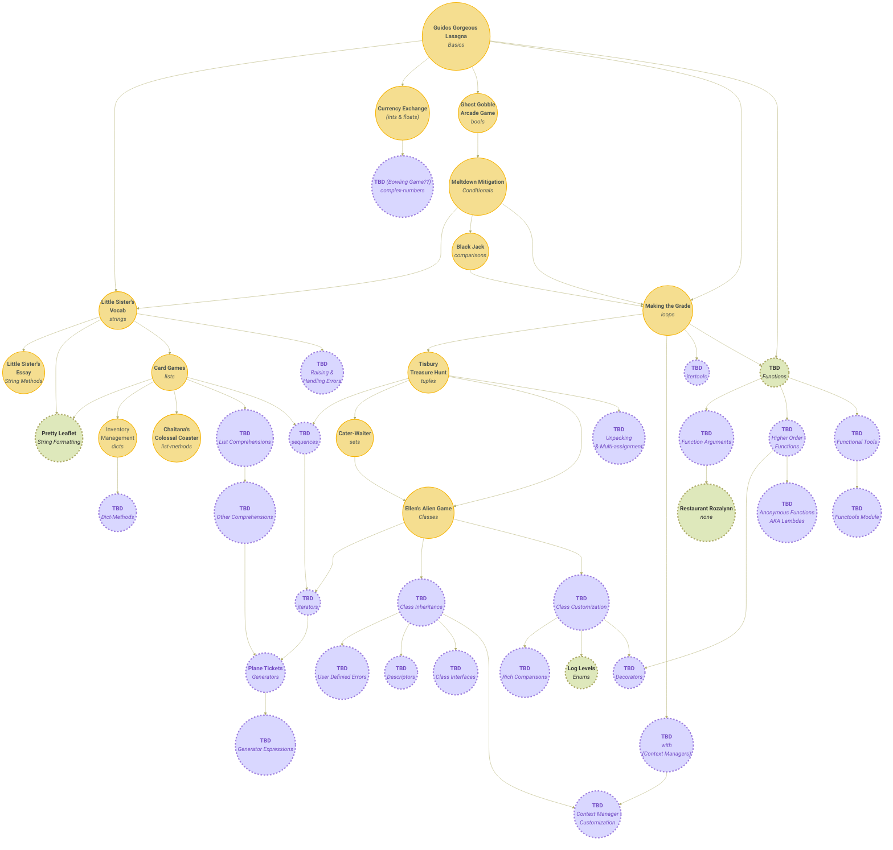

 

<h1>Concept and Practice Exercises</h1>

 

## Implemented Practice Exercises

<b><em>Practice Exercises with Difficulty, Solutions, and Mentor Notes</em></b>

 

| Exercise                                                                                                                                   | Difficulty         | Solutions                                                                                                                                                                                                                            | Prereqs                                                                                                           | Practices                                                                                                         | Mentor Notes                                                                                                           | Jinja?&nbsp;&nbsp;&nbsp;&nbsp;&nbsp; | Approaches? |
| ------------------------------------------------------------------------------------------------------------------------------------------ | ------------------ | ------------------------------------------------------------------------------------------------------------------------------------------------------------------------------------------------------------------------------------ | ----------------------------------------------------------------------------------------------------------------- | ----------------------------------------------------------------------------------------------------------------- | ---------------------------------------------------------------------------------------------------------------------- | ------------------------------------ | ----------- |
| [**Hello World**](https://github.com/exercism/python/blob/main/exercises/practice/hello-world/.docs/instructions.md)                       | 🔹                 | [example](https://github.com/exercism/python/blob/main/exercises/practice/hello-world/.meta/example.py)┋[most⭐](https://exercism.io/tracks/python/exercises/hello-world/solutions?passed_head_tests=true)                           | NONE                                                                                                              | `basics`                                                                                                          |                                                                                                                        | ✅                                   | ❌          |
| [Acronym](https://github.com/exercism/python/blob/main/exercises/practice/acronym/.docs/instructions.md)                                   | 🔹🔹               | [example](https://github.com/exercism/python/blob/main/exercises/practice/acronym/.meta/example.py)┋[most⭐](https://exercism.io/tracks/python/exercises/acronym/solutions?passed_head_tests=true)                                   | [config.json](https://github.com/exercism/python/blob/64396fd483c6c6770c1313b71cb4d972e5ab9819/config.json#L337)  | [config.json](https://github.com/exercism/python/blob/64396fd483c6c6770c1313b71cb4d972e5ab9819/config.json#L330)  | [acronym](https://github.com/exercism/website-copy/tree/main/tracks/python/exercises/acronym/)                         | ✅                                   | ❌          |
| [Affine Cipher](https://github.com/exercism/python/blob/main/exercises/practice/affine-cipher/.docs/instructions.md)                       | 🔹🔹🔹🔹🔹🔹       | [example](https://github.com/exercism/python/blob/main/exercises/practice/affine-cipher/.meta/example.py)┋[most⭐](https://exercism.io/tracks/python/exercises/affine-cipher/solutions?passed_head_tests=true)                       | [config.json](https://github.com/exercism/python/blob/64396fd483c6c6770c1313b71cb4d972e5ab9819/config.json#L1174) | [config.json](https://github.com/exercism/python/blob/64396fd483c6c6770c1313b71cb4d972e5ab9819/config.json#L1173) |                                                                                                                        | ✅                                   | ❌          |
| [All Your Base](https://github.com/exercism/python/blob/main/exercises/practice/all-your-base/.docs/instructions.md)                       | 🔹🔹🔹🔹           | [example](https://github.com/exercism/python/blob/main/exercises/practice/all-your-base/.meta/example.py)┋[most⭐](https://exercism.io/tracks/python/exercises/all-your-base/solutions?passed_head_tests=true)                       | [config.json](https://github.com/exercism/python/blob/64396fd483c6c6770c1313b71cb4d972e5ab9819/config.json#L1394) | [config.json](https://github.com/exercism/python/blob/64396fd483c6c6770c1313b71cb4d972e5ab9819/config.json#L1393) |                                                                                                                        | ✅                                   | ❌          |
| [Allergies](https://github.com/exercism/python/blob/main/exercises/practice/allergies/.docs/instructions.md)                               | 🔹🔹🔹             | [example](https://github.com/exercism/python/blob/main/exercises/practice/allergies/.meta/example.py)┋[most⭐](https://exercism.io/tracks/python/exercises/allergies/solutions?passed_head_tests=true)                               | [config.json](https://github.com/exercism/python/blob/64396fd483c6c6770c1313b71cb4d972e5ab9819/config.json#L701)  | [config.json](https://github.com/exercism/python/blob/64396fd483c6c6770c1313b71cb4d972e5ab9819/config.json#L700)  | [allergies](https://github.com/exercism/website-copy/tree/main/tracks/python/exercises/allergies/)                     | ✅                                   | ❌          |
| [Alphametics](https://github.com/exercism/python/blob/main/exercises/practice/alphametics/.docs/instructions.md)                           | 🔹🔹🔹🔹🔹🔹       | [example](https://github.com/exercism/python/blob/main/exercises/practice/alphametics/.meta/example.py)┋[most⭐](https://exercism.io/tracks/python/exercises/alphametics/solutions?passed_head_tests=true)                           | [config.json](https://github.com/exercism/python/blob/64396fd483c6c6770c1313b71cb4d972e5ab9819/config.json#L1935) | [config.json](https://github.com/exercism/python/blob/64396fd483c6c6770c1313b71cb4d972e5ab9819/config.json#L1934) |                                                                                                                        | ✅                                   | ❌          |
| [Anagram](https://github.com/exercism/python/blob/main/exercises/practice/anagram/.docs/instructions.md)                                   | 🔹                 | [example](https://github.com/exercism/python/blob/main/exercises/practice/anagram/.meta/example.py)┋[most⭐](https://exercism.io/tracks/python/exercises/anagram/solutions?passed_head_tests=true)                                   | [config.json](https://github.com/exercism/python/blob/64396fd483c6c6770c1313b71cb4d972e5ab9819/config.json#L577)  | [config.json](https://github.com/exercism/python/blob/64396fd483c6c6770c1313b71cb4d972e5ab9819/config.json#L576)  |                                                                                                                        | ✅                                   | ❌          |
| [Armstrong Numbers](https://github.com/exercism/python/blob/main/exercises/practice/armstrong-numbers/.docs/instructions.md)               | 🔹                 | [example](https://github.com/exercism/python/blob/main/exercises/practice/armstrong-numbers/.meta/example.py)┋[most⭐](https://exercism.io/tracks/python/exercises/armstrong-numbers/solutions?passed_head_tests=true)               | [config.json](https://github.com/exercism/python/blob/64396fd483c6c6770c1313b71cb4d972e5ab9819/config.json#L512)  | [config.json](https://github.com/exercism/python/blob/64396fd483c6c6770c1313b71cb4d972e5ab9819/config.json#L511)  |                                                                                                                        | ✅                                   | ❌          |
| [Atbash Cipher](https://github.com/exercism/python/blob/main/exercises/practice/atbash-cipher/.docs/instructions.md)                       | 🔹🔹               | [example](https://github.com/exercism/python/blob/main/exercises/practice/atbash-cipher/.meta/example.py)┋[most⭐](https://exercism.io/tracks/python/exercises/atbash-cipher/solutions?passed_head_tests=true)                       | [config.json](https://github.com/exercism/python/blob/64396fd483c6c6770c1313b71cb4d972e5ab9819/config.json#L1102) | [config.json](https://github.com/exercism/python/blob/64396fd483c6c6770c1313b71cb4d972e5ab9819/config.json#L1101) |                                                                                                                        | ✅                                   | ❌          |
| [Bank Account](https://github.com/exercism/python/blob/main/exercises/practice/bank-account/.docs/instructions.md)                         | 🔹🔹🔹🔹🔹🔹       | [example](https://github.com/exercism/python/blob/main/exercises/practice/bank-account/.meta/example.py)┋[most⭐](https://exercism.io/tracks/python/exercises/bank-account/solutions?passed_head_tests=true)                         | [config.json](https://github.com/exercism/python/blob/64396fd483c6c6770c1313b71cb4d972e5ab9819/config.json#L2207) | [config.json](https://github.com/exercism/python/blob/64396fd483c6c6770c1313b71cb4d972e5ab9819/config.json#L2206) |                                                                                                                        | ❌                                   | ❌          |
| [Binary Search Tree](https://github.com/exercism/python/blob/main/exercises/practice/binary-search-tree/.docs/instructions.md)             | 🔹🔹🔹🔹🔹         | [example](https://github.com/exercism/python/blob/main/exercises/practice/binary-search-tree/.meta/example.py)┋[most⭐](https://exercism.io/tracks/python/exercises/binary-search-tree/solutions?passed_head_tests=true)             | [config.json](https://github.com/exercism/python/blob/64396fd483c6c6770c1313b71cb4d972e5ab9819/config.json#L1157) | [config.json](https://github.com/exercism/python/blob/64396fd483c6c6770c1313b71cb4d972e5ab9819/config.json#L1156) |                                                                                                                        | ✅                                   | ❌          |
| [Binary Search](https://github.com/exercism/python/blob/main/exercises/practice/binary-search/.docs/instructions.md)                       | 🔹                 | [example](https://github.com/exercism/python/blob/main/exercises/practice/binary-search/.meta/example.py)┋[most⭐](https://exercism.io/tracks/python/exercises/binary-search/solutions?passed_head_tests=true)                       | [config.json](https://github.com/exercism/python/blob/64396fd483c6c6770c1313b71cb4d972e5ab9819/config.json#L1192) | [config.json](https://github.com/exercism/python/blob/64396fd483c6c6770c1313b71cb4d972e5ab9819/config.json#L1191) | [binary-search](https://github.com/exercism/website-copy/tree/main/tracks/python/exercises/binary-search/)             | ✅                                   | ❌          |
| [Bob](https://github.com/exercism/python/blob/main/exercises/practice/bob/.docs/instructions.md)                                           | 🔹                 | [example](https://github.com/exercism/python/blob/main/exercises/practice/bob/.meta/example.py)┋[most⭐](https://exercism.io/tracks/python/exercises/bob/solutions?passed_head_tests=true)                                           | [config.json](https://github.com/exercism/python/blob/64396fd483c6c6770c1313b71cb4d972e5ab9819/config.json#L715)  | [config.json](https://github.com/exercism/python/blob/64396fd483c6c6770c1313b71cb4d972e5ab9819/config.json#L714)  | [bob](https://github.com/exercism/website-copy/tree/main/tracks/python/exercises/bob/)                                 | ✅                                   | ✅          |
| [Book Store](https://github.com/exercism/python/blob/main/exercises/practice/book-store/.docs/instructions.md)                             | 🔹🔹🔹🔹🔹         | [example](https://github.com/exercism/python/blob/main/exercises/practice/book-store/.meta/example.py)┋[most⭐](https://exercism.io/tracks/python/exercises/book-store/solutions?passed_head_tests=true)                             | [config.json](https://github.com/exercism/python/blob/64396fd483c6c6770c1313b71cb4d972e5ab9819/config.json#L445)  | [config.json](https://github.com/exercism/python/blob/64396fd483c6c6770c1313b71cb4d972e5ab9819/config.json#L437)  |                                                                                                                        | ✅                                   | ❌          |
| [Bottle Song](https://github.com/exercism/python/blob/main/exercises/practice/bottle-song/.docs/instructions.md)                           | 🔹🔹🔹             | [example](https://github.com/exercism/python/blob/main/exercises/practice/bottle-song/.meta/example.py)┋[most⭐](https://exercism.org/tracks/python/exercises/bottle-song/solutions?passed_head_tests=true)                          | [config.json](https://github.com/exercism/python/blob/main/config.json/#LC1012)                                   | [config.json](https://github.com/exercism/python/blob/main/config.json#LC1012)                                    |                                                                                                                        | ✅                                   | ❌          |
| [Bowling](https://github.com/exercism/python/blob/main/exercises/practice/bowling/.docs/instructions.md)                                   | 🔹🔹🔹🔹🔹         | [example](https://github.com/exercism/python/blob/main/exercises/practice/bowling/.meta/example.py)┋[most⭐](https://exercism.io/tracks/python/exercises/bowling/solutions?passed_head_tests=true)                                   | [config.json](https://github.com/exercism/python/blob/64396fd483c6c6770c1313b71cb4d972e5ab9819/config.json#L1553) | [config.json](https://github.com/exercism/python/blob/64396fd483c6c6770c1313b71cb4d972e5ab9819/config.json#L1552) |                                                                                                                        | ✅                                   | ❌          |
| [Change](https://github.com/exercism/python/blob/main/exercises/practice/change/.docs/instructions.md)                                     | 🔹🔹🔹🔹           | [example](https://github.com/exercism/python/blob/main/exercises/practice/change/.meta/example.py)┋[most⭐](https://exercism.io/tracks/python/exercises/change/solutions?passed_head_tests=true)                                     | [config.json](https://github.com/exercism/python/blob/64396fd483c6c6770c1313b71cb4d972e5ab9819/config.json#L1412) | [config.json](https://github.com/exercism/python/blob/64396fd483c6c6770c1313b71cb4d972e5ab9819/config.json#L1411) |                                                                                                                        | ✅                                   | ❌          |
| [Circular Buffer](https://github.com/exercism/python/blob/main/exercises/practice/circular-buffer/.docs/instructions.md)                   | 🔹🔹🔹             | [example](https://github.com/exercism/python/blob/main/exercises/practice/circular-buffer/.meta/example.py)┋[most⭐](https://exercism.io/tracks/python/exercises/circular-buffer/solutions?passed_head_tests=true)                   | [config.json](https://github.com/exercism/python/blob/64396fd483c6c6770c1313b71cb4d972e5ab9819/config.json#L1475) | [config.json](https://github.com/exercism/python/blob/64396fd483c6c6770c1313b71cb4d972e5ab9819/config.json#L1469) |                                                                                                                        | ✅                                   | ❌          |
| [Clock](https://github.com/exercism/python/blob/main/exercises/practice/clock/.docs/instructions.md)                                       | 🔹🔹🔹             | [example](https://github.com/exercism/python/blob/main/exercises/practice/clock/.meta/example.py)┋[most⭐](https://exercism.io/tracks/python/exercises/clock/solutions?passed_head_tests=true)                                       | [config.json](https://github.com/exercism/python/blob/64396fd483c6c6770c1313b71cb4d972e5ab9819/config.json#L394)  | [config.json](https://github.com/exercism/python/blob/64396fd483c6c6770c1313b71cb4d972e5ab9819/config.json#L389)  | [clock](https://github.com/exercism/website-copy/tree/main/tracks/python/exercises/clock/)                             | ✅                                   | ❌          |
| [Collatz Conjecture](https://github.com/exercism/python/blob/main/exercises/practice/collatz-conjecture/.docs/instructions.md)             | 🔹                 | [example](https://github.com/exercism/python/blob/main/exercises/practice/collatz-conjecture/.meta/example.py)┋[most⭐](https://exercism.io/tracks/python/exercises/collatz-conjecture/solutions?passed_head_tests=true)             | [config.json](https://github.com/exercism/python/blob/64396fd483c6c6770c1313b71cb4d972e5ab9819/config.json#L593)  | [config.json](https://github.com/exercism/python/blob/64396fd483c6c6770c1313b71cb4d972e5ab9819/config.json#L592)  |                                                                                                                        | ✅                                   | ❌          |
| [Complex Numbers](https://github.com/exercism/python/blob/main/exercises/practice/complex-numbers/.docs/instructions.md)                   | 🔹🔹🔹🔹           | [example](https://github.com/exercism/python/blob/main/exercises/practice/complex-numbers/.meta/example.py)┋[most⭐](https://exercism.io/tracks/python/exercises/complex-numbers/solutions?passed_head_tests=true)                   | [config.json](https://github.com/exercism/python/blob/64396fd483c6c6770c1313b71cb4d972e5ab9819/config.json#L799)  | [config.json](https://github.com/exercism/python/blob/64396fd483c6c6770c1313b71cb4d972e5ab9819/config.json#L792)  |                                                                                                                        | ✅                                   | ❌          |
| [Connect](https://github.com/exercism/python/blob/main/exercises/practice/connect/.docs/instructions.md)                                   | 🔹🔹🔹             | [example](https://github.com/exercism/python/blob/main/exercises/practice/connect/.meta/example.py)┋[most⭐](https://exercism.io/tracks/python/exercises/connect/solutions?passed_head_tests=true)                                   | [config.json](https://github.com/exercism/python/blob/64396fd483c6c6770c1313b71cb4d972e5ab9819/config.json#L960)  | [config.json](https://github.com/exercism/python/blob/64396fd483c6c6770c1313b71cb4d972e5ab9819/config.json#L959)  |                                                                                                                        | ✅                                   | ❌          |
| [Crypto Square](https://github.com/exercism/python/blob/main/exercises/practice/crypto-square/.docs/instructions.md)                       | 🔹🔹🔹             | [example](https://github.com/exercism/python/blob/main/exercises/practice/crypto-square/.meta/example.py)┋[most⭐](https://exercism.io/tracks/python/exercises/crypto-square/solutions?passed_head_tests=true)                       | [config.json](https://github.com/exercism/python/blob/64396fd483c6c6770c1313b71cb4d972e5ab9819/config.json#L1263) | [config.json](https://github.com/exercism/python/blob/64396fd483c6c6770c1313b71cb4d972e5ab9819/config.json#L1262) |                                                                                                                        | ✅                                   | ❌          |
| [Darts](https://github.com/exercism/python/blob/main/exercises/practice/darts/.docs/instructions.md)                                       | 🔹                 | [example](https://github.com/exercism/python/blob/main/exercises/practice/darts/.meta/example.py)┋[most⭐](https://exercism.io/tracks/python/exercises/darts/solutions?passed_head_tests=true)                                       | [config.json](https://github.com/exercism/python/blob/64396fd483c6c6770c1313b71cb4d972e5ab9819/config.json#L2199) | [config.json](https://github.com/exercism/python/blob/64396fd483c6c6770c1313b71cb4d972e5ab9819/config.json#L2198) |                                                                                                                        | ✅                                   | ❌          |
| [Diamond](https://github.com/exercism/python/blob/main/exercises/practice/diamond/.docs/instructions.md)                                   | 🔹🔹               | [example](https://github.com/exercism/python/blob/main/exercises/practice/diamond/.meta/example.py)┋[most⭐](https://exercism.io/tracks/python/exercises/diamond/solutions?passed_head_tests=true)                                   | [config.json](https://github.com/exercism/python/blob/64396fd483c6c6770c1313b71cb4d972e5ab9819/config.json#L1696) | [config.json](https://github.com/exercism/python/blob/64396fd483c6c6770c1313b71cb4d972e5ab9819/config.json#L1695) |                                                                                                                        | ✅                                   | ❌          |
| [Difference Of Squares](https://github.com/exercism/python/blob/main/exercises/practice/difference-of-squares/.docs/instructions.md)       | 🔹                 | [example](https://github.com/exercism/python/blob/main/exercises/practice/difference-of-squares/.meta/example.py)┋[most⭐](https://exercism.io/tracks/python/exercises/difference-of-squares/solutions?passed_head_tests=true)       | [config.json](https://github.com/exercism/python/blob/64396fd483c6c6770c1313b71cb4d972e5ab9819/config.json#L601)  | NONE                                                                                                              |                                                                                                                        | ✅                                   | ❌          |
| [Diffie Hellman](https://github.com/exercism/python/blob/main/exercises/practice/diffie-hellman/.docs/instructions.md)                     | 🔹🔹🔹             | [example](https://github.com/exercism/python/blob/main/exercises/practice/diffie-hellman/.meta/example.py)┋[most⭐](https://exercism.io/tracks/python/exercises/diffie-hellman/solutions?passed_head_tests=true)                     | [config.json](https://github.com/exercism/python/blob/64396fd483c6c6770c1313b71cb4d972e5ab9819/config.json#L1956) | NONE                                                                                                              |                                                                                                                        | ✅                                   | ❌          |
| [Dnd Character](https://github.com/exercism/python/blob/main/exercises/practice/dnd-character/.docs/instructions.md)                       | 🔹🔹               | [example](https://github.com/exercism/python/blob/main/exercises/practice/dnd-character/.meta/example.py)┋[most⭐](https://exercism.io/tracks/python/exercises/dnd-character/solutions?passed_head_tests=true)                       | [config.json](https://github.com/exercism/python/blob/64396fd483c6c6770c1313b71cb4d972e5ab9819/config.json#L2078) | NONE                                                                                                              |                                                                                                                        | ✅                                   | ❌          |
| [Dominoes](https://github.com/exercism/python/blob/main/exercises/practice/dominoes/.docs/instructions.md)                                 | 🔹🔹🔹🔹🔹🔹🔹     | [example](https://github.com/exercism/python/blob/main/exercises/practice/dominoes/.meta/example.py)┋[most⭐](https://exercism.io/tracks/python/exercises/dominoes/solutions?passed_head_tests=true)                                 | [config.json](https://github.com/exercism/python/blob/64396fd483c6c6770c1313b71cb4d972e5ab9819/config.json#L1767) | [config.json](https://github.com/exercism/python/blob/64396fd483c6c6770c1313b71cb4d972e5ab9819/config.json#L1755) |                                                                                                                        | ✅                                   | ❌          |
| [Dot Dsl](https://github.com/exercism/python/blob/main/exercises/practice/dot-dsl/.docs/instructions.md)                                   | 🔹🔹🔹🔹🔹         | [example](https://github.com/exercism/python/blob/main/exercises/practice/dot-dsl/.meta/example.py)┋[most⭐](https://exercism.io/tracks/python/exercises/dot-dsl/solutions?passed_head_tests=true)                                   | [config.json](https://github.com/exercism/python/blob/64396fd483c6c6770c1313b71cb4d972e5ab9819/config.json#L1434) | [config.json](https://github.com/exercism/python/blob/64396fd483c6c6770c1313b71cb4d972e5ab9819/config.json#L1427) |                                                                                                                        | ❌                                   | ❌          |
| [Etl](https://github.com/exercism/python/blob/main/exercises/practice/etl/.docs/instructions.md)                                           | 🔹                 | [example](https://github.com/exercism/python/blob/main/exercises/practice/etl/.meta/example.py)┋[most⭐](https://exercism.io/tracks/python/exercises/etl/solutions?passed_head_tests=true)                                           | [config.json](https://github.com/exercism/python/blob/64396fd483c6c6770c1313b71cb4d972e5ab9819/config.json#L1118) | [config.json](https://github.com/exercism/python/blob/64396fd483c6c6770c1313b71cb4d972e5ab9819/config.json#L1117) |                                                                                                                        | ✅                                   | ❌          |
| [Flatten Array](https://github.com/exercism/python/blob/main/exercises/practice/flatten-array/.docs/instructions.md)                       | 🔹                 | [example](https://github.com/exercism/python/blob/main/exercises/practice/flatten-array/.meta/example.py)┋[most⭐](https://exercism.io/tracks/python/exercises/flatten-array/solutions?passed_head_tests=true)                       | [config.json](https://github.com/exercism/python/blob/64396fd483c6c6770c1313b71cb4d972e5ab9819/config.json#L1126) | [config.json](https://github.com/exercism/python/blob/64396fd483c6c6770c1313b71cb4d972e5ab9819/config.json#L1125) |                                                                                                                        | ✅                                   | ❌          |
| [Food Chain](https://github.com/exercism/python/blob/main/exercises/practice/food-chain/.docs/instructions.md)                             | 🔹🔹🔹🔹           | [example](https://github.com/exercism/python/blob/main/exercises/practice/food-chain/.meta/example.py)┋[most⭐](https://exercism.io/tracks/python/exercises/food-chain/solutions?passed_head_tests=true)                             | [config.json](https://github.com/exercism/python/blob/64396fd483c6c6770c1313b71cb4d972e5ab9819/config.json#L1737) | [config.json](https://github.com/exercism/python/blob/64396fd483c6c6770c1313b71cb4d972e5ab9819/config.json#L1731) |                                                                                                                        | ✅                                   | ❌          |
| [Forth](https://github.com/exercism/python/blob/main/exercises/practice/forth/.docs/instructions.md)                                       | 🔹🔹🔹🔹🔹         | [example](https://github.com/exercism/python/blob/main/exercises/practice/forth/.meta/example.py)┋[most⭐](https://exercism.io/tracks/python/exercises/forth/solutions?passed_head_tests=true)                                       | [config.json](https://github.com/exercism/python/blob/64396fd483c6c6770c1313b71cb4d972e5ab9819/config.json#L1571) | [config.json](https://github.com/exercism/python/blob/64396fd483c6c6770c1313b71cb4d972e5ab9819/config.json#L1570) |                                                                                                                        | ✅                                   | ❌          |
| [Gigasecond](https://github.com/exercism/python/blob/main/exercises/practice/gigasecond/.docs/instructions.md)                             | 🔹                 | [example](https://github.com/exercism/python/blob/main/exercises/practice/gigasecond/.meta/example.py)┋[most⭐](https://exercism.io/tracks/python/exercises/gigasecond/solutions?passed_head_tests=true)                             |                                                                                                                   | NONE                                                                                                              |                                                                                                                        | ✅                                   | ❌          |
| [Go Counting](https://github.com/exercism/python/blob/main/exercises/practice/go-counting/.docs/instructions.md)                           | 🔹🔹🔹🔹           | [example](https://github.com/exercism/python/blob/main/exercises/practice/go-counting/.meta/example.py)┋[most⭐](https://exercism.io/tracks/python/exercises/go-counting/solutions?passed_head_tests=true)                           | [config.json](https://github.com/exercism/python/blob/64396fd483c6c6770c1313b71cb4d972e5ab9819/config.json#L868)  | [config.json](https://github.com/exercism/python/blob/64396fd483c6c6770c1313b71cb4d972e5ab9819/config.json#L867)  |                                                                                                                        | ✅                                   | ❌          |
| [Grade School](https://github.com/exercism/python/blob/main/exercises/practice/grade-school/.docs/instructions.md)                         | 🔹🔹🔹             | [example](https://github.com/exercism/python/blob/main/exercises/practice/grade-school/.meta/example.py)┋[most⭐](https://exercism.io/tracks/python/exercises/grade-school/solutions?passed_head_tests=true)                         | [config.json](https://github.com/exercism/python/blob/64396fd483c6c6770c1313b71cb4d972e5ab9819/config.json#L364)  | [config.json](https://github.com/exercism/python/blob/64396fd483c6c6770c1313b71cb4d972e5ab9819/config.json#L363)  | [grade-school](https://github.com/exercism/website-copy/tree/main/tracks/python/exercises/grade-school/)               | ✅                                   | ❌          |
| [Grains](https://github.com/exercism/python/blob/main/exercises/practice/grains/.docs/instructions.md)                                     | 🔹                 | [example](https://github.com/exercism/python/blob/main/exercises/practice/grains/.meta/example.py)┋[most⭐](https://exercism.io/tracks/python/exercises/grains/solutions?passed_head_tests=true)                                     | [config.json](https://github.com/exercism/python/blob/64396fd483c6c6770c1313b71cb4d972e5ab9819/config.json#L678)  | [config.json](https://github.com/exercism/python/blob/64396fd483c6c6770c1313b71cb4d972e5ab9819/config.json#L677)  |                                                                                                                        | ✅                                   | ✅          |
| [Grep](https://github.com/exercism/python/blob/main/exercises/practice/grep/.docs/instructions.md)                                         | 🔹🔹🔹🔹           | [example](https://github.com/exercism/python/blob/main/exercises/practice/grep/.meta/example.py)┋[most⭐](https://exercism.io/tracks/python/exercises/grep/solutions?passed_head_tests=true)                                         | [config.json](https://github.com/exercism/python/blob/64396fd483c6c6770c1313b71cb4d972e5ab9819/config.json#L1536) | [config.json](https://github.com/exercism/python/blob/64396fd483c6c6770c1313b71cb4d972e5ab9819/config.json#L1528) |                                                                                                                        | ✅                                   | ❌          |
| [Hamming](https://github.com/exercism/python/blob/main/exercises/practice/hamming/.docs/instructions.md)                                   | 🔹                 | [example](https://github.com/exercism/python/blob/main/exercises/practice/hamming/.meta/example.py)┋[most⭐](https://exercism.io/tracks/python/exercises/hamming/solutions?passed_head_tests=true)                                   | [config.json](https://github.com/exercism/python/blob/64396fd483c6c6770c1313b71cb4d972e5ab9819/config.json#L259)  | [config.json](https://github.com/exercism/python/blob/64396fd483c6c6770c1313b71cb4d972e5ab9819/config.json#L254)  | [hamming](https://github.com/exercism/website-copy/tree/main/tracks/python/exercises/hamming/)                         | ✅                                   | ❌          |
| [Hangman](https://github.com/exercism/python/blob/main/exercises/practice/hangman/.docs/instructions.md)                                   | 🔹🔹🔹🔹           | [example](https://github.com/exercism/python/blob/main/exercises/practice/hangman/.meta/example.py)┋[most⭐](https://exercism.io/tracks/python/exercises/hangman/solutions?passed_head_tests=true)                                   | [config.json](https://github.com/exercism/python/blob/64396fd483c6c6770c1313b71cb4d972e5ab9819/config.json#L2221) | [config.json](https://github.com/exercism/python/blob/64396fd483c6c6770c1313b71cb4d972e5ab9819/config.json#L2220) |                                                                                                                        | ❌                                   | ❌          |
| [High Scores](https://github.com/exercism/python/blob/main/exercises/practice/high-scores/.docs/instructions.md)                           | 🔹 🔹🔹🔹          | [example](https://github.com/exercism/python/blob/main/exercises/practice/high-scores/.meta/example.py)┋[most⭐](https://exercism.io/tracks/python/exercises/high-scores/solutions?passed_head_tests=true)                           | [config.json](https://github.com/exercism/python/blob/64396fd483c6c6770c1313b71cb4d972e5ab9819/config.json#L226)  | [config.json](https://github.com/exercism/python/blob/64396fd483c6c6770c1313b71cb4d972e5ab9819/config.json#L225)  | [high-scores](https://github.com/exercism/website-copy/tree/main/tracks/python/exercises/high-scores/)                 | ✅                                   | ❌          |
| [House](https://github.com/exercism/python/blob/main/exercises/practice/house/.docs/instructions.md)                                       | 🔹                 | [example](https://github.com/exercism/python/blob/main/exercises/practice/house/.meta/example.py)┋[most⭐](https://exercism.io/tracks/python/exercises/house/solutions?passed_head_tests=true)                                       | [config.json](https://github.com/exercism/python/blob/64396fd483c6c6770c1313b71cb4d972e5ab9819/config.json#L1279) | NONE                                                                                                              |                                                                                                                        | ✅                                   | ❌          |
| [Isbn Verifier](https://github.com/exercism/python/blob/main/exercises/practice/isbn-verifier/.docs/instructions.md)                       | 🔹                 | [example](https://github.com/exercism/python/blob/main/exercises/practice/isbn-verifier/.meta/example.py)┋[most⭐](https://exercism.io/tracks/python/exercises/isbn-verifier/solutions?passed_head_tests=true)                       | [config.json](https://github.com/exercism/python/blob/64396fd483c6c6770c1313b71cb4d972e5ab9819/config.json#L609)  | NONE                                                                                                              |                                                                                                                        | ✅                                   | ❌          |
| [Isogram](https://github.com/exercism/python/blob/main/exercises/practice/isogram/.docs/instructions.md)                                   | 🔹                 | [example](https://github.com/exercism/python/blob/main/exercises/practice/isogram/.meta/example.py)┋[most⭐](https://exercism.io/tracks/python/exercises/isogram/solutions?passed_head_tests=true)                                   | [config.json](https://github.com/exercism/python/blob/64396fd483c6c6770c1313b71cb4d972e5ab9819/config.json#L273)  | [config.json](https://github.com/exercism/python/blob/64396fd483c6c6770c1313b71cb4d972e5ab9819/config.json#L272)  | [isogram](https://github.com/exercism/website-copy/tree/main/tracks/python/exercises/isogram/)                         | ✅                                   | ✅          |
| [Kindergarten Garden](https://github.com/exercism/python/blob/main/exercises/practice/kindergarten-garden/.docs/instructions.md)           | 🔹🔹🔹             | [example](https://github.com/exercism/python/blob/main/exercises/practice/kindergarten-garden/.meta/example.py)┋[most⭐](https://exercism.io/tracks/python/exercises/kindergarten-garden/solutions?passed_head_tests=true)           | [config.json](https://github.com/exercism/python/blob/64396fd483c6c6770c1313b71cb4d972e5ab9819/config.json#L350)  | [config.json](https://github.com/exercism/python/blob/64396fd483c6c6770c1313b71cb4d972e5ab9819/config.json#L344)  | [kindergarten-garden](https://github.com/exercism/website-copy/tree/main/tracks/python/exercises/kindergarten-garden/) | ✅                                   | ❌          |
| [Knapsack](https://github.com/exercism/python/blob/main/exercises/practice/knapsack/.docs/instructions.md)                                 | 🔹🔹🔹🔹🔹         | [example](https://github.com/exercism/python/blob/main/exercises/practice/knapsack/.meta/example.py)┋[most⭐](https://exercism.io/tracks/python/exercises/knapsack/solutions?passed_head_tests=true)                                 | [config.json](https://github.com/exercism/python/blob/64396fd483c6c6770c1313b71cb4d972e5ab9819/config.json#L1453) | [config.json](https://github.com/exercism/python/blob/64396fd483c6c6770c1313b71cb4d972e5ab9819/config.json#L1452) |                                                                                                                        | ✅                                   | ❌          |
| [Largest Series Product](https://github.com/exercism/python/blob/main/exercises/practice/largest-series-product/.docs/instructions.md)     | 🔹🔹🔹🔹           | [example](https://github.com/exercism/python/blob/main/exercises/practice/largest-series-product/.meta/example.py)┋[most⭐](https://exercism.io/tracks/python/exercises/largest-series-product/solutions?passed_head_tests=true)     | [config.json](https://github.com/exercism/python/blob/64396fd483c6c6770c1313b71cb4d972e5ab9819/config.json#L945)  | [config.json](https://github.com/exercism/python/blob/64396fd483c6c6770c1313b71cb4d972e5ab9819/config.json#L939)  |                                                                                                                        | ✅                                   | ❌          |
| [Leap](https://github.com/exercism/python/blob/main/exercises/practice/leap/.docs/instructions.md)                                         | 🔹                 | [example](https://github.com/exercism/python/blob/main/exercises/practice/leap/.meta/example.py)┋[most⭐](https://exercism.io/tracks/python/exercises/leap/solutions?passed_head_tests=true)                                         | [config.json](https://github.com/exercism/python/blob/64396fd483c6c6770c1313b71cb4d972e5ab9819/config.json#L2103) | [config.json](https://github.com/exercism/python/blob/64396fd483c6c6770c1313b71cb4d972e5ab9819/config.json#L2102) | [leap](https://github.com/exercism/website-copy/tree/main/tracks/python/exercises/leap/)                               | ✅                                   | ✅          |
| [Ledger](https://github.com/exercism/python/blob/main/exercises/practice/ledger/.docs/instructions.md)                                     | 🔹🔹🔹🔹           | [example](https://github.com/exercism/python/blob/main/exercises/practice/ledger/.meta/example.py)┋[most⭐](https://exercism.io/tracks/python/exercises/ledger/solutions?passed_head_tests=true)                                     | [config.json](https://github.com/exercism/python/blob/64396fd483c6c6770c1313b71cb4d972e5ab9819/config.json#L1590) | [config.json](https://github.com/exercism/python/blob/64396fd483c6c6770c1313b71cb4d972e5ab9819/config.json#L1589) |                                                                                                                        | ❌                                   | ❌          |
| [Linked List](https://github.com/exercism/python/blob/main/exercises/practice/linked-list/.docs/instructions.md)                           | 🔹🔹🔹🔹           | [example](https://github.com/exercism/python/blob/main/exercises/practice/linked-list/.meta/example.py)┋[most⭐](https://exercism.io/tracks/python/exercises/linked-list/solutions?passed_head_tests=true)                           | [config.json](https://github.com/exercism/python/blob/64396fd483c6c6770c1313b71cb4d972e5ab9819/config.json#L1379) | [config.json](https://github.com/exercism/python/blob/64396fd483c6c6770c1313b71cb4d972e5ab9819/config.json#L1371) |                                                                                                                        | ❌                                   | ❌          |
| [List Ops](https://github.com/exercism/python/blob/main/exercises/practice/list-ops/.docs/instructions.md)                                 | 🔹                 | [example](https://github.com/exercism/python/blob/main/exercises/practice/list-ops/.meta/example.py)┋[most⭐](https://exercism.io/tracks/python/exercises/list-ops/solutions?passed_head_tests=true)                                 | [config.json](https://github.com/exercism/python/blob/64396fd483c6c6770c1313b71cb4d972e5ab9819/config.json#L1294) | NONE                                                                                                              |                                                                                                                        | ✅                                   | ❌          |
| [Luhn](https://github.com/exercism/python/blob/main/exercises/practice/luhn/.docs/instructions.md)                                         | 🔹🔹               | [example](https://github.com/exercism/python/blob/main/exercises/practice/luhn/.meta/example.py)┋[most⭐](https://exercism.io/tracks/python/exercises/luhn/solutions?passed_head_tests=true)                                         | [config.json](https://github.com/exercism/python/blob/64396fd483c6c6770c1313b71cb4d972e5ab9819/config.json#L372)  | [config.json](https://github.com/exercism/python/blob/64396fd483c6c6770c1313b71cb4d972e5ab9819/config.json#L371)  | [luhn](https://github.com/exercism/website-copy/tree/main/tracks/python/exercises/luhn/)                               | ✅                                   | ❌          |
| [Markdown](https://github.com/exercism/python/blob/main/exercises/practice/markdown/.docs/instructions.md)                                 | 🔹🔹🔹🔹           | [example](https://github.com/exercism/python/blob/main/exercises/practice/markdown/.meta/example.py)┋[most⭐](https://exercism.io/tracks/python/exercises/markdown/solutions?passed_head_tests=true)                                 |                                                                                                                   | [config.json](https://github.com/exercism/python/blob/64396fd483c6c6770c1313b71cb4d972e5ab9819/config.json#L401)  | [markdown](https://github.com/exercism/website-copy/tree/main/tracks/python/exercises/markdown/)                       | ✅                                   | ❌          |
| [Matching Brackets](https://github.com/exercism/python/blob/main/exercises/practice/matching-brackets/.docs/instructions.md)               | 🔹🔹               | [example](https://github.com/exercism/python/blob/main/exercises/practice/matching-brackets/.meta/example.py)┋[most⭐](https://exercism.io/tracks/python/exercises/matching-brackets/solutions?passed_head_tests=true)               | [config.json](https://github.com/exercism/python/blob/64396fd483c6c6770c1313b71cb4d972e5ab9819/config.json#L728)  | NONE                                                                                                              | [matching-brackets](https://github.com/exercism/website-copy/tree/main/tracks/python/exercises/matching-brackets/)     | ✅                                   | ❌          |
| [Matrix](https://github.com/exercism/python/blob/main/exercises/practice/matrix/.docs/instructions.md)                                     | 🔹🔹🔹             | [example](https://github.com/exercism/python/blob/main/exercises/practice/matrix/.meta/example.py)┋[most⭐](https://exercism.io/tracks/python/exercises/matrix/solutions?passed_head_tests=true)                                     | [config.json](https://github.com/exercism/python/blob/64396fd483c6c6770c1313b71cb4d972e5ab9819/config.json#L1714) | [config.json](https://github.com/exercism/python/blob/64396fd483c6c6770c1313b71cb4d972e5ab9819/config.json#L1713) | [matrix](https://github.com/exercism/website-copy/tree/main/tracks/python/exercises/matrix/)                           | ✅                                   | ❌          |
| [Meetup](https://github.com/exercism/python/blob/main/exercises/practice/meetup/.docs/instructions.md)                                     | 🔹🔹🔹🔹           | [example](https://github.com/exercism/python/blob/main/exercises/practice/meetup/.meta/example.py)┋[most⭐](https://exercism.io/tracks/python/exercises/meetup/solutions?passed_head_tests=true)                                     | [config.json](https://github.com/exercism/python/blob/64396fd483c6c6770c1313b71cb4d972e5ab9819/config.json#L818)  | [config.json](https://github.com/exercism/python/blob/64396fd483c6c6770c1313b71cb4d972e5ab9819/config.json#L812)  |                                                                                                                        | ✅                                   | ❌          |
| [Minesweeper](https://github.com/exercism/python/blob/main/exercises/practice/minesweeper/.docs/instructions.md)                           | 🔹🔹🔹🔹           | [example](https://github.com/exercism/python/blob/main/exercises/practice/minesweeper/.meta/example.py)┋[most⭐](https://exercism.io/tracks/python/exercises/minesweeper/solutions?passed_head_tests=true)                           | [config.json](https://github.com/exercism/python/blob/64396fd483c6c6770c1313b71cb4d972e5ab9819/config.json#L981)  | [config.json](https://github.com/exercism/python/blob/64396fd483c6c6770c1313b71cb4d972e5ab9819/config.json#L980)  |                                                                                                                        | ✅                                   | ❌          |
| [Nth Prime](https://github.com/exercism/python/blob/main/exercises/practice/nth-prime/.docs/instructions.md)                               | 🔹🔹               | [example](https://github.com/exercism/python/blob/main/exercises/practice/nth-prime/.meta/example.py)┋[most⭐](https://exercism.io/tracks/python/exercises/nth-prime/solutions?passed_head_tests=true)                               | [config.json](https://github.com/exercism/python/blob/64396fd483c6c6770c1313b71cb4d972e5ab9819/config.json#L1814) | NONE                                                                                                              |                                                                                                                        | ✅                                   | ❌          |
| [Ocr Numbers](https://github.com/exercism/python/blob/main/exercises/practice/ocr-numbers/.docs/instructions.md)                           | 🔹🔹🔹             | [example](https://github.com/exercism/python/blob/main/exercises/practice/ocr-numbers/.meta/example.py)┋[most⭐](https://exercism.io/tracks/python/exercises/ocr-numbers/solutions?passed_head_tests=true)                           | [config.json](https://github.com/exercism/python/blob/64396fd483c6c6770c1313b71cb4d972e5ab9819/config.json#L997)  | NONE                                                                                                              |                                                                                                                        | ✅                                   | ❌          |
| [Paasio](https://github.com/exercism/python/blob/main/exercises/practice/paasio/.docs/instructions.md)                                     | 🔹🔹🔹🔹🔹🔹🔹     | [example](https://github.com/exercism/python/blob/main/exercises/practice/paasio/.meta/example.py)┋[most⭐](https://exercism.io/tracks/python/exercises/paasio/solutions?passed_head_tests=true)                                     | [config.json](https://github.com/exercism/python/blob/64396fd483c6c6770c1313b71cb4d972e5ab9819/config.json#L1917) | [config.json](https://github.com/exercism/python/blob/64396fd483c6c6770c1313b71cb4d972e5ab9819/config.json#L1906) |                                                                                                                        | ❌                                   | ❌          |
| [Palindrome Products](https://github.com/exercism/python/blob/main/exercises/practice/palindrome-products/.docs/instructions.md)           | 🔹🔹🔹🔹           | [example](https://github.com/exercism/python/blob/main/exercises/practice/palindrome-products/.meta/example.py)┋[most⭐](https://exercism.io/tracks/python/exercises/palindrome-products/solutions?passed_head_tests=true)           | [config.json](https://github.com/exercism/python/blob/64396fd483c6c6770c1313b71cb4d972e5ab9819/config.json#L626)  | [config.json](https://github.com/exercism/python/blob/64396fd483c6c6770c1313b71cb4d972e5ab9819/config.json#L625)  |                                                                                                                        | ✅                                   | ❌          |
| [Pangram](https://github.com/exercism/python/blob/main/exercises/practice/pangram/.docs/instructions.md)                                   | 🔹                 | [example](https://github.com/exercism/python/blob/main/exercises/practice/pangram/.meta/example.py)┋[most⭐](https://exercism.io/tracks/python/exercises/pangram/solutions?passed_head_tests=true)                                   | [config.json](https://github.com/exercism/python/blob/64396fd483c6c6770c1313b71cb4d972e5ab9819/config.json#L463)  | [config.json](https://github.com/exercism/python/blob/64396fd483c6c6770c1313b71cb4d972e5ab9819/config.json#L462)  |                                                                                                                        | ✅                                   | ✅          |
| [Perfect Numbers](https://github.com/exercism/python/blob/main/exercises/practice/perfect-numbers/.docs/instructions.md)                   | 🔹                 | [example](https://github.com/exercism/python/blob/main/exercises/practice/perfect-numbers/.meta/example.py)┋[most⭐](https://exercism.io/tracks/python/exercises/perfect-numbers/solutions?passed_head_tests=true)                   | [config.json](https://github.com/exercism/python/blob/64396fd483c6c6770c1313b71cb4d972e5ab9819/config.json#L527)  | NONE                                                                                                              |                                                                                                                        | ✅                                   | ❌          |
| [Phone Number](https://github.com/exercism/python/blob/main/exercises/practice/phone-number/.docs/instructions.md)                         | 🔹🔹               | [example](https://github.com/exercism/python/blob/main/exercises/practice/phone-number/.meta/example.py)┋[most⭐](https://exercism.io/tracks/python/exercises/phone-number/solutions?passed_head_tests=true)                         | [config.json](https://github.com/exercism/python/blob/64396fd483c6c6770c1313b71cb4d972e5ab9819/config.json#L547)  | [config.json](https://github.com/exercism/python/blob/64396fd483c6c6770c1313b71cb4d972e5ab9819/config.json#L542)  |                                                                                                                        | ✅                                   | ❌          |
| [Pig Latin](https://github.com/exercism/python/blob/main/exercises/practice/pig-latin/.docs/instructions.md)                               | 🔹🔹               | [example](https://github.com/exercism/python/blob/main/exercises/practice/pig-latin/.meta/example.py)┋[most⭐](https://exercism.io/tracks/python/exercises/pig-latin/solutions?passed_head_tests=true)                               | [config.json](https://github.com/exercism/python/blob/64396fd483c6c6770c1313b71cb4d972e5ab9819/config.json#L1832) | [config.json](https://github.com/exercism/python/blob/64396fd483c6c6770c1313b71cb4d972e5ab9819/config.json#L1831) |                                                                                                                        | ✅                                   | ✅          |
| [Poker](https://github.com/exercism/python/blob/main/exercises/practice/poker/.docs/instructions.md)                                       | 🔹🔹🔹             | [example](https://github.com/exercism/python/blob/main/exercises/practice/poker/.meta/example.py)┋[most⭐](https://exercism.io/tracks/python/exercises/poker/solutions?passed_head_tests=true)                                       | [config.json](https://github.com/exercism/python/blob/64396fd483c6c6770c1313b71cb4d972e5ab9819/config.json#L1016) | [config.json](https://github.com/exercism/python/blob/64396fd483c6c6770c1313b71cb4d972e5ab9819/config.json#L1015) |                                                                                                                        | ✅                                   | ❌          |
| [Pov](https://github.com/exercism/python/blob/main/exercises/practice/pov/.docs/instructions.md)                                           | 🔹🔹🔹🔹🔹🔹🔹🔹🔹 | [example](https://github.com/exercism/python/blob/main/exercises/practice/pov/.meta/example.py)┋[most⭐](https://exercism.io/tracks/python/exercises/pov/solutions?passed_head_tests=true)                                           | [config.json](https://github.com/exercism/python/blob/64396fd483c6c6770c1313b71cb4d972e5ab9819/config.json#L1677) | [config.json](https://github.com/exercism/python/blob/64396fd483c6c6770c1313b71cb4d972e5ab9819/config.json#L1676) |                                                                                                                        | ✅                                   | ❌          |
| [Prime Factors](https://github.com/exercism/python/blob/main/exercises/practice/prime-factors/.docs/instructions.md)                       | 🔹🔹               | [example](https://github.com/exercism/python/blob/main/exercises/practice/prime-factors/.meta/example.py)┋[most⭐](https://exercism.io/tracks/python/exercises/prime-factors/solutions?passed_head_tests=true)                       | [config.json](https://github.com/exercism/python/blob/64396fd483c6c6770c1313b71cb4d972e5ab9819/config.json#L686)  | [config.json](https://github.com/exercism/python/blob/64396fd483c6c6770c1313b71cb4d972e5ab9819/config.json#L685)  |                                                                                                                        | ✅                                   | ❌          |
| [Protein Translation](https://github.com/exercism/python/blob/main/exercises/practice/protein-translation/.docs/instructions.md)           | 🔹🔹               | [example](https://github.com/exercism/python/blob/main/exercises/practice/protein-translation/.meta/example.py)┋[most⭐](https://exercism.io/tracks/python/exercises/protein-translation/solutions?passed_head_tests=true)           | [config.json](https://github.com/exercism/python/blob/64396fd483c6c6770c1313b71cb4d972e5ab9819/config.json#L496)  | [config.json](https://github.com/exercism/python/blob/64396fd483c6c6770c1313b71cb4d972e5ab9819/config.json#L495)  |                                                                                                                        | ✅                                   | ❌          |
| [Proverb](https://github.com/exercism/python/blob/main/exercises/practice/proverb/.docs/instructions.md)                                   | 🔹🔹               | [example](https://github.com/exercism/python/blob/main/exercises/practice/proverb/.meta/example.py)┋[most⭐](https://exercism.io/tracks/python/exercises/proverb/solutions?passed_head_tests=true)                                   | [config.json](https://github.com/exercism/python/blob/main/config.json#LC661)                                     | [config.json](https://github.com/exercism/python/blob/main/config.json#L661)                                      |                                                                                                                        | ✅                                   | ❌          |
| [Pythagorean Triplet](https://github.com/exercism/python/blob/main/exercises/practice/pythagorean-triplet/.docs/instructions.md)           | 🔹🔹🔹             | [example](https://github.com/exercism/python/blob/main/exercises/practice/pythagorean-triplet/.meta/example.py)┋[most⭐](https://exercism.io/tracks/python/exercises/pythagorean-triplet/solutions?passed_head_tests=true)           | [config.json](https://github.com/exercism/python/blob/64396fd483c6c6770c1313b71cb4d972e5ab9819/config.json#L745)  | [config.json](https://github.com/exercism/python/blob/64396fd483c6c6770c1313b71cb4d972e5ab9819/config.json#L744)  |                                                                                                                        | ✅                                   | ❌          |
| [Queen Attack](https://github.com/exercism/python/blob/main/exercises/practice/queen-attack/.docs/instructions.md)                         | 🔹🔹               | [example](https://github.com/exercism/python/blob/main/exercises/practice/queen-attack/.meta/example.py)┋[most⭐](https://exercism.io/tracks/python/exercises/queen-attack/solutions?passed_head_tests=true)                         | [config.json](https://github.com/exercism/python/blob/64396fd483c6c6770c1313b71cb4d972e5ab9819/config.json#L1302) | NONE                                                                                                              |                                                                                                                        | ✅                                   | ❌          |
| [Rail Fence Cipher](https://github.com/exercism/python/blob/main/exercises/practice/rail-fence-cipher/.docs/instructions.md)               | 🔹🔹🔹🔹           | [example](https://github.com/exercism/python/blob/main/exercises/practice/rail-fence-cipher/.meta/example.py)┋[most⭐](https://exercism.io/tracks/python/exercises/rail-fence-cipher/solutions?passed_head_tests=true)               | [config.json](https://github.com/exercism/python/blob/64396fd483c6c6770c1313b71cb4d972e5ab9819/config.json#L1849) | [config.json](https://github.com/exercism/python/blob/64396fd483c6c6770c1313b71cb4d972e5ab9819/config.json#L1848) |                                                                                                                        | ✅                                   | ❌          |
| [Raindrops](https://github.com/exercism/python/blob/main/exercises/practice/raindrops/.docs/instructions.md)                               | 🔹                 | [example](https://github.com/exercism/python/blob/main/exercises/practice/raindrops/.meta/example.py)┋[most⭐](https://exercism.io/tracks/python/exercises/raindrops/solutions?passed_head_tests=true)                               | [config.json](https://github.com/exercism/python/blob/64396fd483c6c6770c1313b71cb4d972e5ab9819/config.json#L210)  | [config.json](https://github.com/exercism/python/blob/64396fd483c6c6770c1313b71cb4d972e5ab9819/config.json#L209)  | [raindrops](https://github.com/exercism/website-copy/tree/main/tracks/python/exercises/raindrops/)                     | ✅                                   | ❌          |
| [Rational Numbers](https://github.com/exercism/python/blob/main/exercises/practice/rational-numbers/.docs/instructions.md)                 | 🔹🔹🔹🔹🔹         | [example](https://github.com/exercism/python/blob/main/exercises/practice/rational-numbers/.meta/example.py)┋[most⭐](https://exercism.io/tracks/python/exercises/rational-numbers/solutions?passed_head_tests=true)                 | [config.json](https://github.com/exercism/python/blob/64396fd483c6c6770c1313b71cb4d972e5ab9819/config.json#L2240) | [config.json](https://github.com/exercism/python/blob/64396fd483c6c6770c1313b71cb4d972e5ab9819/config.json#L2239) |                                                                                                                        | ✅                                   | ❌          |
| [React](https://github.com/exercism/python/blob/main/exercises/practice/react/.docs/instructions.md)                                       | 🔹🔹🔹🔹🔹🔹       | [example](https://github.com/exercism/python/blob/main/exercises/practice/react/.meta/example.py)┋[most⭐](https://exercism.io/tracks/python/exercises/react/solutions?passed_head_tests=true)                                       | [config.json](https://github.com/exercism/python/blob/64396fd483c6c6770c1313b71cb4d972e5ab9819/config.json#L890)  | [config.json](https://github.com/exercism/python/blob/64396fd483c6c6770c1313b71cb4d972e5ab9819/config.json#L884)  |                                                                                                                        | ❌                                   | ❌          |
| [Rectangles](https://github.com/exercism/python/blob/main/exercises/practice/rectangles/.docs/instructions.md)                             | 🔹🔹🔹             | [example](https://github.com/exercism/python/blob/main/exercises/practice/rectangles/.meta/example.py)┋[most⭐](https://exercism.io/tracks/python/exercises/rectangles/solutions?passed_head_tests=true)                             | [config.json](https://github.com/exercism/python/blob/64396fd483c6c6770c1313b71cb4d972e5ab9819/config.json#L1032) | [config.json](https://github.com/exercism/python/blob/64396fd483c6c6770c1313b71cb4d972e5ab9819/config.json#L1031) |                                                                                                                        | ✅                                   | ❌          |
| [Resistor Color Trio](https://github.com/exercism/python/blob/main/exercises/practice/resistor-color-trio/.docs/instructions.md)           | 🔹🔹               | [example](https://github.com/exercism/python/blob/main/exercises/practice/resistor-color-trio/.meta/example.py)┋[most⭐](https://exercism.io/tracks/python/exercises/resistor-color-trio/solutions?passed_head_tests=true)           | [config.json](https://github.com/exercism/python/blob/main/config.json#LC631)                                     | [config.json](https://github.com/exercism/python/blob/main/config.json#L631)                                      |                                                                                                                        | ✅                                   | ❌          |
| [Resistor Color Duo](https://github.com/exercism/python/blob/main/exercises/practice/resistor-color-duo/.docs/instructions.md)             | 🔹                 | [example](https://github.com/exercism/python/blob/main/exercises/practice/resistor-color-duo/.meta/example.py)┋[most⭐](https://exercism.io/tracks/python/exercises/resistor-color-duo/solutions?passed_head_tests=true)             | [config.json](https://github.com/exercism/python/blob/64396fd483c6c6770c1313b71cb4d972e5ab9819/config.json#L2119) | NONE                                                                                                              |                                                                                                                        | ✅                                   | ❌          |
| [Resistor Color](https://github.com/exercism/python/blob/main/exercises/practice/resistor-color/.docs/instructions.md)                     | 🔹                 | [example](https://github.com/exercism/python/blob/main/exercises/practice/resistor-color/.meta/example.py)┋[most⭐](https://exercism.io/tracks/python/exercises/resistor-color/solutions?passed_head_tests=true)                     | [config.json](https://github.com/exercism/python/blob/64396fd483c6c6770c1313b71cb4d972e5ab9819/config.json#L2111) | [config.json](https://github.com/exercism/python/blob/64396fd483c6c6770c1313b71cb4d972e5ab9819/config.json#L2110) |                                                                                                                        | ✅                                   | ❌          |
| [Rest Api](https://github.com/exercism/python/blob/main/exercises/practice/rest-api/.docs/instructions.md)                                 | 🔹🔹🔹🔹🔹🔹🔹🔹   | [example](https://github.com/exercism/python/blob/main/exercises/practice/rest-api/.meta/example.py)┋[most⭐](https://exercism.io/tracks/python/exercises/rest-api/solutions?passed_head_tests=true)                                 | [config.json](https://github.com/exercism/python/blob/64396fd483c6c6770c1313b71cb4d972e5ab9819/config.json#L1795) | [config.json](https://github.com/exercism/python/blob/64396fd483c6c6770c1313b71cb4d972e5ab9819/config.json#L1787) |                                                                                                                        | ✅                                   | ❌          |
| [Reverse String](https://github.com/exercism/python/blob/main/exercises/practice/reverse-string/.docs/instructions.md)                     | 🔹                 | [example](https://github.com/exercism/python/blob/main/exercises/practice/reverse-string/.meta/example.py)┋[most⭐](https://exercism.io/tracks/python/exercises/reverse-string/solutions?passed_head_tests=true)                     | [config.json](https://github.com/exercism/python/blob/64396fd483c6c6770c1313b71cb4d972e5ab9819/config.json#L2133) | NONE                                                                                                              | [reverse-string](https://github.com/exercism/website-copy/tree/main/tracks/python/exercises/reverse-string/)           | ✅                                   | ❌          |
| [Rna Transcription](https://github.com/exercism/python/blob/main/exercises/practice/rna-transcription/.docs/instructions.md)               | 🔹                 | [example](https://github.com/exercism/python/blob/main/exercises/practice/rna-transcription/.meta/example.py)┋[most⭐](https://exercism.io/tracks/python/exercises/rna-transcription/solutions?passed_head_tests=true)               | [config.json](https://github.com/exercism/python/blob/64396fd483c6c6770c1313b71cb4d972e5ab9819/config.json#L2149) | [config.json](https://github.com/exercism/python/blob/64396fd483c6c6770c1313b71cb4d972e5ab9819/config.json#L2148) |                                                                                                                        | ✅                                   | ✅          |
| [Robot Name](https://github.com/exercism/python/blob/main/exercises/practice/robot-name/.docs/instructions.md)                             | 🔹🔹               | [example](https://github.com/exercism/python/blob/main/exercises/practice/robot-name/.meta/example.py)┋[most⭐](https://exercism.io/tracks/python/exercises/robot-name/solutions?passed_head_tests=true)                             | [config.json](https://github.com/exercism/python/blob/64396fd483c6c6770c1313b71cb4d972e5ab9819/config.json#L479)  | NONE                                                                                                              |                                                                                                                        | ❌                                   | ❌          |
| [Robot Simulator](https://github.com/exercism/python/blob/main/exercises/practice/robot-simulator/.docs/instructions.md)                   | 🔹🔹🔹             | [example](https://github.com/exercism/python/blob/main/exercises/practice/robot-simulator/.meta/example.py)┋[most⭐](https://exercism.io/tracks/python/exercises/robot-simulator/solutions?passed_head_tests=true)                   | [config.json](https://github.com/exercism/python/blob/64396fd483c6c6770c1313b71cb4d972e5ab9819/config.json#L1324) | [config.json](https://github.com/exercism/python/blob/64396fd483c6c6770c1313b71cb4d972e5ab9819/config.json#L1315) |                                                                                                                        | ✅                                   | ❌          |
| [Roman Numerals](https://github.com/exercism/python/blob/main/exercises/practice/roman-numerals/.docs/instructions.md)                     | 🔹🔹               | [example](https://github.com/exercism/python/blob/main/exercises/practice/roman-numerals/.meta/example.py)┋[most⭐](https://exercism.io/tracks/python/exercises/roman-numerals/solutions?passed_head_tests=true)                     | [config.json](https://github.com/exercism/python/blob/64396fd483c6c6770c1313b71cb4d972e5ab9819/config.json#L1340) | NONE                                                                                                              |                                                                                                                        | ✅                                   | ❌          |
| [Rotational Cipher](https://github.com/exercism/python/blob/main/exercises/practice/rotational-cipher/.docs/instructions.md)               | 🔹                 | [example](https://github.com/exercism/python/blob/main/exercises/practice/rotational-cipher/.meta/example.py)┋[most⭐](https://exercism.io/tracks/python/exercises/rotational-cipher/solutions?passed_head_tests=true)               | [config.json](https://github.com/exercism/python/blob/64396fd483c6c6770c1313b71cb4d972e5ab9819/config.json#L1209) | [config.json](https://github.com/exercism/python/blob/64396fd483c6c6770c1313b71cb4d972e5ab9819/config.json#L1208) |                                                                                                                        | ✅                                   | ❌          |
| [Run Length Encoding](https://github.com/exercism/python/blob/main/exercises/practice/run-length-encoding/.docs/instructions.md)           | 🔹🔹               | [example](https://github.com/exercism/python/blob/main/exercises/practice/run-length-encoding/.meta/example.py)┋[most⭐](https://exercism.io/tracks/python/exercises/run-length-encoding/solutions?passed_head_tests=true)           | [config.json](https://github.com/exercism/python/blob/64396fd483c6c6770c1313b71cb4d972e5ab9819/config.json#L1493) | [config.json](https://github.com/exercism/python/blob/64396fd483c6c6770c1313b71cb4d972e5ab9819/config.json#L1492) |                                                                                                                        | ✅                                   | ❌          |
| [Saddle Points](https://github.com/exercism/python/blob/main/exercises/practice/saddle-points/.docs/instructions.md)                       | 🔹🔹🔹             | [example](https://github.com/exercism/python/blob/main/exercises/practice/saddle-points/.meta/example.py)┋[most⭐](https://exercism.io/tracks/python/exercises/saddle-points/solutions?passed_head_tests=true)                       | [config.json](https://github.com/exercism/python/blob/64396fd483c6c6770c1313b71cb4d972e5ab9819/config.json#L649)  | [config.json](https://github.com/exercism/python/blob/64396fd483c6c6770c1313b71cb4d972e5ab9819/config.json#L643)  |                                                                                                                        | ✅                                   | ❌          |
| [Satellite](https://github.com/exercism/python/blob/main/exercises/practice/satellite/.docs/instructions.md)                               | 🔹🔹🔹🔹🔹🔹🔹     | [example](https://github.com/exercism/python/blob/main/exercises/practice/satellite/.meta/example.py)┋[most⭐](https://exercism.io/tracks/python/exercises/satellite/solutions?passed_head_tests=true)                               | [config.json](https://github.com/exercism/python/blob/64396fd483c6c6770c1313b71cb4d972e5ab9819/config.json#L1640) | [config.json](https://github.com/exercism/python/blob/64396fd483c6c6770c1313b71cb4d972e5ab9819/config.json#L1634) |                                                                                                                        | ✅                                   | ❌          |
| [Say](https://github.com/exercism/python/blob/main/exercises/practice/say/.docs/instructions.md)                                           | 🔹🔹               | [example](https://github.com/exercism/python/blob/main/exercises/practice/say/.meta/example.py)┋[most⭐](https://exercism.io/tracks/python/exercises/say/solutions?passed_head_tests=true)                                           | [config.json](https://github.com/exercism/python/blob/64396fd483c6c6770c1313b71cb4d972e5ab9819/config.json#L1052) | [config.json](https://github.com/exercism/python/blob/64396fd483c6c6770c1313b71cb4d972e5ab9819/config.json#L1051) |                                                                                                                        | ✅                                   | ❌          |
| [Scale Generator](https://github.com/exercism/python/blob/main/exercises/practice/scale-generator/.docs/instructions.md)                   | 🔹🔹🔹🔹           | [example](https://github.com/exercism/python/blob/main/exercises/practice/scale-generator/.meta/example.py)┋[most⭐](https://exercism.io/tracks/python/exercises/scale-generator/solutions?passed_head_tests=true)                   | [config.json](https://github.com/exercism/python/blob/64396fd483c6c6770c1313b71cb4d972e5ab9819/config.json#L1084) | [config.json](https://github.com/exercism/python/blob/64396fd483c6c6770c1313b71cb4d972e5ab9819/config.json#L1083) |                                                                                                                        | ✅                                   | ❌          |
| [Scrabble Score](https://github.com/exercism/python/blob/main/exercises/practice/scrabble-score/.docs/instructions.md)                     | 🔹🔹               | [example](https://github.com/exercism/python/blob/main/exercises/practice/scrabble-score/.meta/example.py)┋[most⭐](https://exercism.io/tracks/python/exercises/scrabble-score/solutions?passed_head_tests=true)                     | [config.json](https://github.com/exercism/python/blob/64396fd483c6c6770c1313b71cb4d972e5ab9819/config.json#L316)  | [config.json](https://github.com/exercism/python/blob/64396fd483c6c6770c1313b71cb4d972e5ab9819/config.json#L315)  | [scrabble-score](https://github.com/exercism/website-copy/tree/main/tracks/python/exercises/scrabble-score/)           | ✅                                   | ❌          |
| [Secret Handshake](https://github.com/exercism/python/blob/main/exercises/practice/secret-handshake/.docs/instructions.md)                 | 🔹                 | [example](https://github.com/exercism/python/blob/main/exercises/practice/secret-handshake/.meta/example.py)┋[most⭐](https://exercism.io/tracks/python/exercises/secret-handshake/solutions?passed_head_tests=true)                 | [config.json](https://github.com/exercism/python/blob/64396fd483c6c6770c1313b71cb4d972e5ab9819/config.json#L924)  | [config.json](https://github.com/exercism/python/blob/64396fd483c6c6770c1313b71cb4d972e5ab9819/config.json#L923)  |                                                                                                                        | ✅                                   | ❌          |
| [Series](https://github.com/exercism/python/blob/main/exercises/practice/series/.docs/instructions.md)                                     | 🔹🔹               | [example](https://github.com/exercism/python/blob/main/exercises/practice/series/.meta/example.py)┋[most⭐](https://exercism.io/tracks/python/exercises/series/solutions?passed_head_tests=true)                                     | [config.json](https://github.com/exercism/python/blob/64396fd483c6c6770c1313b71cb4d972e5ab9819/config.json#L562)  | [config.json](https://github.com/exercism/python/blob/64396fd483c6c6770c1313b71cb4d972e5ab9819/config.json#L561)  |                                                                                                                        | ✅                                   | ❌          |
| [Sgf Parsing](https://github.com/exercism/python/blob/main/exercises/practice/sgf-parsing/.docs/instructions.md)                           | 🔹🔹🔹🔹🔹🔹🔹     | [example](https://github.com/exercism/python/blob/main/exercises/practice/sgf-parsing/.meta/example.py)┋[most⭐](https://exercism.io/tracks/python/exercises/sgf-parsing/solutions?passed_head_tests=true)                           | [config.json](https://github.com/exercism/python/blob/64396fd483c6c6770c1313b71cb4d972e5ab9819/config.json#L2261) | [config.json](https://github.com/exercism/python/blob/64396fd483c6c6770c1313b71cb4d972e5ab9819/config.json#L2255) |                                                                                                                        | ✅                                   | ❌          |
| [Sieve](https://github.com/exercism/python/blob/main/exercises/practice/sieve/.docs/instructions.md)                                       | 🔹🔹🔹             | [example](https://github.com/exercism/python/blob/main/exercises/practice/sieve/.meta/example.py)┋[most⭐](https://exercism.io/tracks/python/exercises/sieve/solutions?passed_head_tests=true)                                       | [config.json](https://github.com/exercism/python/blob/64396fd483c6c6770c1313b71cb4d972e5ab9819/config.json#L836)  | [config.json](https://github.com/exercism/python/blob/64396fd483c6c6770c1313b71cb4d972e5ab9819/config.json#L835)  |                                                                                                                        | ✅                                   | ❌          |
| [Simple Cipher](https://github.com/exercism/python/blob/main/exercises/practice/simple-cipher/.docs/instructions.md)                       | 🔹🔹🔹             | [example](https://github.com/exercism/python/blob/main/exercises/practice/simple-cipher/.meta/example.py)┋[most⭐](https://exercism.io/tracks/python/exercises/simple-cipher/solutions?passed_head_tests=true)                       | [config.json](https://github.com/exercism/python/blob/64396fd483c6c6770c1313b71cb4d972e5ab9819/config.json#L761)  | NONE                                                                                                              |                                                                                                                        | ✅                                   | ❌          |
| [Simple Linked List](https://github.com/exercism/python/blob/main/exercises/practice/simple-linked-list/.docs/instructions.md)             | 🔹🔹🔹             | [example](https://github.com/exercism/python/blob/main/exercises/practice/simple-linked-list/.meta/example.py)┋[most⭐](https://exercism.io/tracks/python/exercises/simple-linked-list/solutions?passed_head_tests=true)             | [config.json](https://github.com/exercism/python/blob/64396fd483c6c6770c1313b71cb4d972e5ab9819/config.json#L1357) | [config.json](https://github.com/exercism/python/blob/64396fd483c6c6770c1313b71cb4d972e5ab9819/config.json#L1356) |                                                                                                                        | ❌                                   | ❌          |
| [Space Age](https://github.com/exercism/python/blob/main/exercises/practice/space-age/.docs/instructions.md)                               | 🔹                 | [example](https://github.com/exercism/python/blob/main/exercises/practice/space-age/.meta/example.py)┋[most⭐](https://exercism.io/tracks/python/exercises/space-age/solutions?passed_head_tests=true)                               | [config.json](https://github.com/exercism/python/blob/64396fd483c6c6770c1313b71cb4d972e5ab9819/config.json#L2164) | [config.json](https://github.com/exercism/python/blob/64396fd483c6c6770c1313b71cb4d972e5ab9819/config.json#L2163) |                                                                                                                        | ✅                                   | ❌          |
| [Spiral Matrix](https://github.com/exercism/python/blob/main/exercises/practice/spiral-matrix/.docs/instructions.md)                       | 🔹🔹🔹🔹           | [example](https://github.com/exercism/python/blob/main/exercises/practice/spiral-matrix/.meta/example.py)┋[most⭐](https://exercism.io/tracks/python/exercises/spiral-matrix/solutions?passed_head_tests=true)                       | [config.json](https://github.com/exercism/python/blob/64396fd483c6c6770c1313b71cb4d972e5ab9819/config.json#L1714) | [config.json](https://github.com/exercism/python/blob/64396fd483c6c6770c1313b71cb4d972e5ab9819/config.json#L1713) |                                                                                                                        | ✅                                   | ❌          |
| [Sublist](https://github.com/exercism/python/blob/main/exercises/practice/sublist/.docs/instructions.md)                                   | 🔹🔹               | [example](https://github.com/exercism/python/blob/main/exercises/practice/sublist/.meta/example.py)┋[most⭐](https://exercism.io/tracks/python/exercises/sublist/solutions?passed_head_tests=true)                                   | [config.json](https://github.com/exercism/python/blob/64396fd483c6c6770c1313b71cb4d972e5ab9819/config.json#L1141) | [config.json](https://github.com/exercism/python/blob/64396fd483c6c6770c1313b71cb4d972e5ab9819/config.json#L1140) |                                                                                                                        | ✅                                   | ❌          |
| [Sum Of Multiples](https://github.com/exercism/python/blob/main/exercises/practice/sum-of-multiples/.docs/instructions.md)                 | 🔹                 | [example](https://github.com/exercism/python/blob/main/exercises/practice/sum-of-multiples/.meta/example.py)┋[most⭐](https://exercism.io/tracks/python/exercises/sum-of-multiples/solutions?passed_head_tests=true)                 | [config.json](https://github.com/exercism/python/blob/64396fd483c6c6770c1313b71cb4d972e5ab9819/config.json#L778)  | [config.json](https://github.com/exercism/python/blob/64396fd483c6c6770c1313b71cb4d972e5ab9819/config.json#L777)  | [sum-of-multiples](https://github.com/exercism/website-copy/tree/main/tracks/python/exercises/sum-of-multiples/)       | ✅                                   | ❌          |
| [Tournament](https://github.com/exercism/python/blob/main/exercises/practice/tournament/.docs/instructions.md)                             | 🔹🔹🔹🔹           | [example](https://github.com/exercism/python/blob/main/exercises/practice/tournament/.meta/example.py)┋[most⭐](https://exercism.io/tracks/python/exercises/tournament/solutions?passed_head_tests=true)                             | [config.json](https://github.com/exercism/python/blob/64396fd483c6c6770c1313b71cb4d972e5ab9819/config.json#L421)  | [config.json](https://github.com/exercism/python/blob/64396fd483c6c6770c1313b71cb4d972e5ab9819/config.json#L409)  |                                                                                                                        | ✅                                   | ❌          |
| [Transpose](https://github.com/exercism/python/blob/main/exercises/practice/transpose/.docs/instructions.md)                               | 🔹🔹               | [example](https://github.com/exercism/python/blob/main/exercises/practice/transpose/.meta/example.py)┋[most⭐](https://exercism.io/tracks/python/exercises/transpose/solutions?passed_head_tests=true)                               | [config.json](https://github.com/exercism/python/blob/64396fd483c6c6770c1313b71cb4d972e5ab9819/config.json#L1511) | [config.json](https://github.com/exercism/python/blob/64396fd483c6c6770c1313b71cb4d972e5ab9819/config.json#L1510) |                                                                                                                        | ✅                                   | ❌          |
| [Tree Building](https://github.com/exercism/python/blob/main/exercises/practice/tree-building/.docs/instructions.md)                       | 🔹🔹🔹             | [example](https://github.com/exercism/python/blob/main/exercises/practice/tree-building/.meta/example.py)┋[most⭐](https://exercism.io/tracks/python/exercises/tree-building/solutions?passed_head_tests=true)                       | [config.json](https://github.com/exercism/python/blob/64396fd483c6c6770c1313b71cb4d972e5ab9819/config.json#L852)  | [config.json](https://github.com/exercism/python/blob/64396fd483c6c6770c1313b71cb4d972e5ab9819/config.json#L851)  |                                                                                                                        | ❌                                   | ❌          |
| [Triangle](https://github.com/exercism/python/blob/main/exercises/practice/triangle/.docs/instructions.md)                                 | 🔹                 | [example](https://github.com/exercism/python/blob/main/exercises/practice/triangle/.meta/example.py)┋[most⭐](https://exercism.io/tracks/python/exercises/triangle/solutions?passed_head_tests=true)                                 | [config.json](https://github.com/exercism/python/blob/64396fd483c6c6770c1313b71cb4d972e5ab9819/config.json#L664)  | [config.json](https://github.com/exercism/python/blob/64396fd483c6c6770c1313b71cb4d972e5ab9819/config.json#L663)  |                                                                                                                        | ✅                                   | ❌          |
| [Twelve Days](https://github.com/exercism/python/blob/main/exercises/practice/twelve-days/.docs/instructions.md)                           | 🔹🔹               | [example](https://github.com/exercism/python/blob/main/exercises/practice/twelve-days/.meta/example.py)┋[most⭐](https://exercism.io/tracks/python/exercises/twelve-days/solutions?passed_head_tests=true)                           | [config.json](https://github.com/exercism/python/blob/64396fd483c6c6770c1313b71cb4d972e5ab9819/config.json#L281)  | [config.json](https://github.com/exercism/python/blob/64396fd483c6c6770c1313b71cb4d972e5ab9819/config.json#L280)  | [twelve-days](https://github.com/exercism/website-copy/tree/main/tracks/python/exercises/twelve-days/)                 | ✅                                   | ❌          |
| [Two Bucket](https://github.com/exercism/python/blob/main/exercises/practice/two-bucket/.docs/instructions.md)                             | 🔹🔹🔹🔹🔹🔹       | [example](https://github.com/exercism/python/blob/main/exercises/practice/two-bucket/.meta/example.py)┋[most⭐](https://exercism.io/tracks/python/exercises/two-bucket/solutions?passed_head_tests=true)                             | [config.json](https://github.com/exercism/python/blob/64396fd483c6c6770c1313b71cb4d972e5ab9819/config.json#L1244) | [config.json](https://github.com/exercism/python/blob/64396fd483c6c6770c1313b71cb4d972e5ab9819/config.json#L1243) |                                                                                                                        | ✅                                   | ❌          |
| [Two Fer](https://github.com/exercism/python/blob/main/exercises/practice/two-fer/.docs/instructions.md)                                   | 🔹                 | [example](https://github.com/exercism/python/blob/main/exercises/practice/two-fer/.meta/example.py)┋[most⭐](https://exercism.io/tracks/python/exercises/two-fer/solutions?passed_head_tests=true)                                   | [config.json](https://github.com/exercism/python/blob/64396fd483c6c6770c1313b71cb4d972e5ab9819/config.json#L202)  | [config.json](https://github.com/exercism/python/blob/64396fd483c6c6770c1313b71cb4d972e5ab9819/config.json#L201)  | [two-fer](https://github.com/exercism/website-copy/tree/main/tracks/python/exercises/two-fer/)                         | ✅                                   | ❌          |
| [Variable Length Quantity](https://github.com/exercism/python/blob/main/exercises/practice/variable-length-quantity/.docs/instructions.md) | 🔹🔹🔹🔹           | [example](https://github.com/exercism/python/blob/main/exercises/practice/variable-length-quantity/.meta/example.py)┋[most⭐](https://exercism.io/tracks/python/exercises/variable-length-quantity/solutions?passed_head_tests=true) | [config.json](https://github.com/exercism/python/blob/64396fd483c6c6770c1313b71cb4d972e5ab9819/config.json#L1226) | [config.json](https://github.com/exercism/python/blob/64396fd483c6c6770c1313b71cb4d972e5ab9819/config.json#L1225) |                                                                                                                        | ✅                                   | ❌          |
| [Word Count](https://github.com/exercism/python/blob/main/exercises/practice/word-count/.docs/instructions.md)                             | 🔹🔹               | [example](https://github.com/exercism/python/blob/main/exercises/practice/word-count/.meta/example.py)┋[most⭐](https://exercism.io/tracks/python/exercises/word-count/solutions?passed_head_tests=true)                             | [config.json](https://github.com/exercism/python/blob/64396fd483c6c6770c1313b71cb4d972e5ab9819/config.json#L302)  | [config.json](https://github.com/exercism/python/blob/64396fd483c6c6770c1313b71cb4d972e5ab9819/config.json#L296)  | [word-count](https://github.com/exercism/website-copy/tree/main/tracks/python/exercises/word-count/)                   | ✅                                   | ❌          |
| [Word Search](https://github.com/exercism/python/blob/main/exercises/practice/word-search/.docs/instructions.md)                           | 🔹🔹🔹🔹🔹🔹       | [example](https://github.com/exercism/python/blob/main/exercises/practice/word-search/.meta/example.py)┋[most⭐](https://exercism.io/tracks/python/exercises/word-search/solutions?passed_head_tests=true)                           | [config.json](https://github.com/exercism/python/blob/64396fd483c6c6770c1313b71cb4d972e5ab9819/config.json#L1616) | [config.json](https://github.com/exercism/python/blob/64396fd483c6c6770c1313b71cb4d972e5ab9819/config.json#L1606) |                                                                                                                        | ✅                                   | ❌          |
| [Wordy](https://github.com/exercism/python/blob/main/exercises/practice/wordy/.docs/instructions.md)                                       | 🔹                 | [example](https://github.com/exercism/python/blob/main/exercises/practice/wordy/.meta/example.py)┋[most⭐](https://exercism.io/tracks/python/exercises/wordy/solutions?passed_head_tests=true)                                       | [config.json](https://github.com/exercism/python/blob/64396fd483c6c6770c1313b71cb4d972e5ab9819/config.json#L1069) | [config.json](https://github.com/exercism/python/blob/64396fd483c6c6770c1313b71cb4d972e5ab9819/config.json#L1068) |                                                                                                                        | ✅                                   | ✅          |
| [Yacht](https://github.com/exercism/python/blob/main/exercises/practice/yacht/.docs/instructions.md)                                       | 🔹🔹               | [example](https://github.com/exercism/python/blob/main/exercises/practice/yacht/.meta/example.py)┋[most⭐](https://exercism.io/tracks/python/exercises/yacht/solutions?passed_head_tests=true)                                       | [config.json](https://github.com/exercism/python/blob/64396fd483c6c6770c1313b71cb4d972e5ab9819/config.json#L2180) | [config.json](https://github.com/exercism/python/blob/64396fd483c6c6770c1313b71cb4d972e5ab9819/config.json#L2179) |                                                                                                                        | ✅                                   | ❌          |
| [Zebra Puzzle](https://github.com/exercism/python/blob/main/exercises/practice/zebra-puzzle/.docs/instructions.md)                         | 🔹🔹🔹🔹🔹         | [example](https://github.com/exercism/python/blob/main/exercises/practice/zebra-puzzle/.meta/example.py)┋[most⭐](https://exercism.io/tracks/python/exercises/zebra-puzzle/solutions?passed_head_tests=true)                         | [config.json](https://github.com/exercism/python/blob/64396fd483c6c6770c1313b71cb4d972e5ab9819/config.json#L1866) | [config.json](https://github.com/exercism/python/blob/64396fd483c6c6770c1313b71cb4d972e5ab9819/config.json#L1865) |                                                                                                                        | ✅                                   | ❌          |
| [Zipper](https://github.com/exercism/python/blob/main/exercises/practice/zipper/.docs/instructions.md)                                     | 🔹🔹🔹🔹🔹🔹       | [example](https://github.com/exercism/python/blob/main/exercises/practice/zipper/.meta/example.py)┋[most⭐](https://exercism.io/tracks/python/exercises/zipper/solutions?passed_head_tests=true)                                     | [config.json](https://github.com/exercism/python/blob/64396fd483c6c6770c1313b71cb4d972e5ab9819/config.json#L1659) | [config.json](https://github.com/exercism/python/blob/64396fd483c6c6770c1313b71cb4d972e5ab9819/config.json#L1658) |                                                                                                                        | ✅                                   | ❌          |

 

### Deprecated

| Exercise                                                                                                                                     | Difficulty |
| -------------------------------------------------------------------------------------------------------------------------------------------- | ---------- |
| [Accumulate](https://github.com/exercism/python/blob/main/exercises/practice/accumulate/.docs/instructions.md)                               | 🔹🔹       |
| [Beer Song](https://github.com/exercism/python/blob/main/exercises/practice/beer-song/.docs/instructions.md)                                 | 🔹🔹🔹     |
| [Binary](https://github.com/exercism/python/blob/main/exercises/practice/binary/.docs/instructions.md)                                       | 🔹🔹🔹     |
| [Error Handling](https://github.com/exercism/python/blob/main/exercises/practice/error-handling/.docs/instructions.md)                       | 🔹🔹🔹     |
| [Hexadecimal](https://github.com/exercism/python/blob/main/exercises/practice/hexadecimal/.docs/instructions.md)                             | 🔹🔹🔹     |
| [Nucleotide Count](https://github.com/exercism/python/blob/main/exercises/practice/nucleotide-count/.docs/instructions.md)                   | 🔹🔹       |
| [Parallel Letter Frequency](https://github.com/exercism/python/blob/main/exercises/practice/parallel-letter-frequency/.docs/instructions.md) | 🔹🔹🔹     |
| [Pascal's Triangle](https://github.com/exercism/python/blob/main/exercises/practice/pascals-triangle/.docs/instructions.md)                  | 🔹🔹🔹     |
| [Point Mutations](https://github.com/exercism/python/blob/main/exercises/practice/point-mutations/.docs/instructions.md)                     | 🔹🔹🔹     |
| [Trinary](https://github.com/exercism/python/blob/main/exercises/practice/trinary/.docs/instructions.md)                                     | 🔹🔹🔹🔹   |
| [Custom Set](https://github.com/exercism/python/blob/main/exercises/practice/custom-set/.docs/instructions.md)                               | 🔹🔹🔹🔹🔹 |

 

 

## Concepts Without Planned Exercises

<b><em>No Exercises Planned</b></em>

 

| Status | Concept                                  | About&Intro | Exercise | Design Doc or Issue |
| :----: | ---------------------------------------- | :---------: | -------- | ------------------- |
|   ~~   | \*general--Composition                   |     ~~      | NA       | NA                  |
|   ~~   | \*general--Data Structures]              |     ~~      | NA       | NA                  |
|   ~~   | \*general--Encapsulation                 |     ~~      | NA       | NA                  |
|   ~~   | \*general--Interfaces]                   |     ~~      | NA       | NA                  |
|   ~~   | \*general--Lookup efficiency]            |     ~~      | NA       | NA                  |
|   ~~   | \*general--Mutability in Python]         |     ~~      | NA       | NA                  |
|   ~~   | \*general--Mutation                      |     ~~      | NA       | NA                  |
|   ~~   | \*general--Polymorphism                  |     ~~      | NA       | NA                  |
|   ~~   | \*general--Recursive data structures     |     ~~      | NA       | NA                  |
|   ~~   | \*general--Scope                         |     ~~      | NA       | NA                  |
|   ~~   | \*general--Standard Library              |     ~~      | NA       | NA                  |
|   ~~   | \*general--State                         |     ~~      | NA       | NA                  |
|   ~~   | \*no stand-alone--del                    |     ~~      | Multiple | Multiple            |
|   ~~   | \*no stand-alone--Duck Typing            |     ~~      | Multiple | Multiple            |
|   ~~   | \*no stand-alone--Dynamic Typing         |     ~~      | Multiple | Multiple            |
|   ~~   | \*no stand-alone--Expressions            |     ~~      | Multiple | Multiple            |
|   ~~   | \*no stand-alone--Immutability in Python |     ~~      | Multiple | Multiple            |
|   ~~   | \*no stand-alone--Operator precedence    |     ~~      | Multiple | Multiple            |
|   ~~   | \*no stand-alone--Operators]             |     ~~      | Multiple | Multiple            |
|   ~~   | \*no stand-alone--Order of Evaluation    |     ~~      | Multiple | Multiple            |
|   ~~   | \*no stand-alone--type                   |     ~~      | Multiple | Multiple            |
|   ~~   | \*no stand-alone--type conversion        |     ~~      | Multiple | Multiple            |

 

 

## Implemented & Planned Concept Exercises

<em>  = live on exercism.org &nbsp;&nbsp;&nbsp;&nbsp;&nbsp;&nbsp;
 = drafted but not live

 = planned or in progress &nbsp;&nbsp;
 = future
</em>

 

|                     Status                     | Concept                                                                                                                      |                  About&Intro                   | Exercise                                                                                                                      | Design Doc or Issue                                                                                              | Stub Docstring Level |
| :--------------------------------------------: | :--------------------------------------------------------------------------------------------------------------------------- | :--------------------------------------------: | :---------------------------------------------------------------------------------------------------------------------------- | :--------------------------------------------------------------------------------------------------------------- | :---------------------- |
|   | [basics](https://github.com/exercism/python/blob/main/concepts/basics)                                                       |   | [Guidos Gorgeous Lasagna](https://github.com/exercism/python/tree/main/tree/main/exercises/concept/guidos-gorgeous-lasagna)   | [`.meta`folder](https://github.com/exercism/python/tree/main/exercises/concept/guidos-gorgeous-lasagna/.meta)    | Full                    |
|   | [bools](https://github.com/exercism/python/blob/main/concepts/bools)                                                         |   | [Ghost Gobble Arcade Game](https://github.com/exercism/python/tree/main/tree/main/exercises/concept/ghost-gobble-arcade-game) | [`.meta`folder](https://github.com/exercism/python/tree/main/exercises/concept/ghost-gobble-arcade-game/.meta)   | Full                    |
|   | [numbers](https://github.com/exercism/python/blob/main/concepts/numbers)                                                     |   | [Currency Exchange](https://github.com/exercism/python/tree/main/exercises/concept/currency-exchange)                         | [`.meta`folder](https://github.com/exercism/python/tree/main/exercises/concept/currency-exchange/.meta)          | Full                    |
|    | [complex-numbers](https://github.com/exercism/python/blob/main/concepts/complex-numbers)                                     |    | ~                                                                                                                             | [#2208](https://github.com/exercism/v3/issues/2208)                                                              | TBD                     |
|   | [conditionals](https://github.com/exercism/python/blob/main/concepts/conditionals)                                           |   | [Meltdown Mitigation ](https://github.com/exercism/python/tree/main/exercises/concept/meltdown-mitigation)                    | [`.meta`folder](https://github.com/exercism/python/tree/main/exercises/concept/meltdown-mitigation/.meta)        | Full                    |
|   | [comparisons](https://github.com/exercism/python/blob/main/concepts/comparisons)                                             |   | [Black Jack](https://github.com/exercism/python/tree/main/exercises/concept/black-jack)                                       | [`.meta`folder](https://github.com/exercism/python/tree/main/exercises/concept/black-jack/.meta)                 | Full                    |
|   | [strings](https://github.com/exercism/python/blob/main/concepts/strings)                                                     |   | [Litte Sister's Vocab](https://github.com/exercism/python/tree/main/exercises/concept/little-sisters-vocab)                   | [`.meta`folder](https://github.com/exercism/python/tree/main/exercises/concept/little-sisters-vocab/.meta)       | Full                    |
|   | [string-methods](https://github.com/exercism/python/blob/main/concepts/string-methods)                                       |   | [Litte Sister's Essay](https://github.com/exercism/python/tree/main/exercises/concept/little-sisters-essay)                   | [`.meta`folder](https://github.com/exercism/python/tree/main/exercises/concept/little-sisters-essay/.meta)       | Full                    |
|    | [string-formatting](https://github.com/exercism/python/blob/main/concepts/string-formatting)                                 |    | [Pretty Leaflet ](https://github.com/exercism/python/tree/main/exercises/concept/pretty-leaflet)                              | [`.meta`folder](https://github.com/exercism/python/tree/main/exercises/concept/pretty-leaflet/.meta)             | Full                    |
|   | [lists](https://github.com/exercism/python/blob/main/concepts/lists)                                                         |   | [Card Games](https://github.com/exercism/python/tree/main/exercises/concept/card-games)                                       | [`.meta`folder](https://github.com/exercism/python/tree/main/exercises/concept/card-games/.meta)                 | Full                    |
|   | [list-methods](https://github.com/exercism/python/blob/main/concepts/list-methods)                                           |   | [Chaitanas Colossal Coaster](https://github.com/exercism/python/tree/main/exercises/concept/chaitanas-colossal-coaster)       | [`.meta`folder](https://github.com/exercism/python/tree/main/exercises/concept/chaitanas-colossal-coaster/.meta) | Full                    |
|   | [loops](https://github.com/exercism/python/blob/main/concepts/loops)                                                         |   | [Making the Grade](https://github.com/exercism/python/tree/main/exercises/concept/making-the-grade)                           | [`.meta`folder](https://github.com/exercism/python/tree/main/exercises/concept/making-the-grade/.meta)           | Full                    |
|   | [tuples](https://github.com/exercism/python/blob/main/concepts/tuples)                                                       |   | [Tisbury Treasure Hunt](https://github.com/exercism/python/tree/main/exercises/concept/tisbury-treasure-hunt)                 | [`.meta`folder](https://github.com/exercism/python/tree/main/exercises/concept/tisbury-treasure-hunt/.meta)      | Full                    |
|    | [sequences](https://github.com/exercism/python/blob/main/concepts/sequences)                                                 |    | ~                                                                                                                             | [#2290](https://github.com/exercism/python/issues/2290)                                                          | TBD                     |
|   | [dicts](https://github.com/exercism/python/blob/main/concepts/dicts)                                                         |   | [Inventory Management](https://github.com/exercism/python/tree/main/exercises/concept/inventory-management)                   | [`.meta`folder](https://github.com/exercism/python/tree/main/exercises/concept/inventory-management)             | Full                    |
|    | [dict-methods](https://github.com/exercism/python/blob/main/concepts/dict-methods)                                           |    | ~                                                                                                                             | [#2348](https://github.com/exercism/python/issues/2348)                                                          |                         |
|   | [sets](https://github.com/exercism/python/blob/main/concepts/sets)                                                           |   | [Cater Waiter ](https://github.com/exercism/python/tree/main/exercises/concept/cater-waiter)                                  | [`.meta`folder](https://github.com/exercism/python/tree/main/exercises/concept/cater-waiter/.meta)               | Full                    |
|    | [list-comprehensions](https://github.com/exercism/python/blob/main/concepts/list-comprehensions)                             |    | ~                                                                                                                             | [#2295](https://github.com/exercism/python/issues/2295)                                                          |                         |
|    | [other-comprehensions](https://github.com/exercism/python/blob/main/concepts/other-comprehensions)                           |    | ~                                                                                                                             | [#2294](https://github.com/exercism/python/issues/2294)                                                          |                         |
|   | [classes](https://github.com/exercism/python/blob/main/concepts/classes)                                                     |   | [Ellen's Alien Game](https://github.com/exercism/python/tree/main/exercises/concept/ellens-alien-game)                        | [`.meta`folder](https://github.com/exercism/python/tree/main/exercises/concept/ellens-alien-game/.meta)          | Minimal                 |
|    | [generators](https://github.com/exercism/python/blob/main/concepts/generators)                                               |    | Plane Tickets                                                                                                                 | [PR#2729](https://github.com/exercism/python/pull/2729)/[#2293](https://github.com/exercism/python/issues/2293)  | Minimal                 |
|    | [generator-expressions](https://github.com/exercism/python/blob/main/concepts/generator-expressions)                         |    | ~                                                                                                                             | [#2292](https://github.com/exercism/python/issues/2292)                                                          |                         |
|    | [iterators](https://github.com/exercism/python/blob/main/concepts/iterators)                                                 |    | ~                                                                                                                             | [#2367](https://github.com/exercism/python/issues/2367)                                                          | TBD                     |
|    | [functions](https://github.com/exercism/python/blob/main/concepts/functions)                                                 |    | ~                                                                                                                             | [#2353](https://github.com/exercism/python/issues/2353)                                                          |                         |
|    | [unpacking-and-multiple-assignment](https://github.com/exercism/python/blob/main/concepts/unpacking-and-multiple-assignment) |    | ~                                                                                                                             | [#2360](https://github.com/exercism/python/issues/2360)                                                          |                         |
|    | [raising-and-handling-errors](https://github.com/exercism/python/blob/main/concepts/raising-and-handling-errors)             |    | ~                                                                                                                             | TBD                                                                                                              |                         |
|    | [itertools](https://github.com/exercism/python/blob/main/concepts/itertools)                                                 |    | ~                                                                                                                             | [#2368](https://github.com/exercism/python/issues/2368)                                                          |                         |
|    | [with-statement](https://github.com/exercism/python/blob/main/concepts/with-statement)                                       |    | ~                                                                                                                             | [#2369](https://github.com/exercism/python/issues/2369)                                                          |                         |
|    | [enums](https://github.com/exercism/python/blob/main/concepts/enums)                                                         |    | [Log Levels](https://github.com/exercism/python/tree/main/exercises/concept/log-levels)                                       | [`.meta`folder](https://github.com/exercism/python/tree/main/exercises/concept/log-levels)                       | Minimal                 |
|    | [none](https://github.com/exercism/python/blob/main/concepts/none)                                                           |    | [Restaurant Rozalynn](https://github.com/exercism/python/tree/main/exercises/concept/restaurant-rozalynn)                     | [`.meta`folder](https://github.com/exercism/python/tree/main/exercises/concept/restaurant-rozalynn/.meta)        | Minimal                 |
|    | [decorators](https://github.com/exercism/python/blob/main/concepts/decorators)                                               |    | ~                                                                                                                             | [#2356](https://github.com/exercism/python/issues/2356)                                                          |                         |
|    | [rich-comparisons](https://github.com/exercism/python/blob/main/concepts/rich-comparisons)                                   |    | ~                                                                                                                             | [#2287](https://github.com/exercism/python/issues/2287)                                                          |                         |
|    | [function-arguments](https://github.com/exercism/python/blob/main/concepts/function-arguments)                               |    | ~                                                                                                                             | [#2354](https://github.com/exercism/python/issues/2354)                                                          |                         |
|    | [class-customization](https://github.com/exercism/python/blob/main/concepts/class-customization)                             |    | ~                                                                                                                             | [#2350](https://github.com/exercism/python/issues/2350)                                                          |                         |
|    | [class-inheritance](https://github.com/exercism/python/blob/main/concepts/class-inheritance)                                 |    | ~                                                                                                                             | [#2351](https://github.com/exercism/python/issues/2351)                                                          |                         |
|    | [user-defined-errors](https://github.com/exercism/python/blob/main/concepts/user-defined-errors)                             |    | ~                                                                                                                             | TBD                                                                                                              |                         |
|    | [context-manager-customization](https://github.com/exercism/python/blob/main/concepts/context-manager-customization)         |    | ~                                                                                                                             | [#2370](https://github.com/exercism/python/issues/2370)                                                          |                         |
|    | [higher-order-functions](https://github.com/exercism/python/blob/main/concepts/higher-order-functions)                       |    | ~                                                                                                                             | [#2355](https://github.com/exercism/python/issues/2355)                                                          |                         |
|    | [functional-tools](https://github.com/exercism/python/blob/main/concepts/functional-tools)                                   |    | ~                                                                                                                             | [#2359](https://github.com/exercism/python/issues/2359)                                                          |                         |
|    | [functools](https://github.com/exercism/python/blob/main/concepts/functools)                                                 |    | ~                                                                                                                             | [#2366](https://github.com/exercism/python/issues/2366)                                                          |                         |
|    | [anonymous-functions](https://github.com/exercism/python/blob/main/concepts)                                                 |    | ~                                                                                                                             | [#2357](https://github.com/exercism/python/issues/2357)                                                          |                         |
|    | [descriptors](https://github.com/exercism/python/blob/main/concepts/descriptors)                                             |    | ~                                                                                                                             | [#2365](https://github.com/exercism/python/issues/2365)                                                          |                         |
|  | [aliasing](https://github.com/exercism/python/blob/main/concepts)                                                            |  | ~                                                                                                                             | TBD                                                                                                              |                         |
|  | [binary data](https://github.com/exercism/python/blob/main/concepts/binary-data)                                             |  | ~                                                                                                                             | TBD                                                                                                              |                         |
|  | [bitflags](https://github.com/exercism/python/blob/main/concepts/bitflags)                                                   |  | ~                                                                                                                             | TBD                                                                                                              |                         |
|  | [bitwise-operators](https://github.com/exercism/python/blob/main/concepts/bitwise-operators)                                 |  | ~                                                                                                                             | TBD                                                                                                              |                         |
|  | [bytes](https://github.com/exercism/python/blob/main/concepts/bytes)                                                         |  | ~                                                                                                                             | TBD                                                                                                              |                         |
|  | [class-composition](https://github.com/exercism/python/blob/main/concepts/class-composition)                                 |  | ~                                                                                                                             | [#2352](https://github.com/exercism/python/issues/2352)                                                          |                         |
|  | [class-interfaces](https://github.com/exercism/python/blob/main/concepts/class-interfaces)                                   |  | ~                                                                                                                             | TBD                                                                                                              |                         |
|  | [collections](https://github.com/exercism/python/blob/main/concepts/collections)                                             |  | ~                                                                                                                             | TBD                                                                                                              |                         |
|  | [dataclasses-and-namedtuples](https://github.com/exercism/python/blob/main/concepts/dataclasses-and-namedtuples)             |  | ~                                                                                                                             | [#2361](https://github.com/exercism/python/issues/2361)                                                          |                         |
|  | [import](https://github.com/exercism/python/blob/main/concepts/import)                                                       |  | ~                                                                                                                             | ON HOLD                                                                                                          |                         |
|  | [memoryview](https://github.com/exercism/python/blob/main/concepts/memoryview)                                               |  | ~                                                                                                                             | TBD                                                                                                              |                         |
|  | [operator-overloading](https://github.com/exercism/python/blob/main/concepts/operator-overloading)                           |  | ~                                                                                                                             | TBD                                                                                                              |                         |
|  | [regular-expressions](https://github.com/exercism/python/blob/main/concepts/regular-expressions)                             |  | ~                                                                                                                             | TBD                                                                                                              |                         |
|  | [string-methods-splitting](https://github.com/exercism/python/blob/main/concepts/string-methods-splitting)                   |  | ~                                                                                                                             | TBD                                                                                                              |                         |
|  | [testing](https://github.com/exercism/python/blob/main/concepts/testing)                                                     |  | ~                                                                                                                             | TBD                                                                                                              |                         |
|  | [text-processing](https://github.com/exercism/python/blob/main/concepts/text-processing)                                     |  | ~                                                                                                                             | TBD                                                                                                              |                         |
|  | [type-hinting](https://github.com/exercism/python/blob/main/concepts/type-hinting)                                           |  | ~                                                                                                                             | TBD                                                                                                              |                         |
|  | [unicode-regular-expressions](https://github.com/exercism/python/blob/main/concepts/unicode-regular-expressions)             |  | ~                                                                                                                             | TBD                                                                                                              |                         |
|  | [walrus-operator](https://github.com/exercism/python/blob/main/concepts/walrus-operator)                                     |  | ~                                                                                                                             | TBD                                                                                                              |                         |

  

## Concept Exercise Tree

